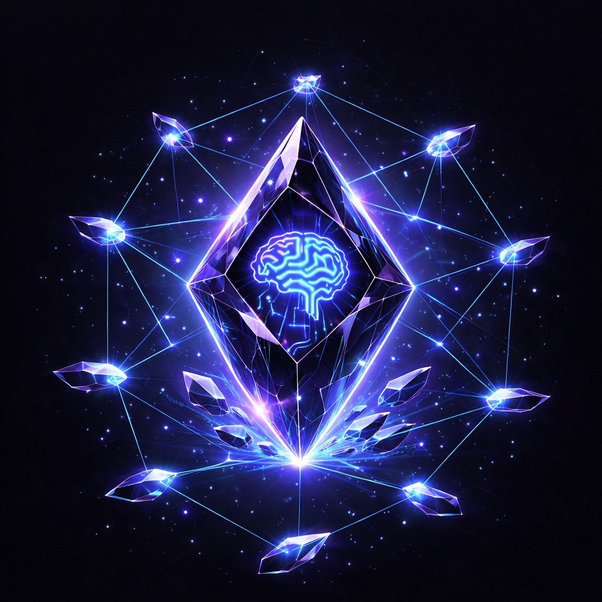

<p align="center">
  
</p>

<h1 align="center">ShardMind</h1>

<p align="center">
  <a href="https://www.typescriptlang.org"></a>
  <a href="https://nodejs.org"></a>
  <a href="LICENSE"></a>
</p>

<p align="center"><b>A package manager for Obsidian vault templates.</b><br>Install, configure, upgrade, and diagnose AI-augmented vaults.</p>

---

## The Problem

Vault templates ship as monolithic git clones. Fork authors diverge from upstream with no path back. Users who edit rendered files lose the ability to pull template updates. Backstage (Spotify, 30k+ stars) has had "propagate template updates to existing projects" as an open feature request since November 2022. Cookiecutter, create-react-app, and Yeoman all gave up on upgrades.

## The Solution

ShardMind separates templates from values. Users only ever edit their values. Templates upgrade cleanly. The system knows which files the user touched and which are still pristine.

```
shardmind install github:breferrari/obsidian-mind

  Quick Setup

  Your name: Brenno Ferrari
  Organization: Independent
  Purpose: Engineering
  QMD enabled: Yes

  Your vault will include:

  brain/          Goals, memories, patterns, decisions
  work/           Active projects, archive
  reference/      Codebase knowledge, architecture
  org/            People, teams
  perf/           Brag doc, competencies, reviews

  Installed. 51 files. Open in Obsidian and run: claude
```

```
shardmind update

  breferrari/obsidian-mind v5.1.0 -> v6.0.0

  43 files unchanged (silent re-render)
   2 files updated (no conflict)
   1 file needs your review:

  CLAUDE.md — you added a custom section
  [Accept new] [Keep mine] [Open in editor] [Skip]

  Updated. 43 silent. 2 merged. 1 reviewed.
```

---

## Get started

```bash
npm install -g shardmind
shardmind --version
```

Node 22+ required.

```bash
# In an empty directory you want to make into a vault
shardmind install github:breferrari/obsidian-mind                # interactive wizard
shardmind install --defaults github:breferrari/obsidian-mind     # accept all defaults

# In an existing vault you cloned before shardmind support
shardmind adopt github:breferrari/obsidian-mind
```

Status check at any time: `shardmind` (no args). Upgrade later: `shardmind update`. Full command reference below.

---

## How It Works

### Three-State Model

Adapted from Terraform and chezmoi. Templates define the desired state. The vault is the actual state. A state file tracks what was rendered and when.

- **Managed** files (user never edited) upgrade silently
- **Modified** files (user edited) get a three-way diff in the TUI
- **User** files (created by the user, not from any template) are never touched

### Values vs Modules

**Values** control what goes *inside* files — your name, org, vault purpose. 4 values, 30 seconds.

**Modules** control what files *exist* — perf tracking, incident management, 1:1 notes. Toggle during install. Defaults all included.

### Signals

Classification signals define how the vault routes content. Core signals (DECISION, WIN, PATTERN) always apply. Module-gated signals (INCIDENT, 1:1) only apply if their module is included. The classification hook reads signals from the schema at runtime — fully data-driven.

---

## Commands

Four commands. Three that write, one that reads. Status-first — `shardmind` with no args is the diagnostic, not a menu.

```bash
# Status (read-only, default)
shardmind                                # Quick status + drift summary
shardmind --verbose                      # Full diagnostics (values, modules, files, env)
shardmind --version                      # Print package version

# Install a shard into the current directory
shardmind install <shard>
  --values <file>                          # Prefill answers from YAML
  --defaults                               # Use schema defaults; skip wizard (Invariant 1 mode)
  --yes                                    # Accept defaults for every prompt
  --dry-run                                # Show plan, write nothing
  --verbose                                # Per-file rendering progress

# Upgrade the installed shard
shardmind update
  --release <tag>                          # Pin to a specific release tag (stable or prerelease)
  --include-prerelease                     # Widen latest-release resolution to prereleases
  --yes                                    # Auto-keep on every conflict
  --dry-run                                # Plan without writing
  --verbose                                # Per-file action history

# Retrofit shardmind into an existing shard clone (pre-shardmind era)
shardmind adopt <shard>
  --values <file>                          # Prefill answers from YAML
  --yes                                    # Auto-keep your version on every differs decision
  --dry-run                                # Preview classification + plan
  --verbose                                # Per-file action history
```

`adopt` is the migration path for users who cloned a shard repo before shardmind support existed — see [`docs/ARCHITECTURE.md §10.5a`](docs/ARCHITECTURE.md) for the flow. `--defaults` on install is the determinism flag: paired with the same shard ref, two runs on different machines produce byte-equivalent vaults (Invariant 1).

### Shard references

```
breferrari/obsidian-mind                  # Registry, latest stable      (registry index lands in 0.1.x — see Status)
breferrari/obsidian-mind@6.0.0            # Registry, exact version
github:breferrari/obsidian-mind           # Direct GitHub, latest stable release
github:breferrari/obsidian-mind@6.0.0     # Direct GitHub, exact tag
github:breferrari/obsidian-mind#main      # Branch
github:breferrari/obsidian-mind#a1b2c3d   # Commit SHA
```

### Common patterns

```bash
# Deterministic install for CI / fleet rollout — byte-equivalent to git clone
shardmind install --defaults github:breferrari/obsidian-mind

# Pre-canned values for a team
shardmind install --values team-defaults.yaml github:breferrari/obsidian-mind

# Pin an update to a specific release
shardmind update --release 6.0.1

# Pull a beta without affecting the latest dist-tag
shardmind update --include-prerelease

# Convert an existing pre-shardmind clone into a managed shard
shardmind adopt github:breferrari/obsidian-mind
```

Wrapper scripts, CI pipelines, enterprise deployments — see [`docs/OPERATIONS.md`](docs/OPERATIONS.md) for exit codes, environment variables (`GITHUB_TOKEN`, `SHARDMIND_GITHUB_API_BASE`, `SHARDMIND_REGISTRY_INDEX_URL`), file locations, and signal handling. Every typed error code with cause + remedy: [`docs/ERRORS.md`](docs/ERRORS.md).

---

## Technology

Built with [Pastel](https://github.com/vadimdemedes/pastel) (Next.js for CLIs), [Ink](https://github.com/vadimdemedes/ink) (React for terminals), and [Nunjucks](https://mozilla.github.io/nunjucks/) (Jinja2 for JavaScript).

| Layer | Stack |
|-------|-------|
| Framework | Pastel (file-system routing, zod arg parsing, Commander under the hood) |
| TUI | Ink + @inkjs/ui (Select, TextInput, Spinner, ProgressBar, DiffView) |
| Templates | Nunjucks (`{{ }}` syntax, frontmatter-aware rendering) |
| Validation | zod (shared between CLI args and schema validation) |
| Merge | node-diff3 (Khanna-Myers three-way merge, same algorithm as git) |
| Distribution | GitHub tarballs (no registry server needed) |

### Runtime Module

Hook scripts import `shardmind/runtime` — a thin exported module (~30KB) with zero dependency on Ink, React, or the CLI framework:

```typescript
import { loadValues, loadState, validateFrontmatter } from 'shardmind/runtime';
```

---

## Shard Anatomy

A shard is a packaged vault template. It includes folder structures, markdown templates, agent configurations, and a values schema that drives the install wizard. ShardMind the engine is agent-agnostic — it renders templates and tracks state regardless of which AI reads the output. The shard content is where agent choice lives.

```
my-shard/
  shard.yaml              # Package identity (name, version, deps)
  shard-schema.yaml       # Values + modules + signals + frontmatter + migrations
  templates/              # Nunjucks templates (.njk)
    CLAUDE.md.njk         # Claude Code operating manual
    AGENTS.md.njk         # Codex operating manual (optional)
    GEMINI.md.njk         # Gemini CLI operating manual (optional)
    brain/
    work/
    perf/
  commands/               # Slash commands (conditionally installed by module)
  agents/                 # Subagents (conditionally installed by module)
  scripts/                # TypeScript hook scripts (Claude Code lifecycle)
  skills/                 # Agent skills (Agent Skills spec — multi-agent compatible)
```

Shard authors choose which agents to support. A shard can ship `CLAUDE.md` only, or all three, or any combination. The vault's markdown notes, frontmatter, and folder structure work with any AI — the operational layer (hooks, commands, agent configs) is where specificity lives.

---

## Documentation

### For shard authors

| Document | What |
|----------|------|
| [`docs/AUTHORING.md`](docs/AUTHORING.md) | **Start here.** Every file and concept a shard author needs. |
| [`schemas/shard.schema.json`](schemas/shard.schema.json) | JSON Schema for `shard.yaml` — drop into VS Code for autocomplete + validation. |
| [`schemas/shard-schema.schema.json`](schemas/shard-schema.schema.json) | JSON Schema for `shard-schema.yaml`. |
| [`examples/minimal-shard/`](examples/minimal-shard/) | Minimal reference shard — 4 values, 2 modules, signals. |

### For users + contributors

| Document | What |
|----------|------|
| [`docs/OPERATIONS.md`](docs/OPERATIONS.md) | Exit codes, env vars (`GITHUB_TOKEN`, `SHARDMIND_GITHUB_API_BASE`, `SHARDMIND_REGISTRY_INDEX_URL`), file locations, signal handling. |
| [`docs/ERRORS.md`](docs/ERRORS.md) | Every `ShardMindError` code: meaning, cause, remedy. |
| [`VISION.md`](VISION.md) | Origin story, architectural bets, scope guardrails, competitive moat. |
| [`ROADMAP.md`](ROADMAP.md) | v0.1 milestones (linked to issues), v0.2 deferred, v1.0 ecosystem. |
| [`docs/ARCHITECTURE.md`](docs/ARCHITECTURE.md) | The what and why. 22 sections. Ownership model, values layer, modules, signals. |
| [`docs/IMPLEMENTATION.md`](docs/IMPLEMENTATION.md) | The how, exactly. 10 modules with TypeScript signatures, 17 merge fixtures, 6-day build plan. |
| [`CLAUDE.md`](CLAUDE.md) | Spec-driven development guide for building ShardMind with AI agents. |

---

## Requirements

- [Node.js](https://nodejs.org) 22+ (matches obsidian-mind's hook runtime requirement)
- [Git](https://git-scm.com)
- [Obsidian](https://obsidian.md) 1.12+ (for CLI support)
- [QMD](https://github.com/tobi/qmd) (optional, for semantic search)

### AI Agent Support

ShardMind installs vault templates. Which AI agent you use with the vault is up to the shard:

| Agent | Config File | Hooks | Status |
|-------|-----------|-------|--------|
| [Claude Code](https://docs.anthropic.com/en/docs/claude-code) | `CLAUDE.md` | 5-hook lifecycle via `.claude/settings.json` | First-class (richest hook system) |
| [Codex CLI](https://github.com/openai/codex) | `AGENTS.md` | `.codex/prompts/` | Supported (shard-defined) |
| [Gemini CLI](https://github.com/google-gemini/gemini-cli) | `GEMINI.md` | `save_memory` / `/memory` | Supported (shard-defined) |

The `shardmind/runtime` module is available to any TypeScript hook script. Claude Code's hook system is the most extensible — it's why obsidian-mind is Claude Code-first. But the vault content (notes, frontmatter, folders, bases) is fully agent-agnostic.

---

## Status

**v0.1.0 shipped on npm** (April 2026). Install with `npm install -g shardmind`. The engine is complete: install (with `--defaults` byte-equivalence guarantee), update (three-way merge + migrations + `--release` / `--include-prerelease`), adopt, status, and the `shardmind/runtime` module are all covered end-to-end (862 tests). Flagship-shard conversion (obsidian-mind v6) and the shard registry index land in 0.1.x point releases.

---

## Author

Created by **[Brenno Ferrari](https://brennoferrari.com)** — Senior iOS Engineer in Berlin. Creator of [obsidian-mind](https://github.com/breferrari/obsidian-mind) (2k+ stars).

---

## License

MIT
