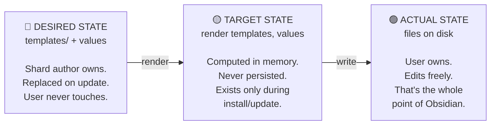
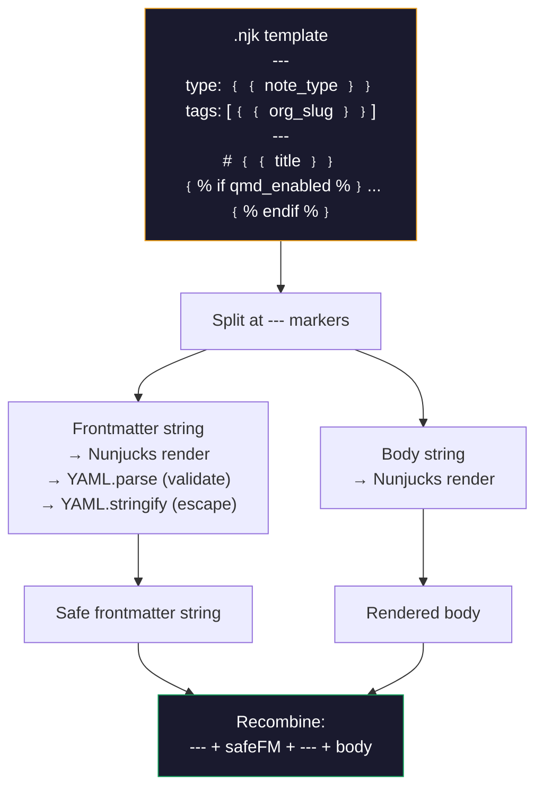

# ShardMind — Architecture Document

> Package manager for Obsidian vault templates.
> Install, configure, upgrade, and diagnose AI-augmented vaults.

**Version**: 0.1.0 (pre-release)
**Author**: Brenno Ferrari
**Date**: April 7, 2026

---

## 1. Vision

Markdown vaults are the dominant memory substrate for AI coding agents. obsidian-mind proved the format — 2k+ stars, 169 forks performing the same structural surgery to reshape it for their domain. Karpathy's LLM Wiki pattern (April 2, 2026) validated the architecture from a completely different starting point.

The problem: there is no standardized way to discover, install, version, compose, or upgrade vault templates. Every project ships as a monolithic git clone with manual setup. Fork authors diverge from upstream with no path back. Users who edit rendered files lose the ability to pull template updates.

ShardMind is the engine that turns vault templates into packages — installable, configurable, upgradeable, and diagnosable.

---

## 2. Core Concepts

### 2.1 Shard

A **shard** is a packaged vault template. It includes folder structures, markdown templates, agent operating manuals, hooks, slash commands, subagents, frontmatter schemas, and a values schema. Each shard is identified by `namespace/name@version`.

ShardMind the engine is agent-agnostic — it renders templates and tracks state regardless of which AI reads the output. The shard content determines agent support: a shard can ship `CLAUDE.md` (Claude Code), `AGENTS.md` (Codex), `GEMINI.md` (Gemini CLI), or any combination. The vault's markdown notes, frontmatter, and folder structure work with any AI. The operational layer (hooks, commands, agent configs) is where agent specificity lives. Claude Code is first-class in obsidian-mind because it has the richest hook system — five lifecycle hooks with external interception points.

### 2.2 Three-State Model

Adapted from Terraform (desired/actual/state) and chezmoi (source/target/destination).



The **state file** (`.shardmind/state.json`) records what was rendered and when, enabling drift detection without restricting the user.

### 2.3 Ownership Model

Every file in the vault has one of three ownership states:

| State | Meaning | Determined by | On update |
|-------|---------|---------------|-----------|
| **managed** | Rendered from template. User hasn't edited. | `hash(file on disk) == hash(last rendered)` | Silent re-render |
| **modified** | Rendered from template. User HAS edited. | `hash(file on disk) != hash(last rendered)` | Three-way diff in TUI |
| **user** | Created by user or LLM, not from template. | Not in state.json | Never touched |

This is how Terraform detects infrastructure drift — compare state hash against actual. The difference: Terraform overwrites drift. ShardMind respects it.

### 2.4 Values vs Modules

Two distinct mechanisms control a vault's shape:

**Values** control what goes *inside* files. The user's name, organization, vault purpose, and QMD preference are values. They're substituted into templates during rendering. There are 4 values in obsidian-mind.

**Modules** control what files and folders *exist*. The `perf/` directory, the `work/incidents/` folder, the `/review-brief` command, and the `brag-spotter` agent are all parts of the `perf` module. Modules are included or excluded during install. Empty Obsidian folders cost nothing — but a researcher looking at `perf/competencies/` feels the vault isn't for them. Modules give users ownership over the vault's shape.

Values are stored in `shard-values.yaml` (user owns). Module selections are stored in `.shardmind/state.json` (ShardMind owns). Templates are rendered with values. Modules gate which templates are rendered at all.

### 2.5 Locality

ShardMind is vault-local. All state lives in `.shardmind/` inside the vault directory. There is no global state, no `~/.shardmind/`, no central registry of vaults on the machine. Same model as git — each repo is self-contained.

ShardMind resolves the vault root by walking up the directory tree from cwd looking for `.shardmind/`. If found, that's the vault root. If not found, you're not in a shard-managed vault.

Multiple vaults on one machine are independent:

```
~/work-vault/.shardmind/       → obsidian-mind@3.5.0
~/research-vault/.shardmind/   → research-wiki@1.0.0
~/freelance-vault/.shardmind/  → obsidian-mind@3.5.0 (different values + modules)
```

---

## 3. File Anatomy of a Shard

> A shard is an Obsidian vault with a `.shardmind/` sidecar. Three testable properties hold:
> 1. The shard repo at HEAD opens cleanly as a vault in Obsidian with no preparation.
> 2. `shardmind install <shard>` with all defaults produces a vault byte-equivalent to `git clone <shard>` (modulo Tier 1 exclusions + `.shardmind/` engine metadata + vault-root `shard-values.yaml`).
> 3. Deleting `.shardmind/` on either side leaves a working vault.
>
> Full contract: [`SHARD-LAYOUT.md`](SHARD-LAYOUT.md). Closed under [#73](https://github.com/breferrari/shardmind/issues/73).

### Source side (the shard repo)

```
my-shard/                             ← git repo root; also opens cleanly as an Obsidian vault
│
├── .shardmind/                       ← engine metadata (source-side)
│   ├── shard.yaml                    ← manifest (name, version, values refs, modules, agents, hooks)
│   ├── shard-schema.yaml             ← values schema → zod at runtime; every value MUST have a default
│   └── hooks/                        ← source-side only; engine reads from tarball, NOT copied to install
│       ├── post-install.ts           ← optional, non-fatal
│       └── post-update.ts            ← optional, non-fatal
│
├── .shardmindignore                  ← repo root; gitignore-spec globs (negation deferred to v0.2)
│
├── <vault content at native paths>   ← brain/, work/, Home.md, perf/, bases/.base.njk, etc.
│
├── CLAUDE.md, AGENTS.md, GEMINI.md   ← agent operating manuals; included per agent selection
│
├── .claude/, .codex/, .gemini/       ← agent operational layers (dotfolders; .njk render allowed)
├── .mcp.json, .obsidian/             ← config + Obsidian vault-shape config
│
├── README.md, LICENSE, CHANGELOG.md  ← Tier 2 default-included; vault-relevant docs
├── ARCHITECTURE.md, .gitignore       ← installed if present
│
└── <repo-only artifacts>             ← .github/, CONTRIBUTING.md, README.<lang>.md, demo media
                                        (excluded via .shardmindignore — see §10.6)
```

The walker is rooted at the shard repo and applies three filters in order: Tier 1 engine exclusions, root-level `.shardmindignore` globs, and symlink rejection. Files survive into the install set verbatim.

`.njk` is the explicit-by-suffix render opt-in. Author convention: keep `.njk` to dotfolder configs (`.claude/settings.json.njk`, `.mcp.json.njk`) so the clone-UX cost stays zero. Iterator templates (`<dir>/_each.<ext>.njk`) and any author-tagged vault-visible `.njk` also render. Vault-visible `{{ }}` *without* the `.njk` suffix is the deferred `rendered_files` opt-in tracked in [#86](https://github.com/breferrari/shardmind/issues/86).

### Installed side (after `shardmind install`)

```
my-vault/
│
├── .shardmind/                       ← engine metadata (installed-side)
│   ├── state.json                    ← ownership hashes + module/agent selections + version + resolved ref
│   ├── shard.yaml                    ← cached manifest
│   ├── shard-schema.yaml             ← cached values schema
│   └── templates/                    ← cached source files; merge base for three-way merge on update
│
├── shard-values.yaml                 ← user's wizard answers; vault-root, NOT under .shardmind/
│                                       ("delete .shardmind/ and shard-values.yaml — the vault
│                                       continues to work" — VISION's additive principle).
│
├── <same vault content as source, with:>
│   ├── .njk files rendered with user values (suffix stripped)
│   ├── optional modules/agents included per wizard (default: all)
│   └── hook may have personalized managed files (bound by Invariants 2 + 3, see §10.6)
│
├── .shardmindignore                  ← installed verbatim (Tier 2); inert post-install
├── README.md, LICENSE, CHANGELOG.md
│
└── (no .github/, no CONTRIBUTING.md, no translations, no demo media — Tier 1 + ignore filtered)
```

Installed-side path constants are authoritative in [`source/runtime/vault-paths.ts`](../source/runtime/vault-paths.ts): `STATE_FILE`, `CACHED_MANIFEST`, `CACHED_SCHEMA`, `CACHED_TEMPLATES` all live under `.shardmind/`; `VALUES_FILE` lives at vault root.

### Tier 1 — engine-enforced exclusions (always excluded source-side)

Not author-configurable. Defined in [`source/core/tier1.ts`](../source/core/tier1.ts):

- `.shardmind/` — installed side gets a fresh metadata dir; source-side `.shardmind/` is engine-only.
- `.git/` — VCS database.
- `.github/` — CI, issue templates, `FUNDING.yml` (defensive: prevents accidental Actions activation if a user later git-pushes their personal vault).
- `.obsidian/workspace.json`, `.obsidian/workspace-mobile.json`, `.obsidian/graph.json` — Obsidian's user-specific ephemeral state.
- **Symbolic links anywhere in the shard source** — engine rejects with `WALK_SYMLINK_REJECTED`. Security baseline: an untrusted shard could symlink outside the install target.

Other Obsidian user-state files (`starred.json`, `bookmarks.json`, `backlink.json`, `page-preview.json`) are author-controlled via `.shardmindignore`.

### Tier 2 — author-controlled via `.shardmindignore`

Glob-only in v0.1 (negation deferred to [#87](https://github.com/breferrari/shardmind/issues/87)). Typical obsidian-mind-shaped exclusions:

```gitignore
# Repo-meta — meaningful on GitHub, noise in a vault
CONTRIBUTING.md
README.*.md              # translations (README.ja.md, README.ko.md, …)

# Marketing media — not vault content
*.gif
*.png
obsidian-mind-logo.*
```

Rule of thumb: if a file is a property of *the GitHub repo*, exclude it; if it's *about the shard's content*, leave it installed.

Shard authors choose which agents to support. The engine walks the shard root and writes the install set, agent-agnostic.

---

## 4. Manifest: `shard.yaml`

Package identity. Small, stable, rarely changes between versions.

```yaml
apiVersion: v1
name: obsidian-mind
namespace: breferrari
version: 3.5.0
description: "Vault template for AI-augmented knowledge work"
persona: "Engineers, researchers, freelancers — anyone using Claude Code as a thinking partner"
license: MIT
homepage: https://github.com/breferrari/obsidian-mind

requires:
  obsidian: ">=1.12.0"
  node: ">=18.0.0"

dependencies:
  - name: obsidian-skills
    namespace: kepano
    version: "^1.0.0"

hooks:
  post-install: hooks/post-install.ts
  post-update: hooks/post-update.ts

# v0.1: dependencies are vendored by the shard author.
# ShardMind validates version compatibility but does not fetch.
```

---

## 5. Schema: `shard-schema.yaml`

Defines three concerns: **values** (template variables), **modules** (optional vault sections), and **frontmatter** (validation rules). Also declares **migrations** between versions.

### 5.1 Values — What Goes Inside Files

Minimal. Only what can't be defaulted.

```yaml
schema_version: 1

values:
  user_name:
    type: string
    required: true
    message: "Your name"
    group: setup

  org_name:
    type: string
    message: "Organization (or 'Independent')"
    default: "Independent"
    group: setup

  vault_purpose:
    type: select
    required: true
    message: "How will you use this vault?"
    options:
      - { value: engineering, label: "Engineering", description: "Projects, incidents, reviews, architecture" }
      - { value: research, label: "Research", description: "Source compilation, wiki, citations" }
      - { value: freelance, label: "Freelance", description: "Clients, projects, invoicing" }
      - { value: general, label: "General", description: "Flexible knowledge work" }
    group: setup

  qmd_enabled:
    type: boolean
    message: "Enable QMD semantic search?"
    default: true
    hint: "Requires: npm install -g @tobilu/qmd"
    group: setup

groups:
  - id: setup
    label: "⚡ Quick Setup"
```

Four values. One group. One TUI screen. Done in 30 seconds.

### 5.2 Modules — What Files Exist

Modules are vault sections that can be included or excluded during install. Each declares its paths, commands, agents, and bases.

```yaml
modules:
  brain:
    label: "Goals, memories, patterns, decisions"
    paths: ["brain/"]
    removable: false

  work:
    label: "Active projects, archive"
    paths: ["work/active/", "work/archive/", "work/Index.md"]
    removable: false

  reference:
    label: "Codebase knowledge, architecture"
    paths: ["reference/"]
    removable: false

  thinking:
    label: "Scratchpad"
    paths: ["thinking/"]
    removable: false

  org:
    label: "People, teams"
    paths: ["org/"]
    commands: ["slack-scan"]
    removable: true

  perf:
    label: "Brag doc, competencies, reviews"
    paths: ["perf/"]
    commands: ["review-brief", "self-review", "review-peer", "peer-scan"]
    agents: ["brag-spotter", "review-prep", "review-fact-checker"]
    bases: ["competency-map", "review-evidence"]
    removable: true

  incidents:
    label: "Incident tracking"
    paths: ["work/incidents/"]
    commands: ["incident-capture"]
    agents: ["slack-archaeologist"]
    bases: ["incidents"]
    removable: true

  1on1s:
    label: "1:1 meeting notes"
    paths: ["work/1-1/"]
    commands: ["capture-1on1"]
    bases: ["1-1-history"]
    removable: true
```

`removable: false` means core — always included. `removable: true` means the user can deselect it during install. All modules default to included. The install flow shows a multiselect review step after values — most users press Enter.

### 5.3 Signals — How the Vault Thinks

Classification signals define what the `classify.ts` hook looks for and where it routes content. Core signals always apply. Module-gated signals only apply if their module is included. The hook reads these at runtime — no hardcoded signal lists.

```yaml
signals:
  - id: DECISION
    description: "A choice was made with reasoning"
    routes_to: "work/active/ or brain/Key Decisions.md"
    core: true

  - id: WIN
    description: "Achievement, praise, or milestone"
    routes_to: "perf/Brag Doc.md"
    core: true

  - id: PATTERN
    description: "Recurring behavior worth documenting"
    routes_to: "brain/Patterns.md"
    core: true

  - id: ARCHITECTURE
    description: "System design, technical structure"
    routes_to: "reference/ or projects/<name>/decisions/"
    core: true

  - id: PERSON
    description: "Information about someone"
    routes_to: "org/people/"
    module: org

  - id: INCIDENT
    description: "Something broke, needs investigation"
    routes_to: "work/incidents/"
    module: incidents

  - id: PRODUCT
    description: "Feature ideas, roadmap, user feedback"
    routes_to: "projects/<relevant>/notes/"
    core: true

  - id: CONTENT
    description: "Draft idea, publishing plan, platform strategy"
    routes_to: "content/drafts/"
    core: true

  - id: STRATEGY
    description: "Growth plan, positioning, competitive analysis"
    routes_to: "strategy/"
    core: true
```

Each module's CLAUDE.md partial documents its own signals. The `_core.md.njk` partial documents universal signals. `classify.ts` reads the schema at runtime via `shardmind/runtime` — fully data-driven.

> [!note] Gap found by validating against the Vigil Mind Reshape
> The reshape changed classify.py from 7 to 9 signals. Without signals in the schema, every domain (researcher, freelancer, student) would need to hand-edit the classifier. With signals in the schema, `/dump` routes correctly for every domain out of the box.

### 5.4 Frontmatter Rules

Validation rules per note type. Doctor and PostToolUse hook both validate against these. Supports arbitrary note type keys with `path_match` for shard-specific types.

```yaml
frontmatter:
  global: [date, description, tags]
  work-note:
    required: [date, status, project]
  incident:
    required: [date, status, quarter, ticket, severity, role]
    path_match: "work/incidents/*.md"
  person:
    required: [date, title]
    path_match: "org/people/*.md"
  1-1:
    required: [date, quarter]
    path_match: "work/1-1/*.md"
  # Shard authors add custom note types:
  project-readme:
    required: [date, status, description]
    path_match: "work/projects/*/README.md"
  decision:
    required: [date, status, project]
    path_match: "work/projects/*/decisions/*.md"
```

`path_match` tells the validation hook how to identify which note type a file is. Without it, type is inferred from parent folder. With it, shard authors can define domain-specific note types (e.g., `project-readme` for a Rails dev who needs `rails_version` in frontmatter).

> [!note] Validated by two independent reshapes
> eliluvish added `project`, `github_issue`, `rails_version`, `ruby_version` as custom frontmatter. The Vigil Mind reshape added `project`, `platform`, `audience`. Both needed note types beyond the predefined set. `path_match` enables this without changing the engine.

### 5.4 Migrations

Declared changes between versions for upgrading `shard-values.yaml`:

```yaml
migrations:
  - from_version: "3.4.0"
    changes:
      - { type: rename, old: review_frequency, new: review_cycle }
      - { type: added, key: vault_purpose, default: "engineering" }
      - { type: removed, key: legacy_brag_format }
```

---

## 6. Values: `shard-values.yaml`

The user's file. Created on first install. ShardMind **never overwrites** it after creation.

```yaml
# shard-values.yaml — YOUR configuration.
# Edit freely. Run 'shardmind --verbose' to validate.

user_name: "Brenno Ferrari"
org_name: "Acme Corp"
vault_purpose: engineering
qmd_enabled: true
```

---

## 7. Template Engine

### 7.1 Nunjucks

All `.njk` files use Nunjucks (Mozilla's Jinja2 port for JavaScript). `{{ }}` syntax is the industry standard. Configuration: `autoescape: false`.

### 7.2 Frontmatter-Aware Rendering

The renderer splits frontmatter from body, renders each separately, parses frontmatter as YAML for safety (handles escaping of special characters), re-stringifies, and recombines.



### 7.3 CLAUDE.md as a Single Template

Under the v6 contract, `CLAUDE.md` (and `AGENTS.md`, `GEMINI.md`) ships as a single Nunjucks template at the shard root — `CLAUDE.md.njk` — rendered like any other `.njk` file. There is no partials/assembly system; per-module conditional content is expressed via `` blocks gated on `included_modules`, e.g.:

```nunjucks

## Performance reviews
…

```

Module deselection means file-path gating (the file is not installed), not section pruning of an assembled CLAUDE.md. See [`docs/SHARD-LAYOUT.md`](SHARD-LAYOUT.md) "no wrapper directories, no partials/assembly system" for the contract rationale.

### 7.4 Dynamic File Generation

Templates prefixed with `_each` iterate over list values. For each item in the corresponding list, renders a separate file named from `item.slug`. Files track individually in state.json.

### 7.5 Module-Gated Rendering

The renderer checks module inclusion before rendering any template. If a template's path falls within an excluded module's paths, it's skipped entirely. No conditional blocks needed in the templates themselves — the file simply doesn't exist.

---

## 8. State File: `.shardmind/state.json`

The bridge between desired and actual state.

```json
{
  "schema_version": 1,
  "shard": "breferrari/obsidian-mind",
  "source": "github:breferrari/obsidian-mind",
  "version": "3.5.0",
  "installed_at": "2026-04-07T14:30:00Z",
  "updated_at": "2026-04-07T14:30:00Z",
  "values_hash": "sha256:aaa...",
  "modules": {
    "brain": "included",
    "work": "included",
    "reference": "included",
    "thinking": "included",
    "org": "included",
    "perf": "excluded",
    "incidents": "included",
    "1on1s": "excluded"
  },
  "files": {
    "CLAUDE.md": {
      "template": "templates/CLAUDE.md.njk",
      "rendered_hash": "sha256:abc...",
      "ownership": "managed"
    },
    "brain/North Star.md": {
      "template": "templates/brain/North Star.md.njk",
      "rendered_hash": "sha256:def...",
      "ownership": "managed"
    }
  }
}
```

Key fields:
- `source` — where to fetch updates from. Read by `shardmind update`. User never re-specifies.
- `modules` — which modules are included/excluded. Persists across updates. User can change during update.
- `files` — per-file hash tracking for drift detection.

### 8.1 Cached Templates

`.shardmind/templates/` stores the templates that produced the current rendered files. This is the **base** in three-way merge during update.

---

## 9. Runtime Hooks (TypeScript)

Hooks execute during Claude Code sessions. They import `shardmind/runtime` to read values and module state.

```
.claude/scripts/
├── session_start.ts        # SessionStart: inject context based on purpose + modules
├── classify.ts             # UserPromptSubmit: classify content, inject routing hints
├── validate_note.ts        # PostToolUse: validate frontmatter per note type
├── backup_transcript.ts    # PreCompact: save session transcript
├── session_end.ts          # Stop: checklist, update indexes
└── charcount.sh            # Tiny shell utility (stays as shell)
```

Hooks read `shard-values.yaml` and `.shardmind/state.json` at runtime to adapt behavior:

```typescript
import { loadValues, loadState } from 'shardmind/runtime';

const values = await loadValues();
const state = await loadState();

// Always
await injectNorthStar();
await injectActiveProjects();

// Purpose-aware
if (values.vault_purpose === 'research') await injectWikiIndex();
if (values.vault_purpose === 'engineering') await injectRecentGitChanges();

// Module-aware
if (state?.modules.perf === 'included') await injectBragSummary();
if (state?.modules['1on1s'] === 'included') await injectUpcoming1on1s();
```

Hooks are always **managed** (replaced on update). Users customize behavior through values and module selection, not by editing scripts.

### 9.3 Hook Contract

Post-install and post-update hooks receive a typed context and run as best-effort (non-fatal):

```typescript
interface HookContext {
  vaultRoot: string;
  values: Record<string, unknown>;
  modules: Record<string, 'included' | 'excluded'>;
  shard: { name: string; version: string };
  previousVersion?: string;      // Only for post-update
  valuesAreDefaults: boolean;    // v6 — Invariant 2 (see SHARD-LAYOUT.md)
  newFiles: string[];            // v6 — managed paths newly added by this run
  removedFiles: string[];        // v6 — managed paths removed by this run
}

// Hook file exports a default async function:
export default async function(ctx: HookContext): Promise<void>;
```

**Hooks CAN**: read/write files in vaultRoot, run shell commands (`git init`, `qmd setup`), log to stdout and stderr (both shown in TUI as separate labeled blocks).

**Hooks CANNOT**: modify `.shardmind/` (ShardMind owns it), modify `shard-values.yaml` (user owns it), return values that affect install/update flow.

**v6 invariants the new ctx fields encode** (canonical contract: `docs/SHARD-LAYOUT.md §Hooks, state, and re-hash semantics`):

- `valuesAreDefaults: true` — every user value equals its schema default (deep-equal; computed defaults resolved against the literal-default map first). Hooks that modify *managed* files must no-op in this branch (Invariant 2). Hooks that create *unmanaged* files (QMD indexes, MCP caches) may run unconditionally — they don't affect byte-equivalence.
- `newFiles: string[]` — empty on clean install (every file is new — uninformative); empty on no-op update; populated for an update with `UpdateAction.kind === 'add'` paths. By default a post-update hook restricts its writes to these paths (Invariant 3).
- `removedFiles: string[]` — empty on install; populated for an update with `UpdateAction.kind === 'delete'` paths. Hooks use this to maintain external state that referenced now-removed managed paths.

**Post-hook re-hash**: after every `post-install` / `post-update` invocation — success OR failure — the engine re-reads each managed file in `state.files` and recomputes `rendered_hash`, then writes the updated `state.json`. This ensures the engine's view of disk reflects actual content even when a hook only partially completed (the hook contract is non-fatal, so a hook that broke can't corrupt the engine). Per-file ENOENT and other I/O errors are tolerated; drift detection picks up any discrepancy on the next status run. Implementation: `source/core/state.ts::rehashManagedFiles`, called by both command machines after the hook subprocess returns. Spec: `docs/SHARD-LAYOUT.md §Hooks, state, and re-hash semantics`.

**If a hook throws**: ShardMind logs the error, shows a warning ("post-install hook exited with code N. Install succeeded; the hook's work may be incomplete."), does NOT rollback. Non-fatal. Same pattern as Helm post-install hooks. The post-hook re-hash still runs.

**Execution runtime**: hooks run in a subprocess spawned by `source/core/hook.ts:executeHook`. The engine ships the `tsx` TypeScript loader (~6 MB) bundled as a runtime dependency so authors can write plain `.ts` without a compile step on their side. An internal wrapper at `source/internal/hook-runner.ts` (emitted to `dist/internal/hook-runner.js`) imports the hook and invokes its default export with the typed `HookContext`.

**Execution environment**: child `cwd` is `ctx.vaultRoot`; env inherits from the parent plus `SHARDMIND_HOOK=1` and `SHARDMIND_HOOK_PHASE=post-install|post-update` for the hook to branch on.

**Output capture**: stdout and stderr are captured into separate 256 KB-capped buffers. Overflow truncates with a `[… truncated, N bytes discarded]` marker rather than dropping the hook. The command TUI additionally renders a tail-only (last 12 lines) live view during execution; the full captured output surfaces in the final summary.

**Timeout**: 30-second default. Per-shard override via `shard.yaml` `hooks.timeout_ms` (valid range 1_000..600_000). Enforcement is soft-SIGTERM + 2 s grace window + SIGKILL; timeouts surface as a warning identical to the non-zero-exit path.

**Cancellation**: the command machine's AbortController aborts the subprocess on Ctrl+C. Since the hook runs strictly after `writeState()` in both install and update executors, a cancelled or timed-out hook does not roll back the install — state.json is already on disk.

### 9.4 Git Tracking

`.shardmind/` contains both trackable state and derivable cache:

| File | Track in git? | Reason |
|------|--------------|--------|
| `.shardmind/state.json` | **Yes** | Collaborators see which shard and version |
| `.shardmind/shard.yaml` | **Yes** | Offline reference |
| `.shardmind/shard-schema.yaml` | **Yes** | Offline reference |
| `.shardmind/templates/` | **No** | Derivable, re-downloaded on update |

The shard's `.gitignore.njk` template includes:

```
# ShardMind cache (re-downloaded on update)
.shardmind/templates/
```

---

## 10. Commands

### 10.1 Command Surface

Four commands. Three that write. One that reads.

| Command | What | Writes? |
|---------|------|---------|
| `shardmind` | Status + health | No |
| `shardmind install <namespace/name>` | Install a shard into an empty (or near-empty) directory | Yes |
| `shardmind update` | Upgrade to a newer version | Yes |
| `shardmind adopt <namespace/name>` | Retrofit the engine onto a vault that was already cloned without shardmind | Yes |
| `shardmind --verbose` | Detailed diagnostics | No |

No `list` (vault-local, one shard per vault, nothing to list). No `doctor` (baked into status). No `init` (v1 shards are authored by hand).

### 10.2 `shardmind` — Status

The root command. Shows vault health at a glance. Runs hash comparisons and file existence checks. No network call by default (update check cached for 24 hours).

Every top-level command (`status`, `install`, `update`, `adopt`) additionally hits `registry.npmjs.org/shardmind/latest` once per 24h via [`core/self-update-check.ts`](IMPLEMENTATION.md#419-self-update-checkts) and shows a one-line banner above its UI when a newer engine version is published. Silent on offline / non-TTY / `CI=1` / `--no-update-check` / `SHARDMIND_NO_UPDATE_CHECK`. The check fires after first paint via `setTimeout(0)` so it never delays a render.

**Installed, healthy:**

```
◆ shardmind

  breferrari/obsidian-mind v3.5.0
  Installed 3 weeks ago · 47 managed files · 0 modified

  ✓ Up to date
```

**Installed, needs attention:**

```
◆ shardmind

  breferrari/obsidian-mind v3.5.0
  Installed 3 weeks ago · 47 managed files · 4 modified

  ⬆  v4.0.0 available — run 'shardmind update'
  ⚠  QMD not installed (qmd_enabled is true)
  ⚠  3 notes missing required frontmatter
```

**Not in a vault:**

```
◆ shardmind

  Not in a shard-managed vault.

  Get started:
    shardmind install breferrari/obsidian-mind
```

### 10.3 `shardmind --verbose` — Detailed Diagnostics

Full diagnostic output. Replaces the old `doctor` command concept.

```
◆ shardmind --verbose

  breferrari/obsidian-mind v3.5.0

  Values:
    ✓ 4/4 valid

  Modules:
    ✓ brain, work, reference, thinking, org, incidents (included)
    · perf, 1on1s (excluded)

  Files:
    ✓ 43 managed (unchanged)
    ⚠  4 modified by you:
       CLAUDE.md — you added a custom section
       brain/North Star.md — filled in your goals
       brain/Patterns.md — added 3 patterns
       work/Index.md — added project links
    · 127 user-created (not tracked)

  Frontmatter:
    ✓ 44/47 notes valid
    ⚠  work/active/Auth Refactor.md — missing 'quarter'
    ⚠  work/incidents/Redis Outage.md — missing 'severity'
    ⚠  org/people/Sarah Chen.md — missing 'title'

  Environment:
    ✓ Obsidian CLI available
    ✓ Node.js v22.1.0
    ⚠  QMD not installed (qmd_enabled is true)
    ⬆  v4.0.0 available (run 'shardmind update')
```

**v0.1 deviations from the example above**:

- **Per-modified-file flavor text** (`"you added a custom section"`, `"filled in your goals"`) is aspirational; natural-language summaries of user edits would require semantic diff (LLM-class understanding) we deliberately keep out of the engine. **Numeric `+N/−M` change counts are shipped** in verbose mode: for each modified file, `core/status.ts` renders the cached template against current values and runs a 2-way line diff, bounded by `MODIFIED_DIFF_CONCURRENCY = 8` to keep the common-case status run sub-second on large vaults. CRLF and leading-BOM normalization apply, and a pure-whitespace change renders as `(whitespace-only)` rather than a confusing `+0/−0`.
- **Shard-specific environment rows** like `"QMD not installed"` require a shard to contribute diagnostics. v0.1 has no `status` hook type (hooks are post-install and post-update only), so the Environment section ships with Node.js version and a PATH-lookup answer for the Obsidian CLI. Shard-contributed diagnostics are a future enhancement.
- **Update-available line** is cache-backed (24h TTL; see `docs/IMPLEMENTATION.md §4.15`). When the cache answer is stale — network offline but a previous check exists — the line suffixes `(cached)` so the user can tell.

### 10.4 `shardmind install <shard>` — Install Flow

```
shardmind install breferrari/obsidian-mind

  ⚡ Quick Setup

  Your name: █
```

After 4 value prompts, a module review step:

```
  Your vault will include:

  ✓ brain/          Goals, memories, patterns, decisions
  ✓ work/           Active projects, archive
  ✓ reference/      Codebase knowledge, architecture
  ✓ thinking/       Scratchpad
  ✓ org/            People, teams
  ✓ perf/           Brag doc, competencies, reviews
  ✓ incidents/      Incident tracking
  ✓ 1-1/            1:1 meeting notes

  Press SPACE to exclude, ENTER to confirm
```

Defaults: all included. User deselects what doesn't fit. Most press Enter.

After confirm: render → write → state.json → post-install hook → summary.

### 10.5 `shardmind update` — Upgrade Flow

```
shardmind update

  breferrari/obsidian-mind v3.5.0 → v4.0.0

  Fetching v4.0.0…
```

If new values were added to the schema: prompt only for those. If schema migrations exist: apply automatically, surface warnings in the final summary. If new optional modules appeared in the new shard: offer to include them (default on). If any modified-by-user files are no longer produced by the new shard: ask whether to keep your version (untracked) or delete.

Then the diff review:

```
  43 files unchanged (silent re-render)
   2 files auto-merged
   1 file needs your review:

  Conflict in CLAUDE.md (1 of 1)
    lines 47–52
    before line
    <<<<<<< yours
    ## Custom Section
    My custom workflow for auth reviews
    =======
    ## Auth Review Workflow
    Updated process for Q2 2026
    >>>>>>> shard update
    after line

    150 unchanged · 8 auto-merged · 1 region conflicted

  [Accept new] [Keep mine] [Skip] (Open in editor · v0.2)
```

After resolution: the executor snapshots every path it will touch to `.shardmind/backups/update-<timestamp>/`, applies writes and deletes in two passes (writes first so a delete can't clobber a new file at the same path), re-caches the manifest + schema + templates, writes new `state.json`, then runs the non-fatal post-update hook. Any failure between snapshot and state-write walks the snapshot back and leaves the vault indistinguishable from pre-update.

Flags:
- `--yes` — skip every prompt; opt into every new optional module and auto-keep every conflict (useful for unattended CI upgrades).
- `--verbose` — show per-file action history during the write phase.
- `--dry-run` — run the full pipeline (fetch, migrate, plan, merge) without touching the vault; the summary reports what *would* happen.

Implementation modules: `source/core/migrator.ts` (IMPLEMENTATION §4.10), `source/core/update-planner.ts` (§4.11), `source/core/update-executor.ts` (§4.12). Orchestration lives in `source/commands/hooks/use-update-machine.ts`. The full phase diagram is in IMPLEMENTATION §3.

### 10.5a `shardmind adopt <shard>` — Retrofit Flow

For users who cloned a shard repo before shardmind support existed (e.g. `obsidian-mind` v5.1 clones). Adopt walks the user's existing vault, classifies each shard-output path, and writes the same `.shardmind/` metadata an install would have produced — without overwriting the user's current bytes unless they explicitly opt in per file.

```
shardmind adopt breferrari/obsidian-mind

  Comparing your vault with the shard…

  Differs from shard: CLAUDE.md (1 of 2)
    lines 14–22
      ## Setup notes
    <<<<<<< mine
      Personal shortcuts I added in week 1
    =======
      ## Module reference
      Generated section (every shard ships this)
    >>>>>>> shard

  [Keep mine] [Use shard]
```

Two pre-flight guards run before the network resolve, so a deterministically-wrong adopt bails in milliseconds:

- `.shardmind/state.json` already exists → `ADOPT_EXISTING_INSTALL`. The vault is already managed; the user wants `shardmind update`.
- `shard-values.yaml` exists without `state.json` → `VALUES_FILE_COLLISION`. Partial-adoption inconsistent state; the user moves the stray file aside.

Phase ordering (logical; UI may interleave loading messages — see IMPLEMENTATION §3.5 for the data-flow diagram):

1. **Fetch** — resolve + download into a temp directory.
2. **Wizard** — collect values + module selections via the same `InstallWizard` component install uses. Wizard runs **before** classification because `.njk` templates need values to render before their output bytes can be hashed.
3. **Classify** (`source/core/adopt-planner.ts::classifyAdoption`) — for every shard output, render or read, hash, stat the user's vault, and assign one of four buckets:
   - **matches** — byte-identical post-render → managed silently.
   - **differs** — bytes differ → 2-way diff prompt (`AdoptDiffView`); user picks `keep_mine` (record user's hash, ownership=`modified`) or `use_shard` (overwrite with shard bytes, ownership=`managed`).
   - **shard-only** — user doesn't have the path → install fresh, managed.
   - Implicit **user-only** — paths in vault but not in shard → never enumerated, left untouched.
4. **Apply** (`source/core/adopt-executor.ts::runAdopt`) — snapshot any `differs+use_shard` user file before overwriting, write shard-only fresh installs, write engine metadata (`state.json`, cached manifest+schema, templates cache, vault-root `shard-values.yaml`). Snapshot-then-restore rollback on any failure between snapshot and final state-write.
5. **Hook** — fire the post-install hook with `valuesAreDefaults` + `newFiles=summary.installedFresh` + `removedFiles=[]`. Non-fatal (Helm semantics, §9.3).
6. **Re-hash** — recompute managed-file hashes per `state.ts::rehashManagedFiles` so any hook edits to managed paths land in the recorded state.

Flags:
- `--yes` — skip wizard + auto-pick `keep_mine` on every `differs`. Preserves the user's bytes on every divergence; safe default for retroactive adoption.
- `--values <file>` — prefill wizard answers (same shape as `install --values`).
- `--verbose` — show per-file action history during the apply phase.
- `--dry-run` — run the full pipeline (fetch, wizard, classify) without touching the vault. Summary reports what *would* happen.

Volatile templates (`{# shardmind: volatile #}`) skip the differs prompt entirely — their rendered output is expected to vary across renders, so a content prompt would be meaningless. User's bytes are accepted as-is; missing-on-disk falls through to shard-only.

Excluded modules' files in the user's vault are not classified — adopt mirrors install's "module excluded → file not installed" rule, so user content at those paths stays user-content without any prompt.

Implementation modules: `source/core/adopt-planner.ts` (IMPLEMENTATION §4.17), `source/core/adopt-executor.ts` (§4.18). Orchestration lives in `source/commands/hooks/use-adopt-machine.ts`; UI components are `source/components/AdoptDiffView.tsx` + `source/components/AdoptSummary.tsx`.

### 10.6 Install Location

Always the current directory. Same as `git init`. The convention: `cd` into your vault folder and run the command.

```bash
mkdir my-vault && cd my-vault
shardmind install breferrari/obsidian-mind
```

If the directory isn't empty, ShardMind warns and asks to confirm. No `--dir` flag in v1.

### 10.7 Update Fetching

`shardmind update` reads the `source` field from `.shardmind/state.json` and resolves the latest installable shard via one of three policies:

1. **Default — latest stable.** Resolves via `GET /repos/:o/:r/releases?per_page=100` filtered for `prerelease: false`. Picks the newest entry. Replaces the v0.1 `/releases/latest` endpoint, which 404'd for repos that publish only prereleases (e.g. an obsidian-mind v6.0.0-beta cycle before a stable release exists). Empty filtered list throws `NO_RELEASES_PUBLISHED`; if any prereleases were filtered out, the hint points at `--include-prerelease`.
2. **`--release <tag>` — pinned tag.** Skips latest-resolution; HEAD-verifies the tarball at `/tarball/v<tag>` exists. Works for stable or prerelease tags. Mutually exclusive with `--include-prerelease` (the pin already chose) and with ref-installed vaults (those track a moving ref by definition). Named `--release` (not `--version`) because Pastel reserves the program-level `--version` flag for printing the package version.
3. **`--include-prerelease` — widened.** Returns the newest entry of any kind from the same `/releases` listing.

**Ref installs** (`state.ref` set; vault was installed via `github:owner/repo#<ref>`) follow a fourth policy: re-resolve `/repos/:o/:r/commits/<ref>` on every update to get the current commit SHA, then HEAD-verify `/tarball/<sha>`. Up-to-date iff `state.resolvedSha === resolved.commit`. The vault tracks the moving ref by design — no flags accepted (combinations with `--release` or `--include-prerelease` reject as `UPDATE_FLAG_CONFLICT`). To stop tracking the ref, reinstall with `shardmind install <source>@<version>`.

The update-check cache (`.shardmind/update-check.json`, 24h TTL) is stable-only. The update command primes it only when the run resolved through the latest-stable policy — `--release`, `--include-prerelease`, and ref installs all skip the prime so the next `shardmind` (status) invocation isn't told a prerelease / pinned tag / SHA-derived version is the latest stable.

---

## 11. Technology Stack

### 11.1 Framework Layer

| Package | Role |
|---------|------|
| **pastel** | CLI framework — file-system routing, zod arg parsing, Commander under the hood |
| **ink** | React renderer for terminal (Yoga flexbox) |
| **@inkjs/ui** | Pre-built components: Select, TextInput, ConfirmInput, Spinner, ProgressBar, Badge, StatusMessage |
| **react** | Required peer dependency |

### 11.2 Core Layer

| Package | Role |
|---------|------|
| **nunjucks** | Template engine (`{{ }}` syntax, ``, ``) |
| **yaml** | YAML parsing (eemeli/yaml — modern, TypeScript-typed) |
| **tar** | Tarball download + extraction (isaacs/node-tar) |
| **semver** | Version parsing, range checking, comparison |
| **zod** | Schema validation (shared with Pastel for arg parsing) |
| **diff** | Unified diff generation for update previews |
| **node-diff3** | Three-way merge algorithm (Khanna-Myers diff3) |

### 11.3 Dev Layer

| Package | Role |
|---------|------|
| **typescript** | Language |
| **@sindresorhus/tsconfig** | Pastel's recommended TS config |
| **vitest** | Test runner |

### 11.4 Dependency Risk: `@inkjs/ui`

**Status (as of April 2026):** frozen upstream. Last release `2.0.0` on 2024-05-22. Last maintainer commit on 2024-05-22. Last maintainer comment on issues: June 2023. Meanwhile the same maintainer actively ships `ink` itself (7.0.0 / 7.0.1 in April 2026). Not archived, but behaviorally abandoned.

**Why we still depend on it.** It covers the full wizard surface in one package: `TextInput`, `Select`, `MultiSelect`, `ConfirmInput`, `Spinner`, `ProgressBar`, `StatusMessage`, `Alert`, `Badge`. No maintained alternative at equivalent breadth exists. The standalone `ink-*` packages (`ink-text-input`, `ink-select-input`) are similarly frozen, and `ink-multi-select` / `ink-progress-bar` are years-dead. `OpenTUI` is a different renderer entirely, not a drop-in swap.

**Hedge: `source/components/ui.ts` shim.** Every TUI file imports components from `./ui.js` rather than `@inkjs/ui` directly. The shim is a one-file re-export. To swap the backend (vendor a component, fork the library, migrate wholesale), only `ui.ts` changes. Callsites are untouched.

**Swap triggers** — any one of:
1. A second real bug we need to patch locally (the first was the `ExistingInstallGate` `onChange` quirk — see upstream issue [vadimdemedes/ink-ui#26](https://github.com/vadimdemedes/ink-ui/issues/26) and PR [#27](https://github.com/vadimdemedes/ink-ui/pull/27)).
2. Ink 7 or later breaks compatibility and nobody upstream fixes it.
3. We need a component `@inkjs/ui` doesn't provide.

**When a trigger fires, vendor the 2–3 components that bit us into `source/components/vendor/*` and route `ui.ts` through the vendored copies. Don't fork the whole package unless the count grows past ~5 components.**

**Revisit cadence.** Re-evaluate at v0.2 scope freeze. Do not pre-emptively migrate.

---

## 12. Project Structure

```
shardmind/
├── source/
│   ├── cli.ts                         # Pastel entry point (3 lines)
│   ├── commands/
│   │   ├── index.tsx                   # Status display (Ink)
│   │   ├── install.tsx                 # shardmind install <shard> (Ink wizard)
│   │   └── update.tsx                  # shardmind update (Ink diff review)
│   ├── components/
│   │   ├── StatusView.tsx              # Root status display
│   │   ├── VerboseView.tsx             # Detailed diagnostics
│   │   ├── InstallWizard.tsx           # Values prompts + module review
│   │   ├── ModuleReview.tsx            # Multiselect for modules
│   │   ├── DiffView.tsx                # Three-way diff display
│   │   └── Header.tsx                  # Branded header
│   ├── core/
│   │   ├── manifest.ts                 # Parse + validate shard.yaml
│   │   ├── schema.ts                   # Parse shard-schema.yaml → zod schema
│   │   ├── registry.ts                 # Resolve namespace/name → GitHub repo + version
│   │   ├── download.ts                 # Fetch + extract GitHub tarball
│   │   ├── renderer.ts                 # Nunjucks engine + frontmatter-aware rendering
│   │   ├── state.ts                    # Read/write .shardmind/state.json
│   │   ├── drift.ts                    # Ownership detection + drift analysis
│   │   ├── differ.ts                   # Three-way diff computation (node-diff3)
│   │   ├── migrator.ts                 # Apply schema migrations to values
│   │   └── modules.ts                  # Module resolution + gating logic
│   ├── runtime/
│   │   ├── index.ts                    # Exported entry point for hook scripts
│   │   ├── values.ts                   # loadValues(), validateValues()
│   │   ├── schema.ts                   # loadSchema()
│   │   ├── frontmatter.ts              # validateFrontmatter()
│   │   ├── state.ts                    # loadState(), getIncludedModules()
│   │   └── types.ts                    # ShardSchema, ShardState, ModuleState, etc.
│   └── types/
│       └── index.ts                    # Shared types + zod schemas
├── tests/
│   ├── unit/
│   │   ├── renderer.test.ts
│   │   ├── schema.test.ts
│   │   ├── drift.test.ts               # Fixture-driven merge tests
│   │   ├── migrator.test.ts
│   │   ├── modules.test.ts
│   │   ├── manifest.test.ts
│   │   └── runtime.test.ts
│   ├── integration/
│   │   ├── install.test.ts
│   │   └── update.test.ts
│   ├── e2e/
│   │   └── cli.test.ts
│   └── fixtures/
│       ├── merge/                       # 16 three-way merge scenarios
│       ├── schema/                      # Valid + invalid schema files
│       ├── render/                      # Template rendering scenarios
│       └── migration/                   # Value migration scenarios
├── package.json
├── tsconfig.json
└── vitest.config.ts
```

---

## 13. Installed Vault Structure

After `shardmind install breferrari/obsidian-mind` (engineering purpose, perf excluded, everything else included):

```
my-vault/
├── .shardmind/                        # ShardMind internal
│   ├── state.json                     # File hashes + ownership + modules + source
│   ├── shard.yaml                     # Cached manifest
│   ├── shard-schema.yaml              # Cached schema
│   └── templates/                     # Cached templates (base for 3-way merge)
│
├── shard-values.yaml                  # USER OWNS. Never overwritten. 4 values.
│
├── CLAUDE.md                          # Rendered from CLAUDE.md.njk (managed)
├── Home.md                            # Rendered (managed)
│
├── brain/                             # Core (always included)
│   ├── North Star.md
│   ├── Memories.md
│   ├── Key Decisions.md
│   ├── Patterns.md
│   ├── Gotchas.md
│   └── Skills.md
│
├── work/                              # Core (always included)
│   ├── active/
│   ├── archive/
│   ├── incidents/                     # incidents module (included)
│   └── Index.md
│                                      # (no work/1-1/ — 1on1s module excluded)
│
├── org/                               # org module (included)
│   ├── people/
│   ├── teams/
│   └── People & Context.md
│                                      # (no perf/ — perf module excluded)
│
├── reference/                         # Core (always included)
├── thinking/                          # Core (always included)
├── templates/                         # Obsidian note templates (managed)
├── bases/                             # Rendered conditionally by module
│
└── .claude/
    ├── commands/                      # Only commands for included modules
    ├── agents/                        # Only agents for included modules
    ├── scripts/                       # Always installed (TypeScript)
    ├── skills/
    └── settings.json                  # Hooks configuration (managed)
```

---

## 14. Karpathy Research Wiki as a Shard

Completely different structure. Same engine.

```
research-vault/
├── .shardmind/
├── shard-values.yaml                  # research_topic, wiki_style, etc.
│
├── CLAUDE.md                          # Research-specific operating manual
├── Home.md
│
├── raw/                               # User drops source docs here
│   └── README.md
├── wiki/                              # LLM compiles articles here
│   └── INDEX.md
├── brain/
│   ├── North Star.md
│   └── Memories.md
├── bases/
│   ├── sources.base
│   └── wiki-pages.base
│
└── .claude/
    ├── commands/
    │   ├── ingest.md
    │   ├── compile.md
    │   ├── lint.md
    │   └── query.md
    ├── agents/
    │   ├── wiki-compiler.md
    │   ├── cross-linker.md
    │   └── contradiction-detector.md
    └── scripts/
        └── session_start.ts
```

No perf/. No org/. No incidents/. Different commands, agents, CLAUDE.md. Same ShardMind engine.

---

## 15. SOUL — Guided File Creation (v0.2)

SOUL.md is a new pattern: **guided creation**. The template provides structure (section headers, instructions). The user provides content (biography, personality, anti-patterns). A rendered-but-empty template is worthless — the value comes entirely from the user's input.

In the ownership model, SOUL is a **modified** file from the moment the user fills in the first line. The three-way merge handles it cleanly — if v4.0 adds new SOUL sections, the merge engine appends them while preserving the user's existing 300+ lines. This is merge scenario 09 (user added content, template added different content, auto-merge succeeds).

**For v0.1**: ship as empty template with section headers and instructions (Option B).

**For v0.2**: add `guided_files` to `shard-schema.yaml` — a third install phase after values and module review:

```yaml
guided_files:
  - path: brain/SOUL.md
    template: templates/brain/SOUL.md.njk
    label: "🧠 SOUL — teach Claude who you are"
    optional: true
    prompts:
      - key: soul_name
        type: string
        message: "Your name"
      - key: communication_style
        type: select
        message: "Communication style"
        options:
          - { value: direct, label: "Direct — skip the fluff" }
          - { value: collaborative, label: "Collaborative — think with me" }
          - { value: structured, label: "Structured — options and tradeoffs" }
      - key: anti_patterns
        type: list
        message: "What should Claude NEVER do?"
        item_type: string
```

> [!important] The demo that sells ShardMind
> SOUL is the most emotionally compelling feature. The terminal recording of `shardmind update` preserving a 386-line identity document through a template upgrade — new sections appended, existing content untouched — is worth more than any technical diagram.

---

## 16. Structural Variants (v0.2 — Flagged)

> [!warning] Deferred — flag for future
> The Vigil Mind Reshape revealed that different purposes need different folder structures (not just different modules). Engineers use `work/active/`, creators use `projects/<name>/`, researchers use `raw/` + `wiki/`. This isn't adding/removing a module — it's changing how a core module is organized.
>
> For v0.1: different purposes are different shards. obsidian-mind is the engineering shard. Creator-builder is a separate shard sharing core templates. Research wiki is its own shard.
>
> For v0.2: modules gain a `structure` field with purpose-driven variants. Design doc: the reshape decision record IS the spec for this feature.

---

## 17. Registry (Phase 0)

Single GitHub repository: `shardmind/registry`. One JSON file.

```json
{
  "shards": {
    "breferrari/obsidian-mind": {
      "source": "github:breferrari/obsidian-mind",
      "description": "Vault for AI-augmented knowledge work",
      "latest": "3.5.0"
    },
    "breferrari/research-wiki": {
      "source": "github:breferrari/research-wiki-shard",
      "description": "LLM-compiled research wiki (Karpathy pattern)",
      "latest": "1.0.0"
    }
  }
}
```

Versions resolved from git tags. No database. No server. Complexity later if needed.

---

## 18. `shardmind/runtime` Module

Thin, separately exported entry point from the ShardMind npm package. Hook scripts import it. Zero dependency on Ink, Pastel, React, or any CLI-specific code.

### 16.1 Package Exports

```json
{
  "name": "shardmind",
  "exports": {
    ".": "./dist/cli.js",
    "./runtime": "./dist/runtime/index.js"
  }
}
```

### 16.2 API Surface

```typescript
// source/runtime/index.ts

/** Load and parse shard-values.yaml from vault root. */
export async function loadValues(): Promise<Record<string, unknown>>;

/** Load and parse shard-schema.yaml from .shardmind/ cache. */
export async function loadSchema(): Promise<ShardSchema>;

/** Validate values against schema. Returns { valid, errors }. */
export function validateValues(values: Record<string, unknown>, schema: ShardSchema): ValidationResult;

/** Validate a note's frontmatter against schema rules. */
export async function validateFrontmatter(filePath: string, content: string): Promise<FrontmatterValidationResult>;

/** Load state file. Returns null if not installed. */
export async function loadState(): Promise<ShardState | null>;

/** Get included modules from state. */
export async function getIncludedModules(): Promise<string[]>;

/** Resolve vault root by walking up from cwd looking for .shardmind/. */
export function resolveVaultRoot(): string;
```

### 16.3 Types

```typescript
export interface ShardState {
  shard: string;
  source: string;
  version: string;
  installed_at: string;
  updated_at: string;
  values_hash: string;
  modules: Record<string, 'included' | 'excluded'>;
  files: Record<string, FileState>;
}

export interface FileState {
  template: string | null;
  rendered_hash: string;
  ownership: 'managed' | 'modified' | 'user';
  iterator_key?: string;
}

export interface ShardSchema {
  schema_version: number;
  values: Record<string, ValueDefinition>;
  groups: GroupDefinition[];
  modules: Record<string, ModuleDefinition>;
  frontmatter: Record<string, FrontmatterRule>;
  migrations: Migration[];
}

export interface ModuleDefinition {
  label: string;
  paths: string[];
  commands?: string[];
  agents?: string[];
  bases?: string[];
  removable: boolean;
}

export interface ValueDefinition {
  type: 'string' | 'boolean' | 'number' | 'select' | 'multiselect' | 'list';
  required?: boolean;
  message: string;
  default?: unknown;
  options?: Array<{ value: string; label: string; description?: string }>;
  min?: number;
  max?: number;
  group: string;
  hint?: string;
  placeholder?: string;
}

export interface GroupDefinition {
  id: string;
  label: string;
  description?: string;
}

export interface FrontmatterRule {
  required?: string[];
}

export type Migration = {
  from_version: string;
  changes: MigrationChange[];
};

export type MigrationChange =
  | { type: 'rename'; old: string; new: string }
  | { type: 'added'; key: string; default: unknown }
  | { type: 'removed'; key: string }
  | { type: 'type_changed'; key: string; from: string; to: string; transform: string };
```

### 16.4 Dependency Isolation

Runtime imports only: `yaml`, `zod`, `node:fs/promises`, `node:path`, `node:crypto`. Total footprint ~30KB. No React. No Ink. No network.

### 16.5 Build Isolation

```typescript
// tsup.config.ts
export default {
  entry: {
    cli: 'source/cli.ts',
    'runtime/index': 'source/runtime/index.ts',
  },
  format: ['esm'],
  dts: true,
  splitting: true,
};
```

---

## 19. Testing Strategy

### 19.1 Testing Tiers

| Tier | What | Framework | Location |
|------|------|-----------|----------|
| **Unit** | Pure functions: renderer, schema, drift, migrator, modules | vitest | `tests/unit/` |
| **Component** | Ink TUI rendering for interactive views | vitest + ink-testing-library | `tests/component/` |
| **Integration** | Multi-module flows: install pipeline, update pipeline | vitest | `tests/integration/` |
| **Fixture-based** | Three-way merge scenarios with real files | vitest + fixture dirs | `tests/fixtures/` |
| **E2E** | Full CLI invocation (`dist/cli.js`) against a temp vault, routed through a local GitHub API emulator | vitest + `node:child_process` | `tests/e2e/` |

### 19.2 Fixture Directory Structure

```
tests/fixtures/
├── merge/                              # 16 three-way merge scenarios
│   ├── 01-managed-no-change/
│   │   ├── scenario.yaml
│   │   ├── old-template.md.njk
│   │   ├── old-values.yaml
│   │   ├── new-template.md.njk
│   │   ├── new-values.yaml
│   │   ├── actual-file.md
│   │   └── expected-output.md
│   ├── 02-managed-template-changed/
│   ├── ...
│   └── 16-claude-md-partial-updated/
├── schema/
├── render/
└── migration/
```

### 19.3 The 20 Merge Scenarios

Seventeen spec scenarios plus three edge cases. Each is a directory under
`tests/fixtures/merge/` with `scenario.yaml` + templates + values + actual
file + expected output. The fixture runner dispatches by scenario flag:
standard scenarios go through `computeMergeAction`; orchestration-level
scenarios (new file / removed / volatile / module change) dispatch to
rendering or drift classification directly.

| # | Scenario | Ownership | Template? | Values? | User edited? | Expected |
|---|----------|-----------|-----------|---------|--------------|----------|
| 01 | No change | managed | no | no | no | Skip |
| 02 | Template changed | managed | yes | no | no | Silent overwrite |
| 03 | Values changed | managed | no | yes | no | Silent re-render |
| 04 | Both changed | managed | yes | yes | no | Silent re-render |
| 05 | User edited, nothing upstream | modified | no | no | yes | Skip. Preserve user's. |
| 06 | Template changed, user edited different section | modified | yes | no | yes | Auto-merge |
| 07 | Template changed, user edited SAME section | modified | yes | no | yes | Conflict → TUI |
| 08 | User deleted section | modified | yes | no | deletion | Auto-merge (honor deletion, apply non-conflicting template edit) |
| 09 | User added below template | modified | yes | no | addition | Auto-merge, preserve additions |
| 10 | New file from template | — | — | — | — | Render, add to state |
| 11 | File removed from template | managed | — | — | no | Ask: delete or keep? |
| 12 | Frontmatter only change | managed | yes (fm) | no | no | Re-render (managed overwrite) |
| 13 | Module newly included on update | — | — | — | — | Render as fresh install for that module |
| 14 | Module excluded on update | included | — | — | — | Ask: delete files or keep as user-owned? |
| 15 | _each item added | managed | no | yes | no | Render new file |
| 16 | CLAUDE.md partial updated | managed | yes | no | no | Re-render full CLAUDE.md |
| 17 | Volatile file, template changed | volatile | yes | no | yes | Skip (never re-render volatile) |
| 18 | Empty file → shard adds content | managed | yes | no | no | Overwrite |
| 19 | UTF-8 non-ASCII round-trip | modified | yes | no | yes | Auto-merge, bytes preserved |
| 20 | Frontmatter edited + body edited (modified) | modified | yes | no | yes | Auto-merge (user tag + shard body change) |

### 19.4 Three-Way Merge Implementation

Uses `node-diff3`'s `diff3MergeRegions` (Khanna–Myers algorithm) — **not**
the flat `diff3Merge`. The regions variant exposes `buffer: 'a' | 'o' | 'b'`
on stable regions and separate `aContent / oContent / bContent` on unstable
ones, which is the only way to distinguish stable-unchanged lines from
stable-auto-merged lines and produce accurate merge stats.

```typescript
import { diff3MergeRegions } from 'node-diff3';

export function threeWayMerge(base, theirs, ours): ThreeWayMergeResult {
  const regions = diff3MergeRegions(
    theirs.split(/\r?\n/),  // a — user on disk
    base.split(/\r?\n/),    // o — old rendered (cached)
    ours.split(/\r?\n/),    // b — new rendered
  );

  for (const r of regions) {
    if (r.stable) {
      emit(r.bufferContent);
      if (r.buffer === 'o') stats.linesUnchanged   += r.bufferContent.length;
      else                  stats.linesAutoMerged  += r.bufferContent.length;
      continue;
    }
    // Unstable: classify as auto-merge or true conflict.
    if (arraysEqual(r.aContent, r.oContent))       emit(r.bContent);  // ours
    else if (arraysEqual(r.bContent, r.oContent))  emit(r.aContent);  // theirs
    else if (arraysEqual(r.aContent, r.bContent))  emit(r.aContent);  // false conflict
    else                                           emitConflictMarkers(...);
  }
}
```

The `/\r?\n/` split tolerates CRLF on Windows-saved user files while base and
ours are renderer output (always LF). Merged output is always LF — callers
convert at the write boundary if they need platform-native line endings.

### 19.5 Edge Cases

| Edge case | Decision |
|-----------|----------|
| **Frontmatter merge** | Render the whole file; renderer parses frontmatter and emits normalized YAML (parse → stringify via `yaml`). diff3 then line-merges the whole document. User tag additions and shard field additions merge cleanly because disjoint YAML keys become non-adjacent lines. Fixture 20 proves this. |
| **Empty file** | Render pipeline produces an empty string; `sha256(base) === sha256(ours)` short-circuits the no-change path. Fixture 18 tests the variant where base is empty but ours has content → overwrite. |
| **Hash-identical after re-render** | Short-circuit via `sha256(base) === sha256(ours)`. No diff3 pass. Covered by scenarios 01, 05. |
| **CRLF user file** | `split(/\r?\n/)` normalizes on the way in; merged output is LF. Covered by `tests/unit/differ-line-endings.test.ts`. |
| **UTF-8 non-ASCII** | diff3 is byte/line-agnostic for string content. Fixture 19 exercises emoji, accented Latin, and CJK. |
| **Wikilink targets moved** | Warn. Suggest find-and-replace. *(v0.2 — out of scope for the engine.)* |
| **_each item renamed** | Rename file, don't delete+recreate (preserves backlinks). *(v0.2 — requires iterator-aware diffing beyond the single-file merge primitive.)* |

### 19.6 Test-First Build Order

1. ✅ Write 17 spec-defined fixture files (templates, values, actual, expected) in PR #10.
2. ✅ Write test runner (`tests/unit/drift.test.ts`) that auto-discovers fixtures and dispatches by scenario kind.
3. ✅ `it.fails` all 17 before the engine exists.
4. ✅ Implement `computeMergeAction()` → skip / overwrite ownership tests pass.
5. ✅ Implement `threeWayMerge()` → auto_merge / conflict tests pass.
6. ✅ Add edge-case fixtures (empty, UTF-8, frontmatter-modified-merge) plus direct unit tests for stats invariants (`tests/unit/three-way-merge.test.ts`) and CRLF robustness (`tests/unit/differ-line-endings.test.ts`).
7. ✅ Wire into `commands/update.tsx` — PR #52 (Milestone 4).

### 19.7 Hermetic E2E via local GitHub stub

The E2E tier spawns `dist/cli.js` as a subprocess and exercises it the way
an end user would — no direct core imports, no vitest mocks — while
staying hermetic. No test reaches the public internet.

- **Production hook**: `source/core/registry.ts` reads its API base from
  `SHARDMIND_GITHUB_API_BASE` (env, read at call time so in-process
  Layer 1 flow tests can mutate the env in `beforeAll` after the
  static-import graph has loaded the module — see
  `tests/component/flows/`, [#111](https://github.com/breferrari/shardmind/issues/111)
  Phase 1). The same env var is used by future work (#34 `validate`,
  #39 alternate registries, enterprise GHE support).
  `SHARDMIND_REGISTRY_INDEX_URL` has the same shape — and the same
  call-time-read rationale — for the namespaced `owner/repo` index
  lookup.
- **Stub**: `tests/e2e/helpers/github-stub.ts` spins up an HTTP server on
  `127.0.0.1:0` (OS-assigned port) that emulates the GitHub REST
  endpoints the engine consumes — `/releases?per_page=N` (filtered listing),
  `/commits/<ref>` (ref → SHA), and `HEAD` / `GET /tarball/v<ver>` plus
  `/tarball/<sha>` for both tag and ref installs. `setLatest` advertises
  a newer stable release mid-session; `setRef` repoints a branch at a
  new SHA + tarball, driving update-available status without restarting
  the server. The
  server is `unref()`-ed so a forgotten `close()` can't pin the
  process; the suite's `afterAll` closes it explicitly.
- **Fixture tarballs**: `tests/e2e/helpers/tarball.ts` builds three
  variants on demand from `examples/minimal-shard/` — v0.1.0 mirrors
  the source; v0.2.0 adds a brain-module file and bumps Home.md;
  v0.3.0 goes one step further so conflict scenarios have real
  material. The builder caches on SHA-256 of the source tree so
  repeated runs don't pay the tar cost when nothing changed.
- **Subprocess wrapper**: `tests/e2e/helpers/spawn-cli.ts` wraps
  `node:child_process.spawn('node', [dist/cli.js, ...args])`. Captures
  stdout / stderr / exit code / signal and normalizes CRLF so Windows
  runs match POSIX assertions. The `signalAt` option listens for a
  stdout regex and delivers a signal mid-run, which is how SIGINT
  rollback scenarios stay deterministic without timing-sensitive sleeps.
- **Build guard**: `tests/e2e/helpers/build-once.ts` rebuilds
  `dist/cli.js` when any source file is newer. Memoized per-process so
  parallel vitest workers don't race on the tsup invocation. CI runs
  `npm run build` explicitly (see `.github/workflows/ci.yml`); the
  guard exists so `npm test` works locally without a manual build step.
- **Layer 2 — real-PTY TUI scenarios** (`tests/e2e/tui/`,
  [#111](https://github.com/breferrari/shardmind/issues/111) Phase 2):
  the subprocess wrapper above pipes stdio, so `stdin.isTTY === false`
  in the child and Ink renders a single final frame in non-TTY mode.
  Layer 2 closes that gap by allocating a pseudoterminal via
  [`node-pty`](https://github.com/microsoft/node-pty) and rendering
  the byte stream through [`@xterm/headless`](https://www.npmjs.com/package/@xterm/headless)
  into an 80x24 (or larger) cell grid. This catches three bug classes
  the pipe path can't: real OS SIGINT delivery + the production
  `useSigintRollback` timing window, raw-mode keystroke handling
  (`@inkjs/ui` Select / TextInput behave differently when
  `stdin.isRaw === true`), and incremental ANSI rendering during the
  `running-hook` phase. macOS + Linux only — Windows skipped because
  ConPTY semantics diverge enough that those scenarios are their own
  track (**#57**). Helpers: `tests/e2e/tui/helpers/pty-cli.ts` (typed
  PTY wrapper with `write` / `waitForScreen` / `sigint` / `kill`),
  `virtual-screen.ts` (xterm-headless feeder + serializer),
  `build-fixture-shard.ts` (custom-shard tarball builder for hook
  scenarios). The Layer 1 in-process flow tests
  (`tests/component/flows/`) cover the bulk of the regression matrix;
  Layer 2 carries only the 9 scenarios where the real-TTY path is the
  thing under test (issue body §Strategy: Layer 2 scenarios 1, 9, 11,
  14, 18, 20, 26, 27, 28).
- **Adding a TUI scenario** (#111 Phase 3 contributor guide): the
  framework is designed so a new scenario is a single file under
  `tests/component/flows/` (Layer 1) or `tests/e2e/tui/` (Layer 2)
  with no plumbing changes required. **Pick the layer first**: Layer 1
  is the default — it's an order of magnitude faster, runs on every
  OS the project supports, and catches every state-machine /
  iteration-shape bug reachable from React state (which is most of
  them). Reach for Layer 2 only when the bug surface needs real-
  terminal semantics: OS SIGINT delivery via the kernel (not
  `process.emit`), raw-mode keystroke handling that diverges with
  `stdin.isRaw === true`, ANSI rendering during incremental phases
  like `running-hook`, or anything else that requires `stdout.isTTY`
  to be genuinely true. **Layer 1 file shape**: import
  `setupFlowSuite` + the relevant `mountInstall` / `mountUpdate` /
  `mountAdopt` / `mountStatus` from `tests/component/flows/helpers.tsx`,
  drive the React tree via `r.stdin.write(...)`, assert against
  `r.lastFrame()` and on-disk vault state. The `helpers.tsx` module
  also exports `buildCustomTarball({ version, schema,
  manifestOverrides, mutate, outDir, prefix })` for scenarios that
  need shapes the minimal-shard fixture can't supply (additional
  value types, computed defaults, multi-file mutations, schema
  additions, file removals). **Layer 2 file shape**: import
  `spawnCliPty` and the keystroke constants (`ENTER`, `ESC`,
  `ARROW_DOWN`, etc.) from `tests/e2e/tui/helpers/pty-cli.ts`, drive
  the PTY via `handle.write(byte)`, assert via
  `handle.screen.serialize()` / `.contains(text)` / `.matches(regex)`
  or `handle.waitForScreen(predicate, { timeoutMs, description })`.
  For PTY scenarios that need a custom shard (per-test slug,
  hook script body, multi-file mutations), the `.ts`-importable
  `tests/e2e/tui/helpers/build-fixture-shard.ts` exposes
  `buildHookFixtureShard({ name, namespace, hookSource,
  hookTimeoutMs, ... })` and `buildMutatedShard({ mutate, dropHooks,
  ... })` — distinct from Layer 1's `buildCustomTarball` only because
  the L1 helper lives in a `.tsx` file (it pulls Ink in transitively
  via the rest of the module) and a Layer 2 `.ts` consumer can't
  import from there without dragging React into the graph. Both
  Layer 2 helpers clean up their tmp clone dirs on throw — pinned by
  the Phase 3 harness contract tests. The harness smoke files
  (`tests/component/flows/harness.test.tsx` and
  `tests/e2e/tui/harness.test.ts`) are themselves the executable
  documentation for the helpers' shapes — start there when adding a
  scenario that uses an API the existing scenarios don't.
- **Cross-platform SIGINT — production vs CI**: Node's `child.kill('SIGINT')`
  force-terminates on Windows instead of delivering a catchable signal.
  `source/core/cancellation.ts` compensates in the **production** CLI: it
  installs a stdin listener in non-TTY mode that watches for the ETX byte
  (`0x03`, the ASCII form of Ctrl+C) and calls `process.emit('SIGINT')`
  inside the child's own process — where every `process.on('SIGINT', ...)`
  handler, including `useSigintRollback`, fires exactly as it would on
  POSIX. TTY users keep the native console-signal path on both platforms
  — the stdin listener attaches only when `stdin.isTTY` is falsy on boot
  so Ink's keyboard handling doesn't fight for stdin bytes.

  The **test harness** delivers ETX on Windows and a real signal on POSIX;
  `signalAt: { afterMs }` times the interrupt against a slowed-down stub
  tarball (`stub.setTarballDelay(ms)`) since non-TTY Ink renders only the
  final frame and pattern-based timing isn't reliable. This works on
  Windows dev boxes but not on GitHub Actions Windows Server 2022 runners
  — the runner image has a pipe-buffering quirk where the parent's
  single-byte write doesn't reach the child before the test's outer
  timeout fires. Until we find a test-harness mechanism that bridges
  reliably, the two SIGINT E2E scenarios carry an
  `it.skipIf(process.platform === 'win32')` on that cell; follow-up
  tracked as **#57**. The production bridge is not gated — real Windows
  users get the same cancellation behavior as POSIX, and local Windows
  dev boxes exercise the path end-to-end.
- **Exit code contract**: install and update set `process.exitCode = 1`
  on error-phase transitions so scripting / CI can detect failures. The
  status command (`commands/index.tsx`) intentionally keeps exit 0 even
  on error: per §10.2 it's an ambient read-only surface and must never
  stack-trace the shell. The typed error code still surfaces to stdout.
- **Invariant 1 byte-equivalence gate**: the E2E suite runs
  `shardmind install --defaults` against the minimal-shard tarball and
  asserts the resulting vault satisfies the precise mapping in
  [`docs/SHARD-LAYOUT.md §Installation invariants`](SHARD-LAYOUT.md):
  every static clone path is byte-identical at the same install path;
  every renderable `.njk` template lives at the stripped install path
  (no byte compare); engine metadata is excluded from comparison. The
  helper that operationalizes this is `tests/e2e/helpers/invariant1.ts`;
  it delegates clone-side enumeration to the engine's own filter modules
  (`isTier1Excluded`, `loadShardmindignore`) so the gate cannot disagree
  with the install walker on what "should be installed". A regression
  that drops a file, leaks a Tier 1 entry, or corrupts a static byte
  trips the gate via the three mismatch arrays (`staticByteMismatches`,
  `missingFromInstall`, `extrasInInstall`); `matched` is a non-zero
  count under "everything green" rather than an array.
- **v6 contract acceptance suite**: complementing the byte-equivalence
  gate, `tests/e2e/obsidian-mind-contract.test.ts` exercises the full
  behavioral matrix of [`docs/SHARD-LAYOUT.md`](SHARD-LAYOUT.md) — every
  combination of install / update / adopt × user choices × edit states ×
  upstream changes — against a richer obsidian-mind-shaped fixture
  (`tests/fixtures/shards/obsidian-mind-like/`) at three versions
  (`6.0.0`, `6.0.1`, `6.1.0`). 28 scenarios cover install (defaults +
  custom values + collisions), update (no edits / non-conflicting edits
  / conflicts under `--yes` / new modules / removed files / value
  changes), adopt (clean clone / edited clone / user files / existing-
  install rejection / adopt→update), refs + versions, the additive
  principle (delete `.shardmind/`; install over no-`.shardmind/`
  source), hook failure (mid-edit throw + timeout), and adversarial
  cases (symlink rejection, 1k-line `.shardmindignore`, mixed-default-
  type `valuesAreDefaults`, case-insensitive macOS). Module-deselection
  scenarios that bypass the wizard live in
  `tests/integration/obsidian-mind-contract.test.ts` because the CLI
  exposes no non-interactive `--modules` flag — those go through
  `runInstall(...)` with custom selections directly. Every test cites
  the `docs/SHARD-LAYOUT.md` section it validates inline. Fixture
  smokes pin the contract (parses through engine loaders + manifest-
  version stamping in the tarball builder) so a fixture regression
  surfaces as one obvious failure rather than ~30 cryptic E2E failures.

---

## 20. Build Sequence

| Day | Deliverable |
|-----|-------------|
| 1 | Scaffold with `create-pastel-app`. Core: manifest.ts, schema.ts, download.ts, renderer.ts, modules.ts. runtime/index.ts exports. Unit tests. `shardmind --version` works. |
| 2 | `commands/install.tsx`: 4-value wizard + module review multiselect. State file. First E2E install of obsidian-mind. |
| 3 | Write all 16 merge fixtures. Implement drift.ts + differ.ts (TDD). node-diff3 integration. All scenarios passing. |
| 4 | `commands/update.tsx` wired to drift engine + DiffView. `commands/index.tsx` status display + verbose mode. |
| 5 | obsidian-mind v6: shard.yaml, shard-schema.yaml, .njk templates, CLAUDE.md.njk, TypeScript hooks. |
| 6 | Research-wiki shard. E2E tests. README. npm publish. Announce. |

---

## 21. Deferred (v0.2+)

| Item | Why Deferred | Design Hint |
|------|-------------|-------------|
| **Dependency fetching** | Shard authors vendor deps in v0.1. Recursive download loop adds complexity. | `registry.ts` gains a `fetchDependencies()` method. |
| **Uninstall / eject** | Manual for v0.1: delete `.shardmind/` and `shard-values.yaml`. Vault keeps working. | `shardmind eject` command. ShardMind is additive, not load-bearing. |
| **Shard composition** | One shard per vault in v0.1. `state.json` has `schema_version: 1` — bump to 2 with `shards[]` when composition ships. | Affects state.json design, module conflict resolution, partial rendering. |
| **Structural variants** | Different purposes need different folder structures. For v0.1: different purposes = different shards. | `modules.structure` with purpose-driven variants. Reshape doc is the design spec. |
| **SOUL guided creation** | Ship as empty template in v0.1. | `guided_files` in schema, third install phase. |
| **`shardmind init`** | For shard authors. You are the first shard author. Build by hand. | Scaffolds `shard.yaml`, `shard-schema.yaml`, `templates/` from prompts. |

---

## 22. Competitive Moat

Backstage has had "propagate template updates to existing projects" as an open feature request since November 2022. Three years, no solution shipped. Cookiecutter's `cruft` tool is widely regarded as brittle. create-react-app gave up on upgrades entirely. Yeoman never attempted it.

ShardMind's update engine — hash-based drift detection, cached templates for three-way merge, declarative migrations, ownership-aware file handling — solves a problem that the biggest scaffolding platforms haven't solved. That's the moat. Not the registry. Not the TUI. The update engine.

## Related

- [IMPLEMENTATION.md](IMPLEMENTATION.md) — companion doc: the how, exactly
- [VISION.md](../VISION.md) — origin story, architectural bets, scope guardrails
- [ROADMAP.md](../ROADMAP.md) — milestones linked to GitHub issues
- [CLAUDE.md](../CLAUDE.md) — spec-driven development guide
- [examples/minimal-shard/](../examples/minimal-shard/) — test shard for development
- [README.md](../README.md) — project overview
