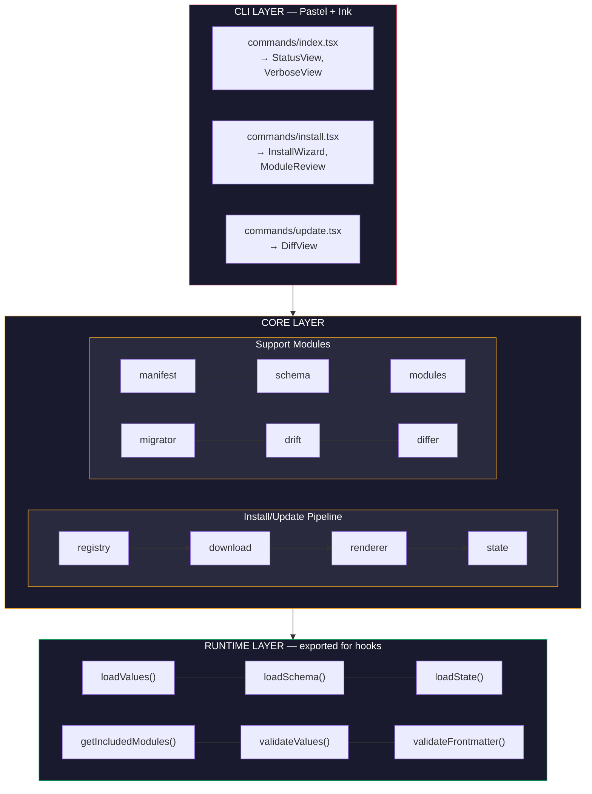
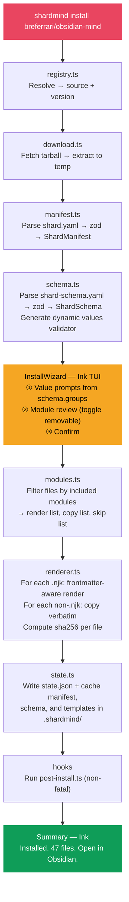

# ShardMind — Implementation Specification

> The engineering blueprint. Every module, every flow, every edge case.
> Designed to be read by humans and executed by AI coding agents.

**Companion to**: [ARCHITECTURE.md](ARCHITECTURE.md) (the what and why)
**This document**: the how, exactly

---

## 0. How to Read This Document

This spec is organized by **module**. Each module section contains:

- **Purpose**: one sentence
- **Inputs / Outputs**: exact types
- **Algorithm**: step-by-step, numbered
- **Error cases**: what can go wrong and what to do
- **Dependencies**: other modules it imports
- **Tests**: what to test, referencing fixtures

Diagrams use Mermaid for GitHub rendering. Data formats show exact shapes. Decision points are explicit.

---

## 1. System Overview



---

## 2. Data Flow: Install



---

## 3. Data Flow: Update

Concretely driven by the `useUpdateMachine` hook in `source/commands/hooks/use-update-machine.ts`. Each node below corresponds to a phase variant in the machine's `Phase` union.

```mermaid
graph TD
    A["shardmind update"] --> B

    B["state.ts<br/>Read state.json → source, version, modules, files<br/>Absent → throw UPDATE_NO_INSTALL (exit 1)"] --> C
    C["registry + download<br/>Resolve state.source → tarball<br/>version + tarball_sha match state → up-to-date, exit"] --> D
    D["manifest + schema<br/>Parse new shard.yaml, shard-schema.yaml"] --> E
    E["values-io + migrator<br/>Load shard-values.yaml → applyMigrations<br/>(rename/added/removed/type_changed)"] --> F

    F["computeSchemaAdditions<br/>newRequiredKeys[], newOptionalModules[]"] --> G1
    G1{New required<br/>values?}
    G1 -->|Yes| G2["prompt-new-values<br/>NewValuesPrompt — Ink TUI"]
    G1 -->|No| H1
    G2 --> H1
    H1{New optional<br/>modules?}
    H1 -->|Yes| H2["prompt-new-modules<br/>NewModulesReview — Ink TUI"]
    H1 -->|No| I
    H2 --> I

    I["detectDrift + renderNewShard (parallel)<br/>Classify files; render new shard once"] --> J1

    J1{Modified files<br/>no longer in new shard?}
    J1 -->|Yes| J2["prompt-removed-files<br/>RemovedFilesReview — Ink TUI<br/>keep / delete per file"]
    J1 -->|No| K
    J2 --> K

    K["planUpdate<br/>Per-file UpdateAction + pendingConflicts<br/>(modified-file merges run in parallel, bounded 16)"] --> L1

    L1{Pending<br/>conflicts?}
    L1 -->|Yes| L2["resolving-conflicts loop<br/>DiffView per file<br/>accept_new / keep_mine / skip"]
    L1 -->|No| M
    L2 --> M

    M["writing — update-executor<br/>Snapshot → write pass → delete pass<br/>Re-cache templates + manifest + schema<br/>writeState"] --> N
    N["post-update hook<br/>(subprocess via tsx, non-fatal)"] --> O
    O["summary — UpdateSummary<br/>Counts, conflict resolutions,<br/>migration warnings, hook output"]

    M -->|Any failure| R["rollbackUpdate<br/>Restore snapshot + erase added paths"]

    style A fill:#e94560,stroke:#e94560,color:#fff
    style L2 fill:#e94560,stroke:#e94560,color:#fff
    style M fill:#f5a623,stroke:#f5a623,color:#000
    style O fill:#0f9d58,stroke:#0f9d58,color:#fff
    style R fill:#777,stroke:#777,color:#fff
```



---

## 4. Module Specifications

### 4.1 `registry.ts`

**Purpose**: Resolve a shard identifier to a downloadable source URL and version.

**Inputs**:
```typescript
resolve(shardRef: string): Promise<ResolvedShard>
// shardRef examples:
//   "breferrari/obsidian-mind"         → latest from registry
//   "breferrari/obsidian-mind@3.5.0"   → specific version
//   "github:breferrari/obsidian-mind"  → direct GitHub, skip registry
```

**Outputs**:
```typescript
interface ResolvedShard {
  namespace: string;          // "breferrari"
  name: string;               // "obsidian-mind"
  version: string;            // "3.5.0"
  source: string;             // "github:breferrari/obsidian-mind"
  tarballUrl: string;         // "https://api.github.com/repos/breferrari/obsidian-mind/tarball/v3.5.0"
}
```

**Algorithm**:
1. Parse `shardRef` into namespace, name, and optional version
2. If `shardRef` starts with `github:` → direct mode, skip registry
3. Else → fetch registry index from `${REGISTRY_INDEX_URL}` (defaults to `https://raw.githubusercontent.com/shardmind/registry/main/index.json`; see env-var overrides below)
4. Look up `namespace/name` in registry
5. If version not specified → use `latest` field from registry
6. Construct tarball URL: `${GITHUB_API_BASE}/repos/{owner}/{repo}/tarball/v{version}` (defaults to `https://api.github.com`; see env-var overrides below)
7. Verify the tag exists (HEAD request to GitHub API). 404 → error.

**Env-var overrides** (read once at module load, overridable for testing,
enterprise GitHub Enterprise deployments, and future self-hosted registry
scenarios — see ARCHITECTURE §19.7):

| Variable | Default | Effect |
|----------|---------|--------|
| `SHARDMIND_GITHUB_API_BASE` | `https://api.github.com` | Routes `releases/latest` + tarball calls through the provided base. Surrounding whitespace and trailing slashes are stripped. |
| `SHARDMIND_REGISTRY_INDEX_URL` | `https://raw.githubusercontent.com/shardmind/registry/main/index.json` | Points the namespaced `owner/repo` index lookup at an alternate registry. Surrounding whitespace is stripped. |

Both are invisible to production users — the defaults reproduce the
current behavior exactly. The E2E suite uses `SHARDMIND_GITHUB_API_BASE`
to point at a local stub server (see `tests/e2e/helpers/github-stub.ts`).

**Error cases**:
- Shard not found in registry → `"Shard 'foo/bar' not found. Check spelling or use github:owner/repo for direct install."`
- Version not found → `"Version 3.5.0 not found for breferrari/obsidian-mind. Available: 3.4.0, 3.3.0"`
- Network failure → `"Could not reach GitHub. Check your connection."`
- Rate limited → `"GitHub API rate limit reached. Set GITHUB_TOKEN for higher limits."`

**Environment**: Reads `GITHUB_TOKEN` env var for authenticated requests (5000 req/hr vs 60 unauthenticated).

**Dependencies**: none (uses built-in `fetch`).

---

### 4.2 `download.ts`

**Purpose**: Download and extract a shard tarball to a temporary directory.

**Inputs**:
```typescript
downloadShard(tarballUrl: string): Promise<TempShard>
```

**Outputs**:
```typescript
interface TempShard {
  tempDir: string;             // Absolute path to extracted shard root
  manifest: string;            // Path to .shardmind/shard.yaml within tempDir
  schema: string;              // Path to .shardmind/shard-schema.yaml within tempDir
  tarball_sha256: string;      // sha256 of the tarball bytes (recorded in state.json)
  cleanup: () => Promise<void>;
}
```

**Algorithm**:
1. Create temp directory: `os.tmpdir() + '/shardmind-' + crypto.randomUUID()`.
2. Fetch tarball URL with `fetch()`, following redirects (GitHub returns 302).
3. Set headers: `Accept: application/vnd.github+json`, `Authorization: Bearer ${GITHUB_TOKEN}` for github.com/codeload.github.com hosts when the env var is set.
4. Pipe response body through a hash-tap transform (sha256) and into `tar.x({ strip: 1, C: tempDir })`.
   - `strip: 1` removes the GitHub archive's top-level directory (`owner-repo-sha/`).
   - `tar.x` normalizes Windows path separators to forward slashes, so the engine never sees `\` in a relPath.
5. Verify `<tempDir>/.shardmind/shard.yaml` exists. If not → throw `DOWNLOAD_MISSING_MANIFEST`.
6. Verify `<tempDir>/.shardmind/shard-schema.yaml` exists. If not → throw `DOWNLOAD_MISSING_SCHEMA`.
7. Return `TempShard` with `cleanup` function and `tarball_sha256` from the hash tap.

**Error cases**:
- HTTP non-200 → `DOWNLOAD_HTTP_ERROR` with `"Failed to download: HTTP {status}"`.
- Network failure → `DOWNLOAD_HTTP_ERROR` with the underlying message.
- Empty body → `DOWNLOAD_HTTP_ERROR`.
- Tarball corrupted → `DOWNLOAD_INVALID_TARBALL`.
- Missing `.shardmind/shard.yaml` → `DOWNLOAD_MISSING_MANIFEST`.
- Missing `.shardmind/shard-schema.yaml` → `DOWNLOAD_MISSING_SCHEMA`.
- Disk full → propagate OS error.

**Dependencies**: `tar` (node-tar), `node:crypto`, `node:stream`.

---

### 4.3 `manifest.ts`

**Purpose**: Parse and validate `shard.yaml`.

**Inputs**:
```typescript
parseManifest(filePath: string): Promise<ShardManifest>
```

**Outputs**: `ShardManifest` (see types in architecture doc section 16.3).

**Zod schema**:
```typescript
const ShardManifestSchema = z.object({
  apiVersion: z.literal('v1'),
  name: z.string().regex(/^[a-z0-9-]+$/),
  namespace: z.string().regex(/^[a-z0-9-]+$/),
  version: z.string().refine(v => semver.valid(v), 'Must be valid semver'),
  description: z.string().optional(),
  persona: z.string().optional(),
  license: z.string().optional(),
  homepage: z.string().url().optional(),
  requires: z.object({
    obsidian: z.string().optional(),
    node: z.string().optional(),
  }).optional(),
  dependencies: z.array(z.object({
    name: z.string(),
    namespace: z.string(),
    version: z.string(),
  })).default([]),
  hooks: z.object({
    'post-install': z.string().optional(),
    'post-update': z.string().optional(),
    // Per-shard hook execution timeout in milliseconds. Default 30_000
    // when absent; clamped to 1_000..600_000 at validation time.
    timeout_ms: z.number().int().min(1_000).max(600_000).optional(),
  }).default({}),
});
```

**Error cases**:
- YAML parse error → `"shard.yaml is not valid YAML: {error}"`
- Zod validation error → `"shard.yaml validation failed: {field}: {message}"`

**Dependencies**: `yaml`, `zod`, `semver`.

---

### 4.4 `schema.ts`

**Purpose**: Parse `shard-schema.yaml` and generate a dynamic zod validator for user values.

**Inputs**:
```typescript
parseSchema(filePath: string): Promise<ShardSchema>
buildValuesValidator(schema: ShardSchema): z.ZodObject<any>
```

**Algorithm for `buildValuesValidator`**:
1. For each entry in `schema.values`:
   - `string` → `z.string()`
   - `boolean` → `z.boolean()`
   - `number` → `z.number()`, apply `.min()/.max()` if set
   - `select` → `z.enum([option.value, ...])`
   - `multiselect` → `z.array(z.enum([...]))`
   - `list` → `z.array(z.any())`
2. Apply `.optional()` if `required` is false or absent
3. Apply `.default()` if `default` is set and not a template expression
4. Return `z.object(shape)`

**Computed defaults**: If a default value is a string starting with `{{` (e.g., `"{{ vault_purpose == 'engineering' }}"`), it's evaluated after all non-computed values are collected. This is relevant for the install wizard — collect non-computed values first, then resolve computed defaults, then present them as pre-filled.

**Dependencies**: `yaml`, `zod`.

---

### 4.5 `modules.ts`

**Purpose**: Walk the shard root and classify every file into render / copy / skip based on module inclusion. Under the v6 layout (closed in [#73](https://github.com/breferrari/shardmind/issues/73)) the shard repo *is* the installed vault — no `templates/` wrapper, no separate `commands/` / `agents/` / `codex/` trees.

**Inputs**:
```typescript
resolveModules(
  schema: ShardSchema,
  selections: Record<string, 'included' | 'excluded'>,
  rootDir: string,                           // shard tempDir (post-extract) or examples/<shard>
): Promise<ModuleResolution>

walkShardSource(                             // shared with state.ts:cacheTemplates
  rootDir: string,
  ignoreFilter: IgnoreFilter,
): Promise<WalkedFile[]>
```

**Outputs**:
```typescript
interface ModuleResolution {
  render: FileEntry[];      // .njk files to render with Nunjucks
  copy: FileEntry[];        // Non-.njk files to copy verbatim
  skip: FileEntry[];        // Files gated by excluded modules
}

interface FileEntry {
  sourcePath: string;       // Absolute path in rootDir
  outputPath: string;       // Path in vault (= relPath, with .njk stripped if rendered)
  module: string | null;    // Which module this belongs to, or null for always-included
  volatile: boolean;        // Has {# shardmind: volatile #} hint
  iterator: string | null;  // For _each templates: the parent dir name (iterator key)
}

interface WalkedFile {
  relPath: string;          // Posix path from rootDir (e.g. "brain/North Star.md")
  absPath: string;          // Absolute path on disk
}
```

**Algorithm**:
1. Load `.shardmindignore` from `rootDir` via `loadShardmindignore` (§4.5b). Returns `EMPTY_FILTER` if absent.
2. Walk `rootDir` recursively (DFS). For each `Dirent`:
   a. If `entry.isSymbolicLink()` → throw `WALK_SYMLINK_REJECTED` (security baseline; an untrusted shard could symlink outside the install target).
   b. If neither file nor directory (socket, FIFO, device) → throw `WALK_INVALID_ENTRY`.
   c. Compute `relPath = relDir === '' ? entry.name : relDir + '/' + entry.name`.
   d. If `isTier1Excluded(relPath)` (§4.5a) → skip the entry entirely (no recursion for dirs).
   e. If `ignoreFilter.ignores(relPath, isDir)` → skip.
   f. Directory → recurse. File → push `{ relPath, absPath }`.
3. For each walked file, classify:
   a. **Module assignment** (priority order, returns first hit):
      i. Path-prefix match against `mod.paths` (e.g. `brain/Index.md` → module `brain` with `paths: ['brain/']`).
      ii. Exact match against `bases/<id>.base.njk` for `mod.bases`.
      iii. Per-name match: when the file's parent-dir component (case-insensitive) is `commands` or `agents`, match basename-no-ext against `mod.commands` / `mod.agents` lists. Scopes the heuristic so a vault note named after a command isn't gated by it.
      iv. Else `null` (always-included; e.g. agent operating manuals at the vault root).
   b. **Excluded?** If `moduleId !== null && selections[moduleId] === 'excluded'` → push to `skip` and continue.
   c. **Render or copy?** `relPath.endsWith('.njk')` → render entry; else copy entry.
   d. **Render-only metadata**: read first 256 bytes for `{# shardmind: volatile #}` (volatile flag), and extract iterator key from `_each` parent dir name.
   e. **Output path**: `relPath` for copies; `relPath` minus `.njk` for renders.

**Output path mapping under v6**: source path is preserved (no `templates/` to strip; no special-case rename for `settings.json.njk` since the source is already `.claude/settings.json.njk`).

```
.shardmind/shard.yaml                ← engine reads via download.ts (§4.2); excluded from install set by Tier 1
CLAUDE.md                            → CLAUDE.md (Tier 2 default-included)
Home.md.njk                          → Home.md (rendered; suffix stripped)
brain/North Star.md.njk              → brain/North Star.md (rendered; module: 'brain')
bases/incidents.base.njk             → bases/incidents.base (rendered; module via mod.bases)
.claude/commands/reflect.md          → .claude/commands/reflect.md (copy verbatim; module via mod.commands per-name match)
.claude/settings.json.njk            → .claude/settings.json (rendered; dotfolder convention)
.codex/prompts/standup.md            → .codex/prompts/standup.md (copy verbatim)
.shardmindignore                     → .shardmindignore (Tier 2 — installed verbatim, inert post-install)
```

**Errors**:
- `WALK_SYMLINK_REJECTED` — entry `<relPath>` is a symbolic link.
- `WALK_INVALID_ENTRY` — entry `<relPath>` is neither file nor directory.
- `SHARDMINDIGNORE_NEGATION_UNSUPPORTED` (from §4.5b) — author wrote `!negation` patterns; deferred to v0.2 #87.
- `SHARDMINDIGNORE_READ_FAILED` (from §4.5b) — IO error reading `.shardmindignore` other than ENOENT.

**Shared with `state.ts:cacheTemplates`**: the walker is exported so the merge-base cache mirrors the install set (same Tier 1 + ignore + symlink filter applied to both sides).

**Dependencies**: `node:fs/promises`, `node:path`, `./tier1`, `./shardmindignore`.

### 4.5a `tier1.ts`

**Purpose**: Engine-enforced source-side path exclusions. Authors can't toggle these off.

**API**:
```typescript
export const TIER1: Readonly<{
  excludedDirs: readonly ['.shardmind', '.git', '.github'];
  excludedFiles: readonly [
    '.obsidian/workspace.json',
    '.obsidian/workspace-mobile.json',
    '.obsidian/graph.json',
  ];
}>;
export function isTier1Excluded(relPosixPath: string): boolean;
```

**Algorithm**: lowercase `relPosixPath`; for each excluded dir, return true on `lower === dir || lower.startsWith(dir + '/')`; for each excluded file, return true on `lower === file`. Case-insensitive for HFS+/APFS/NTFS parity (a shard committing `.GIT/HEAD` from Windows is still excluded).

**Why each dir/file is excluded**:
- `.shardmind/` (source-side) — engine metadata; the installed-side `.shardmind/` is written separately by `cacheManifest`.
- `.git/` — VCS database.
- `.github/` — defensive: prevents accidental Actions activation if the user later git-pushes their personal vault.
- `.obsidian/{workspace,workspace-mobile,graph}.json` — Obsidian's user-specific ephemeral state. Other `.obsidian/*` is author-controlled.

Symlinks are rejected by the walker (`WALK_SYMLINK_REJECTED`), not by Tier 1 path matching.

**Dependencies**: none (pure data + matcher).

### 4.5b `shardmindignore.ts`

**Purpose**: Parse the root-level `.shardmindignore` into an `IgnoreFilter` that the walker consults per-entry.

**API**:
```typescript
export interface IgnoreFilter {
  ignores(relPosixPath: string, isDir: boolean): boolean;
}
export async function loadShardmindignore(rootDir: string): Promise<IgnoreFilter>;
export function parseShardmindignore(source: string): IgnoreFilter;
```

**Algorithm**:
1. `loadShardmindignore`: read `<rootDir>/.shardmindignore` as utf-8. ENOENT → return `EMPTY_FILTER`. Other IO errors → throw `SHARDMINDIGNORE_READ_FAILED`.
2. `parseShardmindignore`:
   a. Split on `\r?\n`. For each line, strip whitespace; skip blanks and `#`-comments.
   b. If a non-comment line starts with `!` → record line number for the negation-rejection error.
   c. If any negations were recorded → throw `SHARDMINDIGNORE_NEGATION_UNSUPPORTED` listing every line. Negation deferred to v0.2 ([#87](https://github.com/breferrari/shardmind/issues/87)).
   d. Pass the full source to `ignore().add(source)` — the `ignore` package does the real glob compilation.
3. `IgnoreFilter.ignores(relPosixPath, isDir)`: append `/` to the path when `isDir && !endsWith('/')` so dir-only patterns (`build/`) match correctly, then delegate to the `ignore` package.

**Notes**:
- Gitignore-spec escape semantics work: `\!literal-bang.md` is preserved by `trim()` (the backslash isn't stripped), so the negation pre-pass correctly recognizes only bare-bang lines.
- The pre-pass + `ignore().add()` does a double scan of the source string. Acceptable cost (sources are typically <1KB) for clear error reporting.

**Errors**:
- `SHARDMINDIGNORE_NEGATION_UNSUPPORTED` — message lists every offending line; hint points at #87.
- `SHARDMINDIGNORE_READ_FAILED` — non-ENOENT IO error; hint references the file path.

**Dependencies**: `node:fs/promises`, `node:path`, `ignore` (npm), `runtime/types`, `runtime/errno`.

---

### 4.6 `renderer.ts`

**Purpose**: Render Nunjucks templates with values and computed context. Frontmatter-aware.

**Inputs**:
```typescript
renderFile(entry: FileEntry, context: RenderContext): Promise<RenderedFile>

interface RenderContext {
  values: Record<string, unknown>;              // From shard-values.yaml
  included_modules: string[];                    // Computed from module selections
  shard: { name: string; version: string; };    // From manifest
  install_date: string;                          // ISO timestamp
}

interface RenderedFile {
  outputPath: string;
  content: string;
  hash: string;              // sha256 of content
  volatile: boolean;
}
```

**Algorithm**:
1. Configure Nunjucks environment:
   ```typescript
   const env = nunjucks.configure(tempDir, {
     autoescape: false,
     trimBlocks: true,
     lstripBlocks: true,
   });
   ```
2. Read template source from `entry.sourcePath`
3. If `entry.iterator` is set (this is an `_each` template):
   - Look up `context.values[entry.iterator]` (must be an array)
   - For each item in the array:
     - Render template with `{ ...context, item }`
     - Output path: replace `_each` with `item.slug` or `item.name`
     - Return multiple RenderedFile results
4. Check if content starts with `---\n` (has frontmatter):
   - Yes → split into frontmatter string + body string at second `---`
   - Render frontmatter string with Nunjucks
   - Parse rendered frontmatter with `YAML.parse()`
   - Re-stringify with `YAML.stringify()` (ensures valid YAML, handles escaping)
   - Render body string with Nunjucks
   - Recombine: `"---\n" + safeFrontmatter + "\n---\n" + renderedBody`
   - No → render entire content with Nunjucks
5. Compute `sha256` hash of final content
6. Return RenderedFile

**Computed context variables** (injected alongside user values):
- `included_modules: string[]` — list of included module IDs
- `shard.name`, `shard.version` — from manifest
- `install_date` — ISO timestamp of install
- `year` — current year (for copyright, archive paths)

**Error cases**:
- Nunjucks syntax error → `"Template error in {file}: {message} at line {line}"`
- YAML frontmatter parse error → `"Frontmatter in {file} rendered invalid YAML: {error}"`
- Missing iterator value → `"Template {file} is an _each template but values.{key} is not an array"`

**Dependencies**: `nunjucks`, `yaml`, `node:crypto`.

---

### 4.7 `state.ts`

**Purpose**: Read and write `.shardmind/state.json`. Create `.shardmind/` directory structure.

**Inputs/Outputs**:
```typescript
readState(vaultRoot: string): Promise<ShardState | null>
writeState(vaultRoot: string, state: ShardState): Promise<void>
initShardDir(vaultRoot: string): Promise<void>
cacheTemplates(vaultRoot: string, tempDir: string): Promise<void>
cacheManifest(vaultRoot: string, manifest: ShardManifest, schema: ShardSchema): Promise<void>
```

**`initShardDir` creates**:
```
.shardmind/
├── state.json
├── shard.yaml
├── shard-schema.yaml
└── templates/
```

**`cacheTemplates`**: under v6 ([#73](https://github.com/breferrari/shardmind/issues/73)) the source no longer has a `templates/` wrapper. The function:

1. Asserts `<tempDir>/.shardmind/shard.yaml` exists. If not → throws `STATE_CACHE_MISSING_MANIFEST`.
2. Loads `.shardmindignore` from the source root via `loadShardmindignore` (§4.5b).
3. Walks the source via `walkShardSource` (§4.5) — same Tier 1 + ignore + symlink-rejection filter that `resolveModules` applies to the install set.
4. Removes any prior `.shardmind/templates/` (rebuild from scratch).
5. Copies each walked file to `<vaultRoot>/.shardmind/templates/<relPath>` via `mapConcurrent(16)` (bounded parallelism — same budget the update planner uses).

Module gating is **not** applied to the cache; toggling a module on at update time must be able to read its source from the cache without re-downloading. The cache mirrors the post-walk-filter set, not the post-selection set.

**Errors**:
- `STATE_CACHE_MISSING_MANIFEST` — `.shardmind/shard.yaml` absent in tempDir.
- `WALK_SYMLINK_REJECTED` / `WALK_INVALID_ENTRY` (propagated from the walker).
- `SHARDMINDIGNORE_*` (propagated from the ignore loader).

**Dependencies**: `yaml`, `node:fs/promises`, `node:path`, `./modules` (walkShardSource), `./shardmindignore` (loadShardmindignore), `./fs-utils` (mapConcurrent).

---

### 4.8 `drift.ts`

**Purpose**: Detect ownership state of each file and compute merge actions.

**Inputs**:
```typescript
detectDrift(
  vaultRoot: string,
  state: ShardState,
): Promise<DriftReport>

interface DriftReport {
  managed: DriftEntry[];     // Hash matches — safe to overwrite
  modified: DriftEntry[];    // Hash differs — user edited
  volatile: DriftEntry[];    // Marked volatile — skip
  missing: DriftEntry[];     // In state but not on disk
  orphaned: string[];        // On disk in tracked paths but not in state
}

interface DriftEntry {
  path: string;
  template: string | null;
  renderedHash: string;       // From state.json
  actualHash: string | null;  // Computed from disk (null if missing)
  ownership: 'managed' | 'modified' | 'volatile';
}
```

**Algorithm**:
1. For each file in `state.files` (in parallel via `Promise.all`):
   a. If `FileState.ownership === 'user'` (volatile at install time) → `DriftEntry` with `ownership: 'volatile'` → add to `volatile`. Never hashed; content may diverge by design.
   b. Read file from disk as `Buffer` (not UTF-8). If ENOENT → add to `missing` (propagate state ownership).
   c. Compute `sha256(buffer)` over raw bytes. This is load-bearing: `install-executor` hashes copy-origin files (images, PDFs, binary assets) as bytes too, so a bytewise hash here stays consistent across install/update cycles. A UTF-8 decode-then-hash would replace invalid sequences with `U+FFFD` and mis-classify every binary asset as `modified` on first status check.
   d. Compare against `state.files[path].rendered_hash`. Equal → `managed`. Different → `modified`.
2. Orphan scan (runs in parallel with the classification): union of parent directories of every tracked path is the set of tracked directories. For each tracked directory, `readdir` non-recursively and report files not in `state.files` as orphans. Excludes engine-reserved files (`VALUES_FILE`) and never-scanned directories (`.shardmind`, `.git`, `.obsidian`). Subdirectories of a tracked directory are not auto-scanned — they only count if they themselves contain a tracked file.
3. Return classified report.

**Rationale for non-recursive orphan scan**: the shard only claims to manage what it tracks. A user's `brain/daily/2026-04-19.md` under an untracked subdirectory is their territory, not an orphan. But a `skills/my-extra.md` sibling of a tracked `skills/leadership.md` is an orphan because `skills/` is territory the shard already claims.

**Dependencies**: `node:fs`, `node:crypto`.

---

### 4.9 `differ.ts`

**Purpose**: Compute three-way merge between base, theirs (user), and ours (new template).

**Inputs**:
```typescript
computeMergeAction(input: {
  path: string;
  ownership: 'managed' | 'modified';
  oldTemplate: string;         // From .shardmind/templates/ cache
  newTemplate: string;         // From new shard version
  oldValues: Record<string, unknown>;
  newValues: Record<string, unknown>;
  actualContent: string;       // File on disk
  renderContext: RenderContext;
}): Promise<MergeAction>

type MergeAction =
  | { type: 'skip'; reason: string }
  | { type: 'overwrite'; content: string }
  | { type: 'auto_merge'; content: string; stats: MergeStats }
  | { type: 'conflict'; result: MergeResult }

interface MergeStats {
  linesUnchanged: number;
  linesAutoMerged: number;
}
```

**Algorithm**:
1. Render old template with old values → `base`
2. Render new template with new values → `ours`
3. `theirs` = `actualContent` (what's on disk)
4. If `sha256(base) === sha256(ours)` → no upstream change → `{ type: 'skip' }`
5. If ownership is `managed` (base === theirs) → `{ type: 'overwrite', content: ours }`
6. If ownership is `modified`:
   a. Run `diff3MergeRegions(theirs.split(/\r?\n/), base.split(/\r?\n/), ours.split(/\r?\n/))` — not the flat `diff3Merge`; the regions variant exposes `buffer: 'a' | 'o' | 'b'` on stable regions and `aContent / oContent / bContent` on unstable ones, which is the only way to distinguish stable-unchanged (`buffer === 'o'`) from stable-auto-merged (`buffer === 'a' | 'b'`) lines. The `/\r?\n/` split tolerates CRLF on Windows-saved files; merged output preserves `theirs`'s dominant line ending (`\r\n` if any CRLF in `theirs`, else `\n`) so `shardmind update` doesn't silently flip line endings on Windows users' managed files.
   b. For each stable region: emit `bufferContent`. For each unstable region: if `aContent === oContent` take `bContent`; if `bContent === oContent` take `aContent`; if `aContent === bContent` take either (false conflict); else emit git-style conflict markers and record a `ConflictRegion`.
   c. No conflicts → `{ type: 'auto_merge', content, stats }`. Conflicts → `{ type: 'conflict', result: { content, conflicts, stats } }`.

**`MergeResult`** (for conflicts):
```typescript
interface MergeStatsWithConflicts {
  linesUnchanged: number;
  linesAutoMerged: number;
  linesConflicted: number;
}

interface MergeResult {
  content: string;              // Merged content with conflict markers
  conflicts: ConflictRegion[]; // non-empty ⇒ conflicts exist; consumers read `conflicts.length > 0`
  stats: MergeStatsWithConflicts;
}

interface ConflictRegion {
  lineStart: number;
  lineEnd: number;
  base: string;
  theirs: string;
  ours: string;
}
```

**Conflict markers** (same format as git):
```
<<<<<<< yours
User's version of conflicting lines
=======
Shard update version of conflicting lines
>>>>>>> shard update
```

**Dependencies**: `node-diff3`, `renderer.ts`, `node:crypto`.

---

### 4.10 `migrator.ts`

**Purpose**: Apply declared migrations to transform `shard-values.yaml` between versions.

**Inputs**:
```typescript
applyMigrations(
  values: Record<string, unknown>,
  currentVersion: string,
  targetVersion: string,
  migrations: Migration[],
): MigrationResult

interface MigrationResult {
  values: Record<string, unknown>;   // Transformed values
  applied: MigrationChange[];        // What was changed
  warnings: string[];                // Non-fatal issues
}
```

**Algorithm**:
1. Filter migrations where `semver.gt(migration.from_version, currentVersion)` and `semver.lte(migration.from_version, targetVersion)` — i.e. `currentVersion < from_version ≤ targetVersion`. This makes migrations idempotent: re-running an upgrade at the same target version picks up nothing.
2. Sort by `from_version` ascending.
3. For each migration in order, for each change:
   - `rename`: if `values[old]` present and `values[new]` absent, copy and delete the old key. If the target is already occupied, warn + skip (never overwrite — that would destroy user data). If the source is missing, warn + skip.
   - `added`: if `values[key]` is absent, set to `default`. If already present, no-op (no warning).
   - `removed`: delete `values[key]` and warn (users deserve to know a key they set is being discarded). No-op when already absent.
   - `type_changed`: evaluate `transform` in a `new Function('value', 'return (<expr>)')` sandbox. Catch and warn on any throw, preserving the original value. Sandboxing untrusted shards is not a goal of this layer — the threat model is "buggy transform", not "hostile transform" (shard authors can already ship arbitrary hook code; see ARCHITECTURE §8).
4. Return transformed values + changelog + warnings.

**Error cases**:
- `currentVersion` or `targetVersion` not valid semver → throw `MIGRATION_INVALID_VERSION`.
- Migration references key that doesn't exist → warning, skip.
- Transform expression throws → warning, keep original value.
- Rename target already has a value → warning, both keys preserved.

**Dependencies**: `semver`.

---

### 4.11 `update-planner.ts`

**Purpose**: Pure planner that consumes the drift report + new shard + user decisions and emits a complete `UpdatePlan` describing every per-file action the executor will perform.

**Inputs** (grouped to prevent cross-shard field mixing):
```typescript
planUpdate(input: PlanUpdateInput): Promise<UpdatePlan>

interface PlanUpdateInput {
  vault:   { root: string; state: ShardState; drift: DriftReport };
  values:  { old: Record<string, unknown>; new: Record<string, unknown> };
  newShard: {
    schema: ShardSchema;
    selections: ModuleSelections;
    tempDir: string;
    renderContext: RenderContext;
    filePlan?: NewFilePlan; // if already rendered, reuse to skip a pass
  };
  removedFileDecisions: Record<string, 'delete' | 'keep'>;
}
```

**Algorithm**:
1. If `newShard.filePlan` is supplied, reuse; otherwise call `renderNewShard` to produce the new-shard output set. Build a `Map<outputPath, NewFileEntry>` for O(1) lookup.
2. For each `drift.volatile` entry → emit `skip_volatile`.
3. For each `drift.managed` entry:
   - Not produced by the new shard → emit `delete`.
   - Produced with the same rendered hash → emit `noop`.
   - Produced with a different hash → emit `overwrite` with new content.
4. For each `drift.missing` entry:
   - Not in new shard → emit `delete` (state cleanup).
   - In new shard → emit `restore_missing` with new content.
5. For each `drift.modified` entry (run in parallel with bounded concurrency of 16):
   - Not in new shard → respect `removedFileDecisions[path]` (default `'keep'`). Emit `keep_as_user` or `delete`.
   - Cached old template missing → fall back to `conflictFromDirect` (single-region full-file conflict).
   - Otherwise → call `computeMergeAction`. Translate its four outcomes to `noop`/`overwrite`/`auto_merge`/`conflict` actions. Record `theirsHash` on conflict so the executor can skip re-hashing.
6. For every file in the new-shard plan not in `state.files` → emit `add`.
7. Return `{ actions, pendingConflicts, counts }`. `pendingConflicts` is the subset of `conflict` actions the state machine will drive through DiffView.

**Key invariants**:
- Pure: no writes, no network. Only reads.
- Deterministic: same inputs → same output. Locked by a property-based test.
- Correctness of `theirsHash`: captured at plan time, used at write time — if the user edits the file between plan and write, the executor treats the captured hash as ground truth (the write has already been planned).

**Error cases**:
- Drift reports a modified file not in `state.files` → `UPDATE_CACHE_MISSING`. Inconsistent inputs should surface loudly.

**Dependencies**: `differ.ts`, `renderer.ts`, `modules.ts`, `fs-utils.ts` (`sha256`, `mapConcurrent`), `drift.ts` (type only).

---

### 4.12 `update-executor.ts`

**Purpose**: Apply an `UpdatePlan` against a real vault, with snapshot-based rollback.

**Flow**:
1. Allocate a unique backup directory under `.shardmind/backups/update-<ISO-timestamp>[-N]/`. The millisecond-precision timestamp and numeric suffix together guarantee no collisions between concurrent or near-simultaneous updates.
2. **Snapshot**: copy every file the plan touches (modified content + `.shardmind/state.json` + cached `manifest.yaml`/`shard-schema.yaml`/`templates/`) into `files/` and `cache/` subdirectories of the backup dir. Parallel copies bounded by `SNAPSHOT_CONCURRENCY=16`.
3. **Write pass**: for each non-delete action, fire progress event, write content, update in-memory `nextFiles` map, record summary stat. `overwrite` never adds to `addedPaths` (rollback erasure list); `add` and `restore_missing` do. `keep_as_user` untracks the path from `nextFiles` so the engine stops considering it managed.
4. **Delete pass**: runs after all writes so a rename-style move (delete + add at a different path) can't clobber the incoming file.
5. **Cache + state**: call `initShardDir`, `cacheTemplates`, `cacheManifest`, `writeValuesFile`, `writeState`. Order matters — state is the last thing we touch.
6. **Hook**: call `runPostUpdateHook` with a built `HookContext` and an `AbortController` signal. Behavior is full-execution (spawn the hook through the bundled `tsx` loader via `source/internal/hook-runner.ts`), capture stdout + stderr separately (256 KB per-stream cap), enforce the shard's `hooks.timeout_ms` (default 30 s). Non-fatal per Helm pattern: a throw / non-zero exit / timeout / cancel surface as `HookResult.failed` with captured output, the update summary renders a yellow warning, and the process exit code stays 0. No rollback past this point. See §4.14a for the execution algorithm.
7. **Rollback**: any exception between snapshot and state-write triggers `rollbackUpdate(vaultRoot, backupDir, addedPaths)`. Removes every file in `addedPaths` (files we newly introduced), then restores every snapshotted file from `files/` and `cache/`. Idempotent — running it twice has no observable effect.

**Dry-run mode**:
- Skips backup allocation (`backupDir` in the result is `null`).
- Skips all disk writes.
- Still computes counts and summary so the user can see "what would happen".

**Dependencies**: `fs-utils.ts`, `state.ts` (`writeState`, `cacheTemplates`, `cacheManifest`, `initShardDir`), `install-planner.ts` (`hashValues`), `hook.ts` (`runPostUpdateHook`).

---

### 4.13 `values-io.ts`

**Purpose**: Single YAML-load path for both install's optional `--values` prefill file and update's canonical `shard-values.yaml` read. Subtle behavioral difference — install filters unknown keys against the schema, update keeps everything so migrations can handle the shape change — is a parameter, not a fork.

**Inputs**:
```typescript
loadValuesYaml(
  filePath: string,
  opts: {
    label: string;                     // embedded in error messages
    schemaFilter?: ShardSchema;        // filter unknown keys if set
    errors: { readFailed: ErrorCode; invalid: ErrorCode };
  },
): Promise<Record<string, unknown>>
```

Returns a plain object. Caller-supplied error codes keep each call site's hint contextual.

---

### 4.14 `status.ts`

**Purpose**: Pure aggregator for the `shardmind` (root) command. Produces a `StatusReport` from `state.json`, cached manifest, cached schema, drift detection, values validation, update-check cache, and — when `verbose=true` — per-file frontmatter linting plus environment probing. Consumed by `StatusView` and `VerboseView`.

**Inputs**:
```typescript
buildStatusReport(
  vaultRoot: string,
  opts: {
    verbose: boolean;
    now?: number;              // injectable clock for tests
    skipUpdateCheck?: boolean; // offline/CI mode
  },
): Promise<StatusReport | null>
```

Returns `null` when the vault has no `.shardmind/state.json` — the "not in a shard-managed vault" signal. Never throws on section-level failures; each sub-loader (manifest, schema, drift, values) contributes a `StatusWarning` if it can't do its job, and the aggregator keeps building.

**Algorithm**:
1. `readState(vaultRoot)`. If `null` → return `null` immediately.
2. In parallel:
   - Load cached manifest via `parseManifest(.shardmind/shard.yaml)` (failure → synthesize a minimal manifest from `state.shard` + warning).
   - Load cached schema via `parseSchema(.shardmind/shard-schema.yaml)` (failure → values/frontmatter sections degrade + warning).
   - `detectDrift(vaultRoot, state)` (failure → empty drift + warning).
   - Resolve update availability via `core/update-check.getLatestVersion(vaultRoot, state.source, now)`, unless `skipUpdateCheck` (then report `unknown`).
   - Validate `shard-values.yaml` via `buildValuesValidator(schema).safeParse()`.
3. If `verbose`, fan three independent passes out via `Promise.all`:
   - **Per-modified-file diff.** For each entry in `drift.modified` (capped at 20), read the cached template from `.shardmind/templates/<relative>`, render with current values + selections via `renderString(...)`, diff rendered base against actual disk content via `diffLines` (CRLF + UTF-8-BOM normalized first), and record `{ linesAdded, linesRemoved }`. Every failure step (missing template / render throw / unreadable file) surfaces as a `skipped` variant. Bounded by `MODIFIED_DIFF_CONCURRENCY = 8` to cap disk + heap pressure.
   - **Frontmatter lint.** Walk drift's `managed + modified` `.md` files with `mapConcurrent(16, …)`, run `validateFrontmatter()`, collect missing-key rows (capped at 20).
   - **Environment probe.** Report `process.version` and a parallel PATH scan for an `obsidian`/`Obsidian.exe` binary.
4. Format `installed_at` / `updated_at` via `relativeTimeAgo(fromIso, now)` with buckets `just now → minutes → hours → days → weeks → months → over a year ago`.
5. Emit section warnings (`update available`, `N modified`, `M missing`, `values invalid`, `N frontmatter issues`, and — in verbose mode — `UPDATE_CHECK_CACHE_CORRUPT` if the cache layer healed a corrupt entry during the run) and return the aggregated `StatusReport`.

**Caps**:
- `MAX_PATHS_PER_BUCKET = 20` on every `*Paths` list (counts are full; lists are capped, `truncated` flag set when clamped).
- `MAX_FRONTMATTER_ISSUES = 20`.
- `MAX_INVALID_VALUE_KEYS = 20` with `invalidCount` preserving the pre-cap total.
- `FRONTMATTER_READ_CONCURRENCY = 16` (matches `SNAPSHOT_CONCURRENCY` in update-executor).
- `MODIFIED_DIFF_CONCURRENCY = 8` for the per-file render + diff pass.

**Deviations from the spec** (`docs/ARCHITECTURE.md §10.2–10.3`):
- Flavor text like `"you added a custom section"` is rendered as a plain path without a natural-language summary — semantic diff of user edits would require an LLM. Numeric `+N/−M` counts **are** shipped.
- Shard-specific environment checks (e.g. `"QMD not installed"`) are absent because no `status` hook exists yet (hooks are post-install/post-update only); this remains a future shard-author feature.

**Dependencies**: `core/state`, `core/drift`, `core/manifest`, `core/schema`, `core/values-io`, `core/update-check`, `runtime/frontmatter`, `core/fs-utils`.

### 4.15 `update-check.ts`

**Purpose**: 24-hour cached "latest GitHub release tag" lookup for a given `state.source`. Shared between the status command (read path) and the update command (priming path) so status invocations don't hammer the GitHub API.

**Inputs**:
```typescript
getLatestVersion(
  vaultRoot: string,
  source: string,              // e.g. "github:owner/repo"
  now?: number,
): Promise<UpdateCheckResult>

primeLatestVersion(
  vaultRoot: string,
  source: string,
  latest_version: string,
  now?: number,
): Promise<void>

readCache(vaultRoot: string): Promise<ReadCacheResult>

interface ReadCacheResult {
  cache: UpdateCheck | null;
  /** True when a prior cache file was corrupt (bad JSON, wrong shape,
   *  or a directory at the cache path) and has been auto-deleted. */
  corruptHealed: boolean;
}

type UpdateCheckResult = (
  | { kind: 'fresh'; latest_version: string; checked_at: string }
  | { kind: 'stale'; latest_version: string; checked_at: string; reason: 'no-network' }
  | { kind: 'unknown'; reason: 'no-network' | 'unsupported-source' }
) & {
  /** Set when a prior corrupt cache entry was detected and auto-healed
   *  on the way in. Verbose callers surface it as the typed
   *  `UPDATE_CHECK_CACHE_CORRUPT` warning. */
  cacheHealed?: boolean;
};
```

**Storage**: `.shardmind/update-check.json`. Vault-local; shipped next to `state.json`; written atomically via `writeFile(tmp) → rename(tmp, final)`.

**Algorithm (getLatestVersion)**:
1. If `source` does not start with `github:` → return `unknown/unsupported-source` (no network call).
2. Read cache. If the file is corrupt JSON or wrong shape → delete it, treat as absent.
3. If cache source matches AND `checked_at` is within `TTL_MS = 24h` AND not future-dated → return `fresh` with the cached value. No network.
4. Otherwise call `registry.fetchLatestVersion(source, { signal })` with a 4-second `AbortController` budget. The signal threads all the way down to `fetch()` so an expired budget actually cancels the socket (not just resolves the wrapper). A timeout surfaces internally as a typed `UPDATE_CHECK_FAILED` error rather than a generic `REGISTRY_NETWORK` to preserve the distinction between "GitHub was unreachable" and "our budget expired".
5. Success → write the cache atomically, return `fresh`.
6. Failure:
   - If a cache entry exists (regardless of source/staleness) → return `stale` with the cached value and `reason: 'no-network'`.
   - Otherwise → return `unknown` with `reason: 'no-network'`.

**Algorithm (primeLatestVersion)**:
1. No-op for non-`github:` sources or empty versions.
2. Atomically write a full `UpdateCheck` entry with the given `latest_version`.
3. Callers (update command) `.catch(() => {})` the result — a priming failure must not cascade into an update failure.

**Safety properties**:
- Atomic writes prevent a half-written JSON from being read by a concurrent reader.
- Corrupt JSON is deleted on sight so a crashed half-write can't wedge the cache forever.
- Non-finite or future-dated clocks collapse to "just now"-equivalent, never produce negative durations.
- Every failure mode degrades to a `StatusReport.update` discriminant the UI handles — status never throws on cache pathology.

**Dependencies**: `core/registry` (for `fetchLatestVersion`), `runtime/vault-paths`, `runtime/errno`.

### 4.16 `hook.ts` (execution)

**Purpose**: Locate and execute a shard's post-install / post-update TypeScript hook in a subprocess, capture its output, and surface the outcome to the command UI without ever throwing. The execution half of this file is the pair to `lookupHook`'s sandbox (§4.16's lookup is inherited from the prior ARCHITECTURE §9.3 contract — path traversal rejects happen before any `spawn`). See ARCHITECTURE.md §9.3 for the full hook contract.

**Inputs**:
```typescript
executeHook(
  hookPath: string,
  ctx: HookContext,
  opts: HookExecOpts = {},
): Promise<HookResult>

interface HookExecOpts {
  timeoutMs?: number;
  onStdout?: (chunk: string) => void;
  onStderr?: (chunk: string) => void;
  signal?: AbortSignal;
}

type HookResult =
  | { kind: 'absent' }
  | { kind: 'deferred'; hookPath: string }
  | { kind: 'ran'; stdout: string; stderr: string; exitCode: number }
  | { kind: 'failed'; message: string; stdout: string; stderr: string };
```

**Algorithm**:
1. **Resolve tsx loader**: `createRequire(import.meta.url).resolve('tsx')`. If it throws (node_modules pruned) → return `failed` with reinstall hint.
2. **Resolve hook-runner**: first try `require.resolve('shardmind/internal/hook-runner')` against the package's own `exports` map. Fall back to the source path `../internal/hook-runner.ts` (dev / vitest with no dist). If neither exists → return `failed`.
3. **Write ctx tempfile**: `os.tmpdir() / shardmind-hook-<rand>.json`, mode 0o600. JSON-serialize the ctx. Register a `process.once('SIGINT', unlinkSync)` fallback in case a parent interrupt lands between write and unlink.
4. **Spawn**: `process.execPath` with argv `['--import', pathToFileURL(tsxLoaderPath).href, hookRunnerPath, hookPath, ctxPath]`. Options: `cwd: ctx.vaultRoot`, `stdio: ['ignore', 'pipe', 'pipe']`, `env: { ...process.env, SHARDMIND_HOOK: '1', SHARDMIND_HOOK_PHASE: phase }`, and the caller-supplied `signal`. The phase is derived from `ctx.previousVersion === undefined ? 'post-install' : 'post-update'`.
5. **Stream capture**: attach `utf-8`-decoded data listeners on stdout and stderr. Each chunk appends into a per-stream buffer capped at 256 KB — overflow truncates and records a dropped-byte count used in the final marker. Chunks are forwarded live via `onStdout` / `onStderr` callbacks so the command TUI can render a tail-only "running-hook" phase.
6. **Timeout + abort**: `setTimeout(timeoutMs)` and the caller's `AbortSignal` both land in a `terminate(reason)` closure that sets `timedOut` / `cancelled` and issues `child.kill('SIGTERM')`. A 2-second grace setTimeout follows with `child.kill('SIGKILL')` if the child hasn't exited.
7. **Await exit**: `Promise<{ code, signalName, spawnErr? }>` races `child.on('error')` vs `child.on('close')`. Clear the timeout; remove the abort listener.
8. **Result-decision order** (order matters): `cancelled` → `failed / "cancelled"` first — node emits a spawn `'error'` AND fires the abort listener on auto-kill, and the user-facing message must name the cancel, not the symptom. `timedOut` → `failed / "timed out after Ns"` next. `spawnErr` → `failed / "spawn failed: <msg>"` after. Otherwise → `ran` with `exitCode ?? -1` (signal-terminated children report `code: null, signal: 'SIGTERM'` on POSIX; we fold that to `-1`).
9. **Cleanup**: in a `finally`, remove the SIGINT listener and `fsp.unlink(ctxPath)` — swallow ENOENT (the SIGINT handler may have unlinked already).

**Error modes**:
- `tsx` not resolvable → `failed` with reinstall hint. Only possible if someone manually pruned node_modules.
- Hook-runner not resolvable in either prod or dev paths → `failed`. Indicates a broken install OR a running-from-source configuration neither path recognizes.
- ctx tempfile write ENOSPC / permission denied → `failed` with the OS message.
- Hook throws → runner catches, writes stack to stderr, exits 1 → `ran` with exitCode 1. Treated identically to a non-zero `process.exit` from the UI's perspective.
- Hook hangs past `timeoutMs` → `failed / "timed out after Ns"` with any captured output so far preserved.
- Parent SIGINT (via caller's AbortSignal) → `failed / "cancelled"`.

**Why JSON-temp-file for ctx transport** (decision rationale):
- Env var — Windows process-env has a 32 KB per-var cap; a `values` object larger than that truncates silently.
- Stdin — conflicts with the cancellation bridge in `source/core/cancellation.ts` (which treats ETX bytes on stdin as SIGINT surrogates).
- Temp file — no cap, 0o600 mode, cleanable via `finally` + SIGINT belt-and-braces. Winner.

**Output caps**:
- 256 KB per stream (stdout, stderr independently) inside `executeHook`. Prevents a pathological `console.log` loop from filling Ink's render buffer.
- 64 KB tail-only budget inside the command machines' `running-hook` phase (`HOOK_OUTPUT_UI_CAP_BYTES`). Tighter than the core cap because this buffer lives in React state and re-renders on every chunk.

**Non-fatal semantics**: `executeHook` never throws. The command machines clear `installingRef` / `writingRef` BEFORE invoking the hook so a Ctrl+C during execution cannot walk the install back — state.json is already on disk when the hook fires. The Summary / UpdateSummary components render `failed` identically to a `ran` with non-zero exit: yellow warning with captured output, install/update still reported successful.

**Dependencies**: `core/manifest` (for `DEFAULT_HOOK_TIMEOUT_MS`), `core/fs-utils`, `tsx` (runtime), `node:child_process`, `node:crypto`, `node:fs`, `node:fs/promises`, `node:module`, `node:os`, `node:path`, `node:url`.

**Subprocess entry**: `source/internal/hook-runner.ts` — compiled to `dist/internal/hook-runner.js` via a dedicated tsup entry block. Reads argv[2] (hook path) + argv[3] (ctx tempfile), dynamic-imports the hook via `pathToFileURL`, awaits `mod.default(ctx)`, exits 0 / 1. Any throw reaches the stderr stream with a stack trace. Zero Ink / React / Pastel imports — this is the cold-start path.

---

## 5. Runtime Module: `shardmind/runtime`

### 5.1 `resolveVaultRoot()`

Walk up from `process.cwd()` looking for `.shardmind/state.json`. Max 20 levels. Return absolute path or throw.

### 5.2 `loadValues()`

Read `{vaultRoot}/shard-values.yaml`. Parse with `yaml`. Return plain object. Throw if not found.

### 5.3 `loadState()`

Read `{vaultRoot}/.shardmind/state.json`. Parse with `JSON.parse`. Return `ShardState` or `null`.

### 5.4 `loadSchema()`

Read `{vaultRoot}/.shardmind/shard-schema.yaml`. Parse with `yaml`. Return `ShardSchema`.

### 5.5 `getIncludedModules()`

Load state → filter `state.modules` where value is `'included'` → return key array.

### 5.6 `validateValues()`

Build zod schema from `ShardSchema` (same logic as `schema.ts:buildValuesValidator`). Run `.safeParse()`. Return `ValidationResult`.

### 5.7 `validateFrontmatter(filePath, content)`

1. Extract frontmatter from content (split at `---` markers)
2. Parse frontmatter as YAML
3. Determine note type from `filePath`:
   - `work/incidents/` → `incident`
   - `work/1-1/` → `1-1`
   - `work/` → `work-note`
   - `org/people/` → `person`
   - Match against `schema.frontmatter` keys
4. Check required fields for that note type
5. Always check `global` required fields
6. Return `{ valid, noteType, missing, extra }`

---

## 6. Ink Components

### 6.1 `StatusView.tsx`

Renders when `shardmind` is run with no args. Reads state, checks file hashes, displays summary.

Props: none (reads from disk).

```
◆ shardmind

  breferrari/obsidian-mind v3.5.0
  Installed 3 weeks ago · 47 managed · 2 volatile · 4 modified

  ⬆  v4.0.0 available — run 'shardmind update'
```

### 6.2 `VerboseView.tsx`

Renders when `--verbose` flag is set. Full diagnostics with sections for values, modules, files, frontmatter, environment.

### 6.3 `InstallWizard.tsx`

Two phases:
1. **Values phase**: renders one Ink input per schema value, grouped by `groups[]`. Uses `TextInput` for strings, `Select` for selects, `ConfirmInput` for booleans.
2. **Module review phase**: `MultiSelect`-style list of removable modules, all checked by default. User unchecks to exclude.

After both phases → confirmation screen → proceed.

### 6.4 `ModuleReview.tsx`

Reusable component showing module list with checkboxes. Used by InstallWizard and by update flow (for new modules).

Props:
```typescript
interface ModuleReviewProps {
  modules: Record<string, ModuleDefinition>;
  selections: Record<string, 'included' | 'excluded'>;
  onComplete: (selections: Record<string, 'included' | 'excluded'>) => void;
}
```

### 6.5 `DiffView.tsx`

Shows a three-way diff for a single file. Used during update for modified files with upstream changes. Driven one conflict at a time by the update state machine's `resolving-conflicts` phase.

Props:
```typescript
export type DiffAction = 'accept_new' | 'keep_mine' | 'skip';

interface DiffViewProps {
  path: string;
  index: number;       // 1-based position in the pending-conflicts queue
  total: number;       // total conflicts for this update
  result: MergeResult;
  onChoice: (action: DiffAction) => void;
}
```

Renders: file-path header with `(N of M)` counter, each `ConflictRegion` with ±3 context lines and color-coded `yours`/`shard update` sides, a merge-stats summary (`linesUnchanged · linesAutoMerged · N regions conflicted`), and a `Select` with three active options and one disabled placeholder: Accept new · Keep mine · Skip · (Open in editor · disabled).

CRLF-tolerant — all splits use `/\r?\n/` so a Windows-saved user file does not render `\r` characters that would corrupt the terminal.

The "Open in editor" option is rendered disabled; its choice value is filtered by a `Set<DiffAction>` allowlist so an accidental activation never reaches `onChoice`. Editor integration is tracked in issue #50.

### 6.6 `Header.tsx`

Branded header with ShardMind name, version, and optional vault info.

---

## 7. Error Handling Strategy

### 7.1 Error Categories

| Category | Example | Behavior |
|----------|---------|----------|
| **User error** | Invalid shard ref, missing values | Show message + hint. Don't stack trace. |
| **Network error** | GitHub down, rate limited | Show message + retry hint. |
| **Shard error** | Invalid shard.yaml, broken template | Show message + shard author should fix. |
| **Engine error** | Bug in ShardMind itself | Full stack trace. "This is a bug, please report." |

### 7.2 Implementation

All core functions throw typed errors:

```typescript
class ShardMindError extends Error {
  constructor(
    message: string,
    public code: ErrorCode,
    public hint?: string,
  ) {
    super(message);
  }
}

// Usage:
throw new ShardMindError(
  "Shard 'foo/bar' not found in registry",
  'SHARD_NOT_FOUND',
  "Check spelling or use github:owner/repo for direct install",
);
```

`ErrorCode` is a typed union exported from `source/runtime/errors.ts`. Adding a code there forces every `new ShardMindError(msg, 'X', hint)` call site to compile-check against the union — typos surface at build time.

Update + migration codes (added in Milestone 4):

| Code | Thrown by | Hint pattern |
|------|-----------|--------------|
| `UPDATE_NO_INSTALL` | use-update-machine (thrown when `readState` returns `null`) | "Run `shardmind install <shard>` first, then come back to update." |
| `UPDATE_SOURCE_MISMATCH` | use-update-machine (thrown when `resolveRef(state.source)` surfaces `REGISTRY_INVALID_REF` — state is corrupted or hand-edited) | "The value `<state.source>` in .shardmind/state.json doesn't match the expected `namespace/name` or `github:namespace/name` shape. Likely hand-edited or partially corrupted — reinstall the shard to repair." |
| `UPDATE_CACHE_MISSING` | update-planner (drift references a path absent from `state.files`, OR a `drift.modified` file vanishes between drift scan and merge planning), use-update-machine (cached schema missing) | "State and drift report disagree — re-install the shard." / "Vault contents changed during `shardmind update`. Re-run." |
| `UPDATE_WRITE_FAILED` | update-executor | OS error message + permission / space hint |
| `MIGRATION_INVALID_VERSION` | migrator | "currentVersion and targetVersion must be valid semver." |
| `MIGRATION_TRANSFORM_FAILED` | reserved for sandbox-enforcement path | — |

Commands catch errors and render them in Ink with `StatusMessage variant="error"`.

### 7.3 Rollback on Install Failure

If install fails mid-render (e.g., template error on file 23 of 47):
1. Delete all files written so far
2. Delete `.shardmind/` directory
3. Show error with the specific template that failed
4. Exit cleanly — vault is in pre-install state

---

## 8. Decision Log

Decisions made during architecture that should be preserved:

| # | Decision | Rationale | Alternatives considered |
|---|----------|-----------|----------------------|
| D1 | Nunjucks over Eta | `{{ }}` syntax familiarity for shard authors. Performance irrelevant at 50 files. | Eta (faster, TS-native but `<%= %>` syntax), LiquidJS (sandboxed, unnecessary) |
| D2 | Pastel over Commander + Ink | File-system routing, zod arg parsing, Commander under the hood. Less glue code. | Raw Commander + Ink (more control, more boilerplate) |
| D3 | `node-diff3` over custom diff | Battle-tested Khanna-Myers algorithm. Same approach as git. | Custom implementation using `diff` package (more work, less proven) |
| D4 | Vault-local state, no global | Same model as git. Vaults are independent. No `~/.shardmind/`. | Global registry of installed vaults (complexity, privacy, unnecessary) |
| D5 | `volatile` ownership state | LLM-maintained files (wiki indexes, memory files) need auto-skip during update. | Only 3 states (would prompt user on every update for volatile files) |
| D6 | Modules over value toggles | File existence is a structural decision, not a template variable. Empty folders are harmless but feel wrong. | `enable_X` booleans (over-engineering, 15-question wizard, poisoned the update engine) |
| D7 | 4 values, 1 group | Convention over configuration. Obsidian handles unused features gracefully. | 15+ values with depends_on chains (wizard fatigue, complexity) |
| D8 | TypeScript hooks over Python/shell | Unify the stack. One runtime. Hooks can import `shardmind/runtime`. | Keep Python (extra dependency, two languages, can't share code) |
| D9 | CLAUDE.md as a single `.njk` template (v6) | v6 contract drops the partials/assembly system in favor of a single shard-root `CLAUDE.md.njk`, gated per-module via `` blocks (or file-path gating for whole-section inclusion). Reverses the v0.1 design (Per-module partials assembled via ``); v6 simplification keeps the shard contract flat — no wrapper directories, no assembly-side magic — at the cost of slightly larger conditional blocks in the template. | v0.1 partials/assembly (rejected in v6 — implicit ordering, more files, harder to read end-to-end) |
| D10 | `/vault-upgrade` stays in Claude Code | Semantic content classification is an AI operation. ShardMind is a package manager. | ShardMind handles migration (scope creep, AI dependency in CLI) |
| D11 | Status as root command, not menu | CLI users know what they want. Status answers "is my vault healthy" immediately. | Interactive menu (over-designed for 3 actions) |
| D12 | Cached templates for 3-way merge base | Without cached templates, can't compute proper base for modified files. | Re-download old version during update (network dependency, slow) |
| D13 | `.claude/settings.json` as managed template | Hook registration must update when hooks change. Rendering from template keeps it in sync. | Static file (goes stale when hooks change) |

---

## 9. Build Plan

> **Superseded by [#70](https://github.com/breferrari/shardmind/issues/70) (2026-04-24).** This build plan predates the v6 shard-layout design. The six-day cadence is still a useful frame, but the **specific sub-tasks** in each day below assume the old `templates/`-walk contract, the `partials` field, and the Cookiecutter-style source/target split — all removed in the v6 contract. For the current work plan, engine change scope, invariants, and acceptance criteria, read:
>
> - [`docs/SHARD-LAYOUT.md`](SHARD-LAYOUT.md) — the v6 contract + three binding invariants (the spec).
> - [#70](https://github.com/breferrari/shardmind/issues/70) — the task list mapped onto the six days (the plan).
>
> The day headings below stay; the bullet lists within each day do not reflect reality and should be cross-checked against SHARD-LAYOUT.md + #70 before being actioned. This section will be rewritten when the engine changes land.

### Day 1: Foundation

```
Morning:
  npx create-pastel-app shardmind
  Configure tsup for dual entry (cli + runtime)
  Set up vitest

  Implement + test:
    source/core/manifest.ts      (parse shard.yaml → zod → ShardManifest)
    source/core/schema.ts        (parse shard-schema.yaml → zod → ShardSchema + buildValuesValidator)
    source/runtime/types.ts      (all shared types)

Afternoon:
  Implement + test:
    source/core/download.ts      (fetch tarball → extract to temp → TempShard)
    source/core/modules.ts       (walk template dir → classify by module → ModuleResolution)
    source/core/renderer.ts      (Nunjucks env → frontmatter-aware → RenderedFile)

  Tests:
    tests/unit/manifest.test.ts  (valid, invalid, missing fields)
    tests/unit/schema.test.ts    (parse, validator generation, computed defaults)
    tests/unit/renderer.test.ts  (plain, frontmatter, volatile hint, _each)
    tests/unit/modules.test.ts   (include/exclude, path mapping, copy vs render)
    tests/fixtures/render/       (5 rendering scenarios)
    tests/fixtures/schema/       (5 schema scenarios)

  Verify: shardmind --version works
```

### Day 2: Install Command

```
Morning:
  Implement:
    source/core/state.ts         (read/write state.json, init .shardmind/, cache)
    source/runtime/index.ts      (loadValues, loadState, resolveVaultRoot, etc.)
    source/core/registry.ts      (resolve shard ref → tarball URL)

  Tests:
    tests/unit/state.test.ts
    tests/unit/runtime.test.ts
    tests/unit/registry.test.ts  (mock fetch)

Afternoon:
  Implement:
    source/components/Header.tsx
    source/components/InstallWizard.tsx
    source/components/ModuleReview.tsx
    source/commands/install.tsx

  Integration test:
    tests/integration/install.test.ts
      → create temp dir
      → run install pipeline against real obsidian-mind shard
      → verify: files created, state.json correct, values file written
      → verify: excluded modules have no files
      → verify: volatile files marked correctly
      → cleanup

  Verify: shardmind install breferrari/obsidian-mind works end to end
```

### Day 3: Merge Engine (TDD)

```
Morning:
  Write ALL 17 fixture directories:
    tests/fixtures/merge/01-managed-no-change/
      scenario.yaml, old-template.md.njk, old-values.yaml,
      new-template.md.njk, new-values.yaml, actual-file.md,
      expected-output.md (or expected-action)
    ... through 17-volatile-template-changed/

  Write test runner:
    tests/unit/drift.test.ts (auto-discovers fixtures, runs all scenarios)

  Run tests → all 17 fail

Afternoon:
  Implement:
    source/core/drift.ts        (detectDrift → DriftReport)
    source/core/differ.ts       (computeMergeAction + threeWayMerge via node-diff3)

  Iterate until all 17 scenarios pass.

  Add edge case fixtures:
    frontmatter-merge, empty-file, binary-identical, encoding

  Verify: all merge scenarios pass
```

### Day 4: Update Command + Status

```
Morning:
  Implement:
    source/core/migrator.ts      (apply migrations to values)
    source/components/DiffView.tsx
    source/commands/update.tsx

  Tests:
    tests/unit/migrator.test.ts
    tests/fixtures/migration/    (rename, add, remove, type change)
    tests/integration/update.test.ts
      → install a shard
      → modify some files manually
      → "update" with a modified shard version
      → verify: managed files overwritten, modified files diffed, volatile skipped

Afternoon:
  Implement:
    source/components/StatusView.tsx
    source/components/VerboseView.tsx
    source/commands/index.tsx

  E2E test:
    tests/e2e/cli.test.ts (ships in PR #54)
      → 30 scenarios spawned against dist/cli.js via child_process
      → Bootstrap (2): --version, --help
      → Status    (7): empty vault, fresh install, --verbose sections,
                       update-available arrow, modified-file +N/−M,
                       STATE_CORRUPT rendering, offline degradation
      → Install   (12): happy + slashes + dry-run + open-hint + @version
                        + VERSION_NOT_FOUND + SHARD_NOT_FOUND +
                        REGISTRY_INVALID_REF + VALUES_MISSING + collision
                        backup + dry-run-over-collision + SIGINT rollback
                        (skipped on GH Actions Windows only; see §19.7
                        and #57 — production bridge is cross-platform)
      → Update    (7): UPDATE_NO_INSTALL typed error, up-to-date,
                       real bump + file add, auto-merge on non-conflict,
                       UPDATE_SOURCE_MISMATCH on corrupted state.source,
                       --dry-run no-op, SIGINT rollback
                       (same GH Actions Windows skip as install)
      → Property  (2): install structural determinism (files/modules/
                       values_hash), dry-run safety across arbitrary
                       valid values

  Hermetic via tests/e2e/helpers/github-stub.ts (local HTTP emulator
  pointed at by SHARDMIND_GITHUB_API_BASE). No public network hits.
  See docs/ARCHITECTURE.md §19.7 for the E2E methodology.

  Verify: all 3 commands work, TUI renders correctly, exit codes
  correctly signal success/failure for scripting.
```

### Day 5: obsidian-mind v6

```
In the obsidian-mind repo:

Morning:
  Add shard.yaml
  Add shard-schema.yaml (4 values, 8 modules, frontmatter rules)
  Convert all templates/ to .njk
  Break CLAUDE.md into partials:
    templates/claude/_core.md.njk      (extract ~200 lines of domain-agnostic content)
    templates/claude/_perf.md.njk      (perf note types, properties, commands)
    templates/claude/_incidents.md.njk
    templates/claude/_1on1s.md.njk
    templates/claude/_org.md.njk
  Create templates/CLAUDE.md.njk (assembler)

Afternoon:
  Rewrite hooks in TypeScript:
    .claude/scripts/session_start.ts   (from session-start.sh)
    .claude/scripts/classify.ts        (from classify-message.py)
    .claude/scripts/validate_note.ts   (from validate-write.py)
    .claude/scripts/backup_transcript.ts (from pre-compact.sh)
    .claude/scripts/session_end.ts     (new, from Stop hook logic)

  Add {# shardmind: volatile #} to:
    templates/brain/Memories.md.njk
    templates/work/Index.md.njk
    templates/org/People & Context.md.njk

  Add templates/settings.json.njk

  Test: shardmind install breferrari/obsidian-mind from the ShardMind CLI
  Verify: vault is identical to current git clone experience
```

### Day 6: Ship

```
Morning:
  Create research-wiki shard:
    shard.yaml, shard-schema.yaml (3 values, 4 modules)
    templates/ (CLAUDE.md with _research.md.njk partial)
    commands/ (ingest, compile, lint, query)
    agents/ (wiki-compiler, cross-linker, contradiction-detector)

  Test: shardmind install breferrari/research-wiki

Afternoon:
  npm publish shardmind
  README.md for ShardMind repo
  shardmind.dev landing page (or at minimum a GitHub Pages README)
  Create shardmind/registry repo with index.json (2 shards)
  Announce

  Final test: fresh machine, npm install -g shardmind, shardmind install breferrari/obsidian-mind
```

---

## 10. File Inventory

Every file in the ShardMind repo, its purpose, and approximate size:

```
shardmind/
├── source/
│   ├── cli.ts                          3 lines     Pastel entry
│   ├── commands/
│   │   ├── index.tsx                   ~80 lines   Status + verbose
│   │   ├── install.tsx                 ~120 lines  Install orchestration
│   │   └── update.tsx                  ~150 lines  Update orchestration
│   ├── components/
│   │   ├── Header.tsx                  ~20 lines   Branding
│   │   ├── StatusView.tsx              ~60 lines   Quick status
│   │   ├── VerboseView.tsx             ~120 lines  Full diagnostics
│   │   ├── InstallWizard.tsx           ~100 lines  Value prompts + confirm
│   │   ├── ModuleReview.tsx            ~60 lines   Module multiselect
│   │   └── DiffView.tsx                ~100 lines  Conflict display + actions
│   ├── core/
│   │   ├── manifest.ts                 ~50 lines   Zod schema + parse
│   │   ├── schema.ts                   ~100 lines  Schema parse + validator gen
│   │   ├── registry.ts                 ~80 lines   Resolve + version check
│   │   ├── download.ts                 ~60 lines   Fetch + extract
│   │   ├── renderer.ts                 ~120 lines  Nunjucks + frontmatter
│   │   ├── state.ts                    ~80 lines   State CRUD + caching
│   │   ├── drift.ts                    ~60 lines   Hash comparison + classify
│   │   ├── differ.ts                   ~100 lines  Three-way merge
│   │   ├── migrator.ts                 ~70 lines   Migration apply
│   │   └── modules.ts                  ~100 lines  File walking + gating
│   ├── runtime/
│   │   ├── index.ts                    ~30 lines   Re-exports
│   │   ├── values.ts                   ~30 lines   loadValues
│   │   ├── schema.ts                   ~30 lines   loadSchema
│   │   ├── frontmatter.ts              ~50 lines   validateFrontmatter
│   │   ├── state.ts                    ~40 lines   loadState + getIncludedModules
│   │   └── types.ts                    ~100 lines  All shared types
│   └── types/
│       └── index.ts                    ~20 lines   Re-exports from runtime
├── tests/
│   ├── unit/                           ~7 test files
│   ├── integration/                    ~2 test files
│   ├── e2e/                            ~1 test file
│   └── fixtures/                       ~30 fixture directories
├── package.json
├── tsconfig.json
├── tsup.config.ts
├── vitest.config.ts
├── README.md
├── LICENSE
└── DECISIONS.md                        Copy of section 8 above
```

**Estimated total**: ~1,800 lines of source + ~500 lines of tests + ~100 fixture files.

---

*This document, together with the architecture doc, constitutes the complete specification for ShardMind v0.1.0. The architecture doc defines what and why. This doc defines how, exactly.*

## Related

- [ARCHITECTURE.md](ARCHITECTURE.md) — companion doc: the what and why (22 sections)
- [VISION.md](../VISION.md) — origin story, architectural bets, scope guardrails
- [ROADMAP.md](../ROADMAP.md) — milestones linked to GitHub issues
- [CLAUDE.md](../CLAUDE.md) — spec-driven development guide
- [examples/minimal-shard/](../examples/minimal-shard/) — test shard for development
- [README.md](../README.md) — project overview
