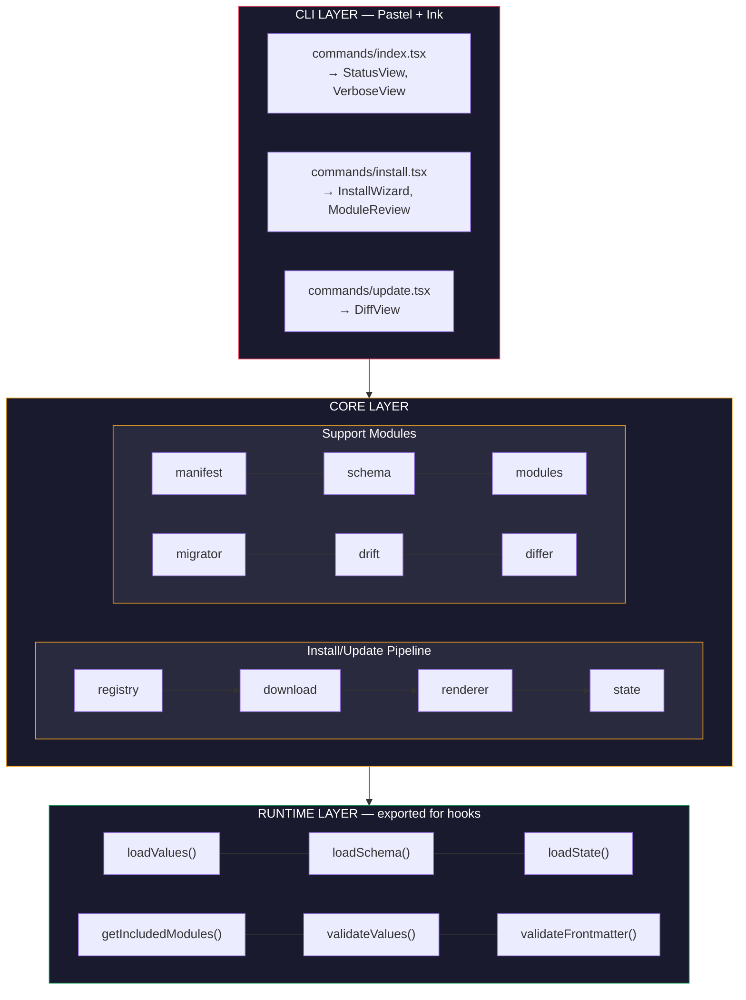
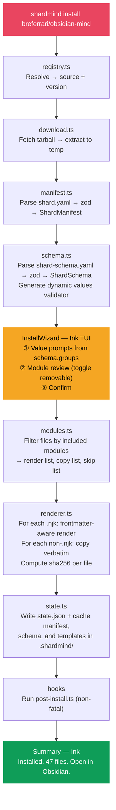
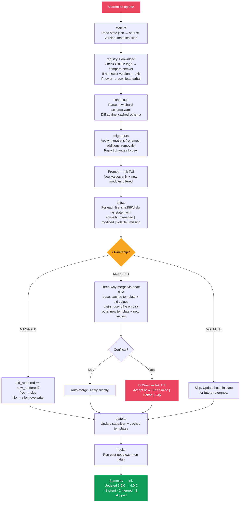

# ShardMind — Implementation Specification

> The engineering blueprint. Every module, every flow, every edge case.
> Designed to be read by humans and executed by AI coding agents.

**Companion to**: [ARCHITECTURE.md](ARCHITECTURE.md) (the what and why)
**This document**: the how, exactly

---

## 0. How to Read This Document

This spec is organized by **module**. Each module section contains:

- **Purpose**: one sentence
- **Inputs / Outputs**: exact types
- **Algorithm**: step-by-step, numbered
- **Error cases**: what can go wrong and what to do
- **Dependencies**: other modules it imports
- **Tests**: what to test, referencing fixtures

Diagrams use Mermaid for GitHub rendering. Data formats show exact shapes. Decision points are explicit.

---

## 1. System Overview



---

## 2. Data Flow: Install



---

## 3. Data Flow: Update



---

## 4. Module Specifications

### 4.1 `registry.ts`

**Purpose**: Resolve a shard identifier to a downloadable source URL and version.

**Inputs**:
```typescript
resolve(shardRef: string): Promise<ResolvedShard>
// shardRef examples:
//   "breferrari/obsidian-mind"         → latest from registry
//   "breferrari/obsidian-mind@3.5.0"   → specific version
//   "github:breferrari/obsidian-mind"  → direct GitHub, skip registry
```

**Outputs**:
```typescript
interface ResolvedShard {
  namespace: string;          // "breferrari"
  name: string;               // "obsidian-mind"
  version: string;            // "3.5.0"
  source: string;             // "github:breferrari/obsidian-mind"
  tarballUrl: string;         // "https://api.github.com/repos/breferrari/obsidian-mind/tarball/v3.5.0"
}
```

**Algorithm**:
1. Parse `shardRef` into namespace, name, and optional version
2. If `shardRef` starts with `github:` → direct mode, skip registry
3. Else → fetch registry index from `https://raw.githubusercontent.com/shardmind/registry/main/index.json`
4. Look up `namespace/name` in registry
5. If version not specified → use `latest` field from registry
6. Construct tarball URL: `https://api.github.com/repos/{owner}/{repo}/tarball/v{version}`
7. Verify the tag exists (HEAD request to GitHub API). 404 → error.

**Error cases**:
- Shard not found in registry → `"Shard 'foo/bar' not found. Check spelling or use github:owner/repo for direct install."`
- Version not found → `"Version 3.5.0 not found for breferrari/obsidian-mind. Available: 3.4.0, 3.3.0"`
- Network failure → `"Could not reach GitHub. Check your connection."`
- Rate limited → `"GitHub API rate limit reached. Set GITHUB_TOKEN for higher limits."`

**Environment**: Reads `GITHUB_TOKEN` env var for authenticated requests (5000 req/hr vs 60 unauthenticated).

**Dependencies**: none (uses built-in `fetch`).

---

### 4.2 `download.ts`

**Purpose**: Download and extract a shard tarball to a temporary directory.

**Inputs**:
```typescript
downloadShard(tarballUrl: string): Promise<TempShard>
```

**Outputs**:
```typescript
interface TempShard {
  tempDir: string;           // Absolute path to extracted shard
  manifest: string;          // Path to shard.yaml within tempDir
  schema: string;            // Path to shard-schema.yaml within tempDir
  cleanup: () => Promise<void>;  // Removes tempDir
}
```

**Algorithm**:
1. Create temp directory: `os.tmpdir() + '/shardmind-' + crypto.randomUUID()`
2. Fetch tarball URL with `fetch()`, following redirects (GitHub returns 302)
3. Set headers: `Accept: application/vnd.github+json`, `Authorization: Bearer ${GITHUB_TOKEN}` if set
4. Pipe response body through `tar.x({ strip: 1, C: tempDir })`
   - `strip: 1` removes the GitHub archive's top-level directory (`owner-repo-sha/`)
5. Verify `shard.yaml` exists in tempDir. If not → error.
6. Verify `shard-schema.yaml` exists. If not → error.
7. Return TempShard with cleanup function

**Error cases**:
- HTTP non-200 → `"Failed to download: HTTP {status}"`
- Tarball corrupted → `"Downloaded archive is not a valid tarball"`
- Missing shard.yaml → `"Not a valid shard: shard.yaml not found"`
- Missing shard-schema.yaml → `"Not a valid shard: shard-schema.yaml not found"`
- Disk full → propagate OS error

**Dependencies**: `tar` (node-tar).

---

### 4.3 `manifest.ts`

**Purpose**: Parse and validate `shard.yaml`.

**Inputs**:
```typescript
parseManifest(filePath: string): Promise<ShardManifest>
```

**Outputs**: `ShardManifest` (see types in architecture doc section 16.3).

**Zod schema**:
```typescript
const ShardManifestSchema = z.object({
  apiVersion: z.literal('v1'),
  name: z.string().regex(/^[a-z0-9-]+$/),
  namespace: z.string().regex(/^[a-z0-9-]+$/),
  version: z.string().refine(v => semver.valid(v), 'Must be valid semver'),
  description: z.string().optional(),
  persona: z.string().optional(),
  license: z.string().optional(),
  homepage: z.string().url().optional(),
  requires: z.object({
    obsidian: z.string().optional(),
    node: z.string().optional(),
  }).optional(),
  dependencies: z.array(z.object({
    name: z.string(),
    namespace: z.string(),
    version: z.string(),
  })).default([]),
  hooks: z.object({
    'post-install': z.string().optional(),
    'post-update': z.string().optional(),
  }).default({}),
});
```

**Error cases**:
- YAML parse error → `"shard.yaml is not valid YAML: {error}"`
- Zod validation error → `"shard.yaml validation failed: {field}: {message}"`

**Dependencies**: `yaml`, `zod`, `semver`.

---

### 4.4 `schema.ts`

**Purpose**: Parse `shard-schema.yaml` and generate a dynamic zod validator for user values.

**Inputs**:
```typescript
parseSchema(filePath: string): Promise<ShardSchema>
buildValuesValidator(schema: ShardSchema): z.ZodObject<any>
```

**Algorithm for `buildValuesValidator`**:
1. For each entry in `schema.values`:
   - `string` → `z.string()`
   - `boolean` → `z.boolean()`
   - `number` → `z.number()`, apply `.min()/.max()` if set
   - `select` → `z.enum([option.value, ...])`
   - `multiselect` → `z.array(z.enum([...]))`
   - `list` → `z.array(z.any())`
2. Apply `.optional()` if `required` is false or absent
3. Apply `.default()` if `default` is set and not a template expression
4. Return `z.object(shape)`

**Computed defaults**: If a default value is a string starting with `{{` (e.g., `"{{ vault_purpose == 'engineering' }}"`), it's evaluated after all non-computed values are collected. This is relevant for the install wizard — collect non-computed values first, then resolve computed defaults, then present them as pre-filled.

**Dependencies**: `yaml`, `zod`.

---

### 4.5 `modules.ts`

**Purpose**: Resolve which files to render, copy, or skip based on module inclusion.

**Inputs**:
```typescript
resolveModules(
  schema: ShardSchema,
  selections: Record<string, 'included' | 'excluded'>,
  tempDir: string,
): Promise<ModuleResolution>
```

**Outputs**:
```typescript
interface ModuleResolution {
  render: FileEntry[];      // .njk files to render with Nunjucks
  copy: FileEntry[];        // Non-.njk files to copy verbatim
  skip: FileEntry[];        // Files gated by excluded modules
}

interface FileEntry {
  sourcePath: string;       // Path in tempDir
  outputPath: string;       // Path in vault (relative to cwd)
  module: string | null;    // Which module this belongs to, or null for core
  volatile: boolean;        // Has {# shardmind: volatile #} hint
  iterator: string | null;  // For _each templates: the list value key
}
```

**Algorithm**:
1. Walk the shard's `templates/` directory recursively
2. For each file:
   a. Determine which module it belongs to by matching its path against `module.paths[]`
   b. If module is excluded → add to `skip`
   c. If file ends in `.njk`:
      - Read first line, check for `{# shardmind: volatile #}`
      - Check if filename starts with `_each` → extract iterator key from filename
      - Compute output path: strip `templates/` prefix, strip `.njk` suffix
      - Add to `render`
   d. Else → add to `copy`
3. Walk `commands/`, `agents/` directories:
   - For each file, check if it's listed in any module's `commands[]` or `agents[]`
   - If its module is excluded → skip
   - Else → add to `copy` with output path under `.claude/commands/` or `.claude/agents/`
4. Walk `scripts/`, `utilities/`, `skills/` → always add to `copy`
5. Add `settings.json.njk` to `render` (always present)

**Output path mapping**:
```
templates/CLAUDE.md.njk              → CLAUDE.md
templates/AGENTS.md.njk              → AGENTS.md                    (if present)
templates/GEMINI.md.njk              → GEMINI.md                    (if present)
templates/brain/North Star.md.njk    → brain/North Star.md
templates/bases/incidents.base.njk   → bases/incidents.base
templates/settings.json.njk          → .claude/settings.json
commands/review-brief.md             → .claude/commands/review-brief.md
agents/brag-spotter.md               → .claude/agents/brag-spotter.md
codex/standup.md                     → .codex/prompts/standup.md    (if present)
scripts/session_start.ts             → .claude/scripts/session_start.ts
utilities/charcount.sh               → .claude/utilities/charcount.sh
skills/obsidian-markdown/SKILL.md    → .claude/skills/obsidian-markdown/SKILL.md
```

The engine maps all files it finds — it doesn't enforce which agent configs a shard includes.

**Dependencies**: `node:fs`, `node:path`.

---

### 4.6 `renderer.ts`

**Purpose**: Render Nunjucks templates with values and computed context. Frontmatter-aware.

**Inputs**:
```typescript
renderFile(entry: FileEntry, context: RenderContext): Promise<RenderedFile>

interface RenderContext {
  values: Record<string, unknown>;              // From shard-values.yaml
  included_modules: string[];                    // Computed from module selections
  shard: { name: string; version: string; };    // From manifest
  install_date: string;                          // ISO timestamp
}

interface RenderedFile {
  outputPath: string;
  content: string;
  hash: string;              // sha256 of content
  volatile: boolean;
}
```

**Algorithm**:
1. Configure Nunjucks environment:
   ```typescript
   const env = nunjucks.configure(tempDir, {
     autoescape: false,
     trimBlocks: true,
     lstripBlocks: true,
   });
   ```
2. Read template source from `entry.sourcePath`
3. If `entry.iterator` is set (this is an `_each` template):
   - Look up `context.values[entry.iterator]` (must be an array)
   - For each item in the array:
     - Render template with `{ ...context, item }`
     - Output path: replace `_each` with `item.slug` or `item.name`
     - Return multiple RenderedFile results
4. Check if content starts with `---\n` (has frontmatter):
   - Yes → split into frontmatter string + body string at second `---`
   - Render frontmatter string with Nunjucks
   - Parse rendered frontmatter with `YAML.parse()`
   - Re-stringify with `YAML.stringify()` (ensures valid YAML, handles escaping)
   - Render body string with Nunjucks
   - Recombine: `"---\n" + safeFrontmatter + "\n---\n" + renderedBody`
   - No → render entire content with Nunjucks
5. Compute `sha256` hash of final content
6. Return RenderedFile

**Computed context variables** (injected alongside user values):
- `included_modules: string[]` — list of included module IDs
- `shard.name`, `shard.version` — from manifest
- `install_date` — ISO timestamp of install
- `year` — current year (for copyright, archive paths)

**Error cases**:
- Nunjucks syntax error → `"Template error in {file}: {message} at line {line}"`
- YAML frontmatter parse error → `"Frontmatter in {file} rendered invalid YAML: {error}"`
- Missing iterator value → `"Template {file} is an _each template but values.{key} is not an array"`

**Dependencies**: `nunjucks`, `yaml`, `node:crypto`.

---

### 4.7 `state.ts`

**Purpose**: Read and write `.shardmind/state.json`. Create `.shardmind/` directory structure.

**Inputs/Outputs**:
```typescript
readState(vaultRoot: string): Promise<ShardState | null>
writeState(vaultRoot: string, state: ShardState): Promise<void>
initShardDir(vaultRoot: string): Promise<void>
cacheTemplates(vaultRoot: string, tempDir: string): Promise<void>
cacheManifest(vaultRoot: string, manifest: ShardManifest, schema: ShardSchema): Promise<void>
```

**`initShardDir` creates**:
```
.shardmind/
├── state.json
├── shard.yaml
├── shard-schema.yaml
└── templates/
```

**`cacheTemplates`**: copies the entire `templates/` directory from temp to `.shardmind/templates/`. This is the base for future three-way merges.

**Dependencies**: `yaml`, `node:fs`, `node:path`.

---

### 4.8 `drift.ts`

**Purpose**: Detect ownership state of each file and compute merge actions.

**Inputs**:
```typescript
detectDrift(
  vaultRoot: string,
  state: ShardState,
): Promise<DriftReport>

interface DriftReport {
  managed: DriftEntry[];     // Hash matches — safe to overwrite
  modified: DriftEntry[];    // Hash differs — user edited
  volatile: DriftEntry[];    // Marked volatile — skip
  missing: DriftEntry[];     // In state but not on disk
  orphaned: string[];        // On disk in tracked paths but not in state
}

interface DriftEntry {
  path: string;
  template: string | null;
  renderedHash: string;       // From state.json
  actualHash: string | null;  // Computed from disk (null if missing)
  ownership: 'managed' | 'modified' | 'volatile';
}
```

**Algorithm**:
1. For each file in `state.files`:
   a. If `ownership === 'volatile'` → add to `volatile`
   b. Read file from disk. If not found → add to `missing`
   c. Compute `sha256(file content)`
   d. Compare against `state.files[path].rendered_hash`
   e. If equal → `managed`
   f. If different → `modified`
2. Return classified report

**Dependencies**: `node:fs`, `node:crypto`.

---

### 4.9 `differ.ts`

**Purpose**: Compute three-way merge between base, theirs (user), and ours (new template).

**Inputs**:
```typescript
computeMergeAction(input: {
  path: string;
  ownership: 'managed' | 'modified';
  oldTemplate: string;         // From .shardmind/templates/ cache
  newTemplate: string;         // From new shard version
  oldValues: Record<string, unknown>;
  newValues: Record<string, unknown>;
  actualContent: string;       // File on disk
  renderContext: RenderContext;
}): Promise<MergeAction>

type MergeAction =
  | { type: 'skip'; reason: string }
  | { type: 'overwrite'; content: string }
  | { type: 'auto_merge'; content: string; stats: MergeStats }
  | { type: 'conflict'; result: MergeResult }

interface MergeStats {
  linesUnchanged: number;
  linesAutoMerged: number;
}
```

**Algorithm**:
1. Render old template with old values → `base`
2. Render new template with new values → `ours`
3. `theirs` = `actualContent` (what's on disk)
4. If `sha256(base) === sha256(ours)` → no upstream change → `{ type: 'skip' }`
5. If ownership is `managed` (base === theirs) → `{ type: 'overwrite', content: ours }`
6. If ownership is `modified`:
   a. Run `diff3Merge(theirs.split('\n'), base.split('\n'), ours.split('\n'))`
   b. If no conflicts → `{ type: 'auto_merge', content: merged }`
   c. If conflicts → `{ type: 'conflict', result: { content, hasConflicts, conflicts, stats } }`

**`MergeResult`** (for conflicts):
```typescript
interface MergeResult {
  content: string;              // Merged content with conflict markers
  hasConflicts: boolean;
  conflicts: ConflictRegion[];
  stats: { linesUnchanged: number; linesAutoMerged: number; linesConflicted: number; };
}

interface ConflictRegion {
  lineStart: number;
  lineEnd: number;
  base: string;
  theirs: string;
  ours: string;
}
```

**Conflict markers** (same format as git):
```
<<<<<<< yours
User's version of conflicting lines
=======
Shard update version of conflicting lines
>>>>>>> shard update
```

**Dependencies**: `node-diff3`, `renderer.ts`, `node:crypto`.

---

### 4.10 `migrator.ts`

**Purpose**: Apply declared migrations to transform `shard-values.yaml` between versions.

**Inputs**:
```typescript
migrate(
  currentValues: Record<string, unknown>,
  currentVersion: string,
  targetVersion: string,
  migrations: Migration[],
): MigrationResult

interface MigrationResult {
  values: Record<string, unknown>;   // Transformed values
  applied: MigrationChange[];        // What was changed
  warnings: string[];                // Non-fatal issues
}
```

**Algorithm**:
1. Filter migrations where `semver.gt(targetVersion, migration.from_version)` and `semver.gte(migration.from_version, currentVersion)`
2. Sort by `from_version` ascending
3. For each migration, for each change:
   - `rename`: copy `values[old]` to `values[new]`, delete `values[old]`
   - `added`: if key doesn't exist, set `values[key] = default`
   - `removed`: delete `values[key]`, add warning
   - `type_changed`: apply transform expression (simple JS eval with value as input)
4. Return transformed values + changelog

**Error cases**:
- Migration references key that doesn't exist → warning, skip
- Transform expression fails → warning, keep original value

**Dependencies**: `semver`.

---

## 5. Runtime Module: `shardmind/runtime`

### 5.1 `resolveVaultRoot()`

Walk up from `process.cwd()` looking for `.shardmind/state.json`. Max 20 levels. Return absolute path or throw.

### 5.2 `loadValues()`

Read `{vaultRoot}/shard-values.yaml`. Parse with `yaml`. Return plain object. Throw if not found.

### 5.3 `loadState()`

Read `{vaultRoot}/.shardmind/state.json`. Parse with `JSON.parse`. Return `ShardState` or `null`.

### 5.4 `loadSchema()`

Read `{vaultRoot}/.shardmind/shard-schema.yaml`. Parse with `yaml`. Return `ShardSchema`.

### 5.5 `getIncludedModules()`

Load state → filter `state.modules` where value is `'included'` → return key array.

### 5.6 `validateValues()`

Build zod schema from `ShardSchema` (same logic as `schema.ts:buildValuesValidator`). Run `.safeParse()`. Return `ValidationResult`.

### 5.7 `validateFrontmatter(filePath, content)`

1. Extract frontmatter from content (split at `---` markers)
2. Parse frontmatter as YAML
3. Determine note type from `filePath`:
   - `work/incidents/` → `incident`
   - `work/1-1/` → `1-1`
   - `work/` → `work-note`
   - `org/people/` → `person`
   - Match against `schema.frontmatter` keys
4. Check required fields for that note type
5. Always check `global` required fields
6. Return `{ valid, noteType, missing, extra }`

---

## 6. Ink Components

### 6.1 `StatusView.tsx`

Renders when `shardmind` is run with no args. Reads state, checks file hashes, displays summary.

Props: none (reads from disk).

```
◆ shardmind

  breferrari/obsidian-mind v3.5.0
  Installed 3 weeks ago · 47 managed · 2 volatile · 4 modified

  ⬆  v4.0.0 available — run 'shardmind update'
```

### 6.2 `VerboseView.tsx`

Renders when `--verbose` flag is set. Full diagnostics with sections for values, modules, files, frontmatter, environment.

### 6.3 `InstallWizard.tsx`

Two phases:
1. **Values phase**: renders one Ink input per schema value, grouped by `groups[]`. Uses `TextInput` for strings, `Select` for selects, `ConfirmInput` for booleans.
2. **Module review phase**: `MultiSelect`-style list of removable modules, all checked by default. User unchecks to exclude.

After both phases → confirmation screen → proceed.

### 6.4 `ModuleReview.tsx`

Reusable component showing module list with checkboxes. Used by InstallWizard and by update flow (for new modules).

Props:
```typescript
interface ModuleReviewProps {
  modules: Record<string, ModuleDefinition>;
  selections: Record<string, 'included' | 'excluded'>;
  onComplete: (selections: Record<string, 'included' | 'excluded'>) => void;
}
```

### 6.5 `DiffView.tsx`

Shows a three-way diff for a single file. Used during update for modified files with upstream changes.

Props:
```typescript
interface DiffViewProps {
  path: string;
  mergeResult: MergeResult;
  onChoice: (choice: 'accept_new' | 'keep_mine' | 'open_editor' | 'skip') => void;
}
```

Renders: file path header, conflict regions with color-coded sides, action buttons.

### 6.6 `Header.tsx`

Branded header with ShardMind name, version, and optional vault info.

---

## 7. Error Handling Strategy

### 7.1 Error Categories

| Category | Example | Behavior |
|----------|---------|----------|
| **User error** | Invalid shard ref, missing values | Show message + hint. Don't stack trace. |
| **Network error** | GitHub down, rate limited | Show message + retry hint. |
| **Shard error** | Invalid shard.yaml, broken template | Show message + shard author should fix. |
| **Engine error** | Bug in ShardMind itself | Full stack trace. "This is a bug, please report." |

### 7.2 Implementation

All core functions throw typed errors:

```typescript
class ShardMindError extends Error {
  constructor(
    message: string,
    public code: string,
    public hint?: string,
  ) {
    super(message);
  }
}

// Usage:
throw new ShardMindError(
  "Shard 'foo/bar' not found in registry",
  'SHARD_NOT_FOUND',
  "Check spelling or use github:owner/repo for direct install",
);
```

Commands catch errors and render them in Ink with `StatusMessage variant="error"`.

### 7.3 Rollback on Install Failure

If install fails mid-render (e.g., template error on file 23 of 47):
1. Delete all files written so far
2. Delete `.shardmind/` directory
3. Show error with the specific template that failed
4. Exit cleanly — vault is in pre-install state

---

## 8. Decision Log

Decisions made during architecture that should be preserved:

| # | Decision | Rationale | Alternatives considered |
|---|----------|-----------|----------------------|
| D1 | Nunjucks over Eta | `{{ }}` syntax familiarity for shard authors. Performance irrelevant at 50 files. | Eta (faster, TS-native but `<%= %>` syntax), LiquidJS (sandboxed, unnecessary) |
| D2 | Pastel over Commander + Ink | File-system routing, zod arg parsing, Commander under the hood. Less glue code. | Raw Commander + Ink (more control, more boilerplate) |
| D3 | `node-diff3` over custom diff | Battle-tested Khanna-Myers algorithm. Same approach as git. | Custom implementation using `diff` package (more work, less proven) |
| D4 | Vault-local state, no global | Same model as git. Vaults are independent. No `~/.shardmind/`. | Global registry of installed vaults (complexity, privacy, unnecessary) |
| D5 | `volatile` ownership state | LLM-maintained files (wiki indexes, memory files) need auto-skip during update. | Only 3 states (would prompt user on every update for volatile files) |
| D6 | Modules over value toggles | File existence is a structural decision, not a template variable. Empty folders are harmless but feel wrong. | `enable_X` booleans (over-engineering, 15-question wizard, poisoned the update engine) |
| D7 | 4 values, 1 group | Convention over configuration. Obsidian handles unused features gracefully. | 15+ values with depends_on chains (wizard fatigue, complexity) |
| D8 | TypeScript hooks over Python/shell | Unify the stack. One runtime. Hooks can import `shardmind/runtime`. | Keep Python (extra dependency, two languages, can't share code) |
| D9 | CLAUDE.md partials | 338-line monolith is unmaintainable as one template. Per-module partials are independently editable. | Single CLAUDE.md.njk with `` blocks (spaghetti) |
| D10 | `/vault-upgrade` stays in Claude Code | Semantic content classification is an AI operation. ShardMind is a package manager. | ShardMind handles migration (scope creep, AI dependency in CLI) |
| D11 | Status as root command, not menu | CLI users know what they want. Status answers "is my vault healthy" immediately. | Interactive menu (over-designed for 3 actions) |
| D12 | Cached templates for 3-way merge base | Without cached templates, can't compute proper base for modified files. | Re-download old version during update (network dependency, slow) |
| D13 | `.claude/settings.json` as managed template | Hook registration must update when hooks change. Rendering from template keeps it in sync. | Static file (goes stale when hooks change) |

---

## 9. Build Plan

### Day 1: Foundation

```
Morning:
  npx create-pastel-app shardmind
  Configure tsup for dual entry (cli + runtime)
  Set up vitest

  Implement + test:
    source/core/manifest.ts      (parse shard.yaml → zod → ShardManifest)
    source/core/schema.ts        (parse shard-schema.yaml → zod → ShardSchema + buildValuesValidator)
    source/runtime/types.ts      (all shared types)

Afternoon:
  Implement + test:
    source/core/download.ts      (fetch tarball → extract to temp → TempShard)
    source/core/modules.ts       (walk template dir → classify by module → ModuleResolution)
    source/core/renderer.ts      (Nunjucks env → frontmatter-aware → RenderedFile)

  Tests:
    tests/unit/manifest.test.ts  (valid, invalid, missing fields)
    tests/unit/schema.test.ts    (parse, validator generation, computed defaults)
    tests/unit/renderer.test.ts  (plain, frontmatter, volatile hint, _each)
    tests/unit/modules.test.ts   (include/exclude, path mapping, copy vs render)
    tests/fixtures/render/       (5 rendering scenarios)
    tests/fixtures/schema/       (5 schema scenarios)

  Verify: shardmind --version works
```

### Day 2: Install Command

```
Morning:
  Implement:
    source/core/state.ts         (read/write state.json, init .shardmind/, cache)
    source/runtime/index.ts      (loadValues, loadState, resolveVaultRoot, etc.)
    source/core/registry.ts      (resolve shard ref → tarball URL)

  Tests:
    tests/unit/state.test.ts
    tests/unit/runtime.test.ts
    tests/unit/registry.test.ts  (mock fetch)

Afternoon:
  Implement:
    source/components/Header.tsx
    source/components/InstallWizard.tsx
    source/components/ModuleReview.tsx
    source/commands/install.tsx

  Integration test:
    tests/integration/install.test.ts
      → create temp dir
      → run install pipeline against real obsidian-mind shard
      → verify: files created, state.json correct, values file written
      → verify: excluded modules have no files
      → verify: volatile files marked correctly
      → cleanup

  Verify: shardmind install breferrari/obsidian-mind works end to end
```

### Day 3: Merge Engine (TDD)

```
Morning:
  Write ALL 17 fixture directories:
    tests/fixtures/merge/01-managed-no-change/
      scenario.yaml, old-template.md.njk, old-values.yaml,
      new-template.md.njk, new-values.yaml, actual-file.md,
      expected-output.md (or expected-action)
    ... through 17-volatile-template-changed/

  Write test runner:
    tests/unit/drift.test.ts (auto-discovers fixtures, runs all scenarios)

  Run tests → all 17 fail

Afternoon:
  Implement:
    source/core/drift.ts        (detectDrift → DriftReport)
    source/core/differ.ts       (computeMergeAction + threeWayMerge via node-diff3)

  Iterate until all 17 scenarios pass.

  Add edge case fixtures:
    frontmatter-merge, empty-file, binary-identical, encoding

  Verify: all merge scenarios pass
```

### Day 4: Update Command + Status

```
Morning:
  Implement:
    source/core/migrator.ts      (apply migrations to values)
    source/components/DiffView.tsx
    source/commands/update.tsx

  Tests:
    tests/unit/migrator.test.ts
    tests/fixtures/migration/    (rename, add, remove, type change)
    tests/integration/update.test.ts
      → install a shard
      → modify some files manually
      → "update" with a modified shard version
      → verify: managed files overwritten, modified files diffed, volatile skipped

Afternoon:
  Implement:
    source/components/StatusView.tsx
    source/components/VerboseView.tsx
    source/commands/index.tsx

  E2E test:
    tests/e2e/cli.test.ts
      → shardmind (status output)
      → shardmind --verbose (diagnostics)
      → shardmind install (full flow)
      → shardmind update (full flow)

  Verify: all 3 commands work, TUI renders correctly
```

### Day 5: obsidian-mind v4

```
In the obsidian-mind repo:

Morning:
  Add shard.yaml
  Add shard-schema.yaml (4 values, 8 modules, frontmatter rules)
  Convert all templates/ to .njk
  Break CLAUDE.md into partials:
    templates/claude/_core.md.njk      (extract ~200 lines of domain-agnostic content)
    templates/claude/_perf.md.njk      (perf note types, properties, commands)
    templates/claude/_incidents.md.njk
    templates/claude/_1on1s.md.njk
    templates/claude/_org.md.njk
  Create templates/CLAUDE.md.njk (assembler)

Afternoon:
  Rewrite hooks in TypeScript:
    .claude/scripts/session_start.ts   (from session-start.sh)
    .claude/scripts/classify.ts        (from classify-message.py)
    .claude/scripts/validate_note.ts   (from validate-write.py)
    .claude/scripts/backup_transcript.ts (from pre-compact.sh)
    .claude/scripts/session_end.ts     (new, from Stop hook logic)

  Add {# shardmind: volatile #} to:
    templates/brain/Memories.md.njk
    templates/work/Index.md.njk
    templates/org/People & Context.md.njk

  Add templates/settings.json.njk

  Test: shardmind install breferrari/obsidian-mind from the ShardMind CLI
  Verify: vault is identical to current git clone experience
```

### Day 6: Ship

```
Morning:
  Create research-wiki shard:
    shard.yaml, shard-schema.yaml (3 values, 4 modules)
    templates/ (CLAUDE.md with _research.md.njk partial)
    commands/ (ingest, compile, lint, query)
    agents/ (wiki-compiler, cross-linker, contradiction-detector)

  Test: shardmind install breferrari/research-wiki

Afternoon:
  npm publish shardmind
  README.md for ShardMind repo
  shardmind.dev landing page (or at minimum a GitHub Pages README)
  Create shardmind/registry repo with index.json (2 shards)
  Announce

  Final test: fresh machine, npm install -g shardmind, shardmind install breferrari/obsidian-mind
```

---

## 10. File Inventory

Every file in the ShardMind repo, its purpose, and approximate size:

```
shardmind/
├── source/
│   ├── cli.ts                          3 lines     Pastel entry
│   ├── commands/
│   │   ├── index.tsx                   ~80 lines   Status + verbose
│   │   ├── install.tsx                 ~120 lines  Install orchestration
│   │   └── update.tsx                  ~150 lines  Update orchestration
│   ├── components/
│   │   ├── Header.tsx                  ~20 lines   Branding
│   │   ├── StatusView.tsx              ~60 lines   Quick status
│   │   ├── VerboseView.tsx             ~120 lines  Full diagnostics
│   │   ├── InstallWizard.tsx           ~100 lines  Value prompts + confirm
│   │   ├── ModuleReview.tsx            ~60 lines   Module multiselect
│   │   └── DiffView.tsx                ~100 lines  Conflict display + actions
│   ├── core/
│   │   ├── manifest.ts                 ~50 lines   Zod schema + parse
│   │   ├── schema.ts                   ~100 lines  Schema parse + validator gen
│   │   ├── registry.ts                 ~80 lines   Resolve + version check
│   │   ├── download.ts                 ~60 lines   Fetch + extract
│   │   ├── renderer.ts                 ~120 lines  Nunjucks + frontmatter
│   │   ├── state.ts                    ~80 lines   State CRUD + caching
│   │   ├── drift.ts                    ~60 lines   Hash comparison + classify
│   │   ├── differ.ts                   ~100 lines  Three-way merge
│   │   ├── migrator.ts                 ~70 lines   Migration apply
│   │   └── modules.ts                  ~100 lines  File walking + gating
│   ├── runtime/
│   │   ├── index.ts                    ~30 lines   Re-exports
│   │   ├── values.ts                   ~30 lines   loadValues
│   │   ├── schema.ts                   ~30 lines   loadSchema
│   │   ├── frontmatter.ts              ~50 lines   validateFrontmatter
│   │   ├── state.ts                    ~40 lines   loadState + getIncludedModules
│   │   └── types.ts                    ~100 lines  All shared types
│   └── types/
│       └── index.ts                    ~20 lines   Re-exports from runtime
├── tests/
│   ├── unit/                           ~7 test files
│   ├── integration/                    ~2 test files
│   ├── e2e/                            ~1 test file
│   └── fixtures/                       ~30 fixture directories
├── package.json
├── tsconfig.json
├── tsup.config.ts
├── vitest.config.ts
├── README.md
├── LICENSE
└── DECISIONS.md                        Copy of section 8 above
```

**Estimated total**: ~1,800 lines of source + ~500 lines of tests + ~100 fixture files.

---

*This document, together with the architecture doc, constitutes the complete specification for ShardMind v0.1.0. The architecture doc defines what and why. This doc defines how, exactly.*

## Related

- [ARCHITECTURE.md](ARCHITECTURE.md) — companion doc: the what and why (22 sections)
- [VISION.md](../VISION.md) — origin story, architectural bets, scope guardrails
- [ROADMAP.md](../ROADMAP.md) — milestones linked to GitHub issues
- [CLAUDE.md](../CLAUDE.md) — spec-driven development guide
- [examples/minimal-shard/](../examples/minimal-shard/) — test shard for development
- [README.md](../README.md) — project overview
