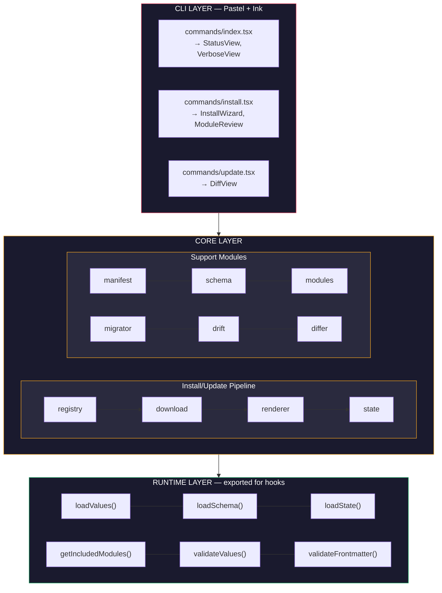
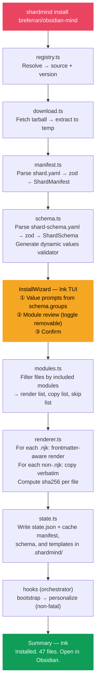
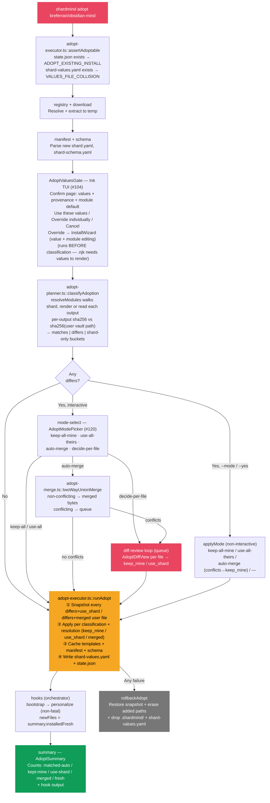

# ShardMind — Implementation Specification

> The engineering blueprint. Every module, every flow, every edge case.
> Designed to be read by humans and executed by AI coding agents.

**Companion to**: [ARCHITECTURE.md](ARCHITECTURE.md) (the what and why)
**This document**: the how, exactly

---

## 0. How to Read This Document

This spec is organized by **module**. Each module section contains:

- **Purpose**: one sentence
- **Inputs / Outputs**: exact types
- **Algorithm**: step-by-step, numbered
- **Error cases**: what can go wrong and what to do
- **Dependencies**: other modules it imports
- **Tests**: what to test, referencing fixtures

Diagrams use Mermaid for GitHub rendering. Data formats show exact shapes. Decision points are explicit.

---

## 1. System Overview


```mermaid
graph TB
    subgraph CLI["CLI LAYER — Pastel + Ink"]
        direction LR
        CMD_IDX["commands/index.tsx<br/>→ StatusView, VerboseView"]
        CMD_INST["commands/install.tsx<br/>→ InstallWizard, ModuleReview"]
        CMD_UPD["commands/update.tsx<br/>→ DiffView"]
    end

    subgraph CORE["CORE LAYER"]
        direction LR
        subgraph pipeline["Install/Update Pipeline"]
            direction LR
            registry --> download --> renderer --> state
        end
        subgraph support["Support Modules"]
            direction LR
            manifest --- schema --- modules
            migrator --- drift --- differ
        end
    end

    subgraph RUNTIME["RUNTIME LAYER — exported for hooks"]
        direction LR
        loadValues["loadValues()"] --- loadSchema["loadSchema()"] --- loadState["loadState()"]
        getModules["getIncludedModules()"] --- validateValues["validateValues()"] --- validateFM["validateFrontmatter()"]
    end

    CLI --> CORE
    CORE --> RUNTIME

    style CLI fill:#1a1a2e,stroke:#e94560,color:#fff
    style CORE fill:#1a1a2e,stroke:#f5a623,color:#fff
    style RUNTIME fill:#1a1a2e,stroke:#0f9d58,color:#fff
    style pipeline fill:#2a2a3e,stroke:#f5a623,color:#fff
    style support fill:#2a2a3e,stroke:#f5a623,color:#fff
```

---

## 2. Data Flow: Install


```mermaid
graph TD
    A["shardmind install breferrari/obsidian-mind"] --> B

    B["registry.ts<br/>Resolve → source + version"] --> C
    C["download.ts<br/>Fetch tarball → extract to temp"] --> D
    D["manifest.ts<br/>Parse shard.yaml → zod → ShardManifest"] --> E
    E["schema.ts<br/>Parse shard-schema.yaml → zod → ShardSchema<br/>Generate dynamic values validator"] --> F

    F["InstallWizard — Ink TUI<br/>① Value prompts from schema.groups<br/>② Module review (toggle removable)<br/>③ Confirm"] --> G

    G["modules.ts<br/>Filter files by included modules<br/>→ render list, copy list, skip list"] --> H

    H["renderer.ts<br/>For each .njk: frontmatter-aware render<br/>For each non-.njk: copy verbatim<br/>Compute sha256 per file"] --> I

    I["state.ts<br/>Write state.json + cache manifest,<br/>schema, and templates in .shardmind/"] --> J

    J["hooks (orchestrator)<br/>bootstrap → personalize (non-fatal)"] --> K
    K["Summary — Ink<br/>Installed. 47 files. Open in Obsidian."]

    style A fill:#e94560,stroke:#e94560,color:#fff
    style F fill:#f5a623,stroke:#f5a623,color:#000
    style K fill:#0f9d58,stroke:#0f9d58,color:#fff
```

---

## 3. Data Flow: Update

Concretely driven by the `useUpdateMachine` hook in `source/commands/hooks/use-update-machine.ts`. Each node below corresponds to a phase variant in the machine's `Phase` union.


```mermaid
graph TD
    A["shardmind update"] --> B

    B["state.ts<br/>Read state.json → source, version, modules, files<br/>Absent → throw UPDATE_NO_INSTALL (exit 1)"] --> C
    C["registry + download<br/>Resolve state.source → tarball<br/>version + tarball_sha match state → up-to-date, exit"] --> D
    D["manifest + schema<br/>Parse new shard.yaml, shard-schema.yaml"] --> E
    E["values-io + migrator<br/>Load shard-values.yaml → applyMigrations<br/>(rename/added/removed/type_changed)"] --> F

    F["computeSchemaAdditions<br/>newRequiredKeys[], newOptionalModules[]"] --> G1
    G1{New required<br/>values?}
    G1 -->|Yes| G2["prompt-new-values<br/>NewValuesPrompt — Ink TUI"]
    G1 -->|No| H1
    G2 --> H1
    H1{New optional<br/>modules?}
    H1 -->|Yes| H2["prompt-new-modules<br/>NewModulesReview — Ink TUI"]
    H1 -->|No| I
    H2 --> I

    I["detectDrift + renderNewShard (parallel)<br/>Classify files; render new shard once"] --> J1

    J1{Modified files<br/>no longer in new shard?}
    J1 -->|Yes| J2["prompt-removed-files<br/>RemovedFilesReview — Ink TUI<br/>keep / delete per file"]
    J1 -->|No| K
    J2 --> K

    K["planUpdate<br/>Per-file UpdateAction + pendingConflicts<br/>(modified-file merges run in parallel, bounded 16)"] --> L1

    L1{Pending<br/>conflicts?}
    L1 -->|Yes| L2["resolving-conflicts loop<br/>DiffView per file<br/>accept_new / keep_mine / skip"]
    L1 -->|No| M
    L2 --> M

    M["writing — update-executor<br/>Snapshot → write pass → delete pass<br/>Re-cache templates + manifest + schema<br/>writeState"] --> N
    N["hooks (orchestrator)<br/>bootstrap if fingerprint changed → post-update (non-fatal)"] --> O
    O["summary — UpdateSummary<br/>Counts, conflict resolutions,<br/>migration warnings, hook output"]

    M -->|Any failure| R["rollbackUpdate<br/>Restore snapshot + erase added paths"]

    style A fill:#e94560,stroke:#e94560,color:#fff
    style L2 fill:#e94560,stroke:#e94560,color:#fff
    style M fill:#f5a623,stroke:#f5a623,color:#000
    style O fill:#0f9d58,stroke:#0f9d58,color:#fff
    style R fill:#777,stroke:#777,color:#fff
```

---

## 3.5 Data Flow: Adopt

Driven by `useAdoptMachine` (`source/commands/hooks/use-adopt-machine.ts`). Mirrors install + update phase shapes so SIGINT handling, hook plumbing, and dry-run posture stay symmetric.


```mermaid
graph TD
    A["shardmind adopt breferrari/obsidian-mind"] --> P1
    P1["adopt-executor.ts::assertAdoptable<br/>state.json exists → ADOPT_EXISTING_INSTALL<br/>shard-values.yaml exists → VALUES_FILE_COLLISION"] --> B

    B["registry + download<br/>Resolve + extract to temp"] --> C
    C["manifest + schema<br/>Parse new shard.yaml, shard-schema.yaml"] --> D

    D["AdoptValuesGate — Ink TUI (#104)<br/>Confirm page: values + provenance + module default<br/>Use these values / Override individually / Cancel<br/>Override → InstallWizard (value + module editing)<br/>(runs BEFORE classification — .njk needs values to render)"] --> E

    E["adopt-planner.ts::classifyAdoption<br/>resolveModules walks shard, render or read each output<br/>per-output sha256 vs sha256(user vault path)<br/>→ matches | differs | shard-only buckets"] --> F1

    F1{Any<br/>differs?}
    F1 -->|"Yes, --mode / --yes"| F2["applyMode (non-interactive)<br/>keep-all-mine / use-all-theirs /<br/>auto-merge (conflicts→keep_mine) / —"]
    F1 -->|Yes, interactive| FM["mode-select — AdoptModePicker (#120)<br/>keep-all-mine · use-all-theirs ·<br/>auto-merge · decide-per-file"]
    F1 -->|No| G

    FM -->|keep-all / use-all| G
    FM -->|"auto-merge"| FA["adopt-merge.ts::twoWayUnionMerge<br/>non-conflicting → merged bytes<br/>conflicting → queue"]
    FM -->|decide-per-file| F3
    FA -->|conflicts| F3
    FA -->|no conflicts| G
    F3["diff-review loop (queue)<br/>AdoptDiffView per file → keep_mine / use_shard"] --> G

    F2 --> G

    G["adopt-executor.ts::runAdopt<br/>① Snapshot every differs+use_shard / differs+merged user file<br/>② Apply per classification + resolution (keep_mine / use_shard / merged)<br/>③ Cache templates + manifest + schema<br/>④ Write shard-values.yaml + state.json"] --> H

    H["hooks (orchestrator)<br/>bootstrap → personalize (non-fatal)<br/>newFiles = summary.installedFresh"] --> I
    I["summary — AdoptSummary<br/>Counts: matched-auto / kept-mine / use-shard / merged / fresh<br/>+ hook output"]

    G -->|Any failure| R["rollbackAdopt<br/>Restore snapshot + erase added paths<br/>+ drop .shardmind/ + shard-values.yaml"]

    style A fill:#e94560,stroke:#e94560,color:#fff
    style F3 fill:#e94560,stroke:#e94560,color:#fff
    style G fill:#f5a623,stroke:#f5a623,color:#000
    style I fill:#0f9d58,stroke:#0f9d58,color:#fff
    style R fill:#777,stroke:#777,color:#fff
```

---

## 4. Module Specifications

### 4.1 `registry.ts`

**Purpose**: Resolve a shard identifier to a downloadable source URL and version.

**Inputs**:
```typescript
resolve(
  shardRef: string,
  options?: { includePrerelease?: boolean },
): Promise<ResolvedShard>
// shardRef examples:
//   "breferrari/obsidian-mind"           → registry index's `latest`
//   "breferrari/obsidian-mind@3.5.0"     → specific version (must be in the index's `versions`)
//   "github:breferrari/obsidian-mind"    → direct GitHub, newest release (stable unless includePrerelease)
//   "github:breferrari/obsidian-mind@3.5.0" → direct GitHub, exact tag (`@v3.5.0` is the same: one leading `v` is stripped)
//   "github:breferrari/obsidian-mind#main"  → direct GitHub, branch HEAD (#76)
//   "github:breferrari/obsidian-mind#abc1234" → direct GitHub, commit SHA (prefix or full)

fetchLatestVersion(
  source: string,                            // state.source, must start with "github:"
  options?: { signal?: AbortSignal; includePrerelease?: boolean },
): Promise<string>                           // semver with the leading `v` stripped
```

`shardRef` is trimmed and matched against `/^(github:)?([a-z0-9][a-z0-9-]*)\/([a-z0-9][a-z0-9-]*)(?:@([^#\s]+)|#([^@\s]+))?$/`: owner and repo are lowercase letters, digits and hyphens, and `@<version>` and `#<ref>` are mutually exclusive. A non-matching ref → `REGISTRY_INVALID_REF`.

`fetchLatestVersion` is the read-only "latest tag" lookup behind the update-check cache (§4.15): the `/releases` listing of step 6, without the tarball HEAD check. A source without the `github:` prefix, or without `owner/repo`, → `REGISTRY_INVALID_REF`.

**Outputs**:
```typescript
interface ResolvedShard {
  namespace: string;                        // "breferrari"
  name: string;                             // "obsidian-mind"
  version: string;                          // "3.5.0" — semver for tag installs;
                                            //          short SHA prefix (7 chars)
                                            //          for ref installs (display only)
  source: string;                           // "github:breferrari/obsidian-mind"
  tarballUrl: string;                       // tag installs: ".../tarball/v3.5.0"
                                            // ref installs: ".../tarball/<full-sha>"
  ref?: { name: string; commit: string };   // present iff ref install
}
```

**Algorithm**:
1. Parse `shardRef` into namespace, name, and optional version OR ref. The regex makes `@<version>` and `#<ref>` mutually exclusive. One leading `v` is stripped from the version, so `@v1.2.3` and `@1.2.3` build the same tarball URL.
2. If `#<ref>` is set:
   a. Direct mode only — `#<ref>` without `github:` prefix is rejected as `REGISTRY_INVALID_REF` (the registry index has no per-branch metadata).
   b. Resolve the ref to a 40-char hex SHA via `GET /repos/:o/:r/commits/{encodeURIComponent(ref)}`. 404 → `REF_NOT_FOUND`. 422 (ambiguous SHA prefix) → `REF_NOT_FOUND` with a "lengthen the prefix" hint.
   c. Construct tarball URL `${GITHUB_API_BASE}/repos/{owner}/{repo}/tarball/<sha>` (no `v` prefix).
   d. HEAD-verify (`verifyTarball` in `'ref'` mode). 404 here is rare but real (force-push between calls); throws `REF_NOT_FOUND` with a "force-push" hint.
   e. Return `ResolvedShard` with `ref: { name, commit }` populated; `version` is the short SHA (7 chars) for display.
3. Else if `shardRef` starts with `github:` → direct mode, skip registry. `source = github:{owner}/{repo}`; go to step 6.
4. Else → fetch registry index from `${REGISTRY_INDEX_URL}` (defaults to `https://raw.githubusercontent.com/shardmind/registry/main/index.json`; see env-var overrides below). The index shape (`{ shards: { "<ns>/<name>": { repo, latest, versions[] } } }`) is provisional until the registry repo exists (#29).
5. Look up `namespace/name` in the index. Missing → `SHARD_NOT_FOUND`. `@version` not in the entry's `versions` → `VERSION_NOT_FOUND` (message lists the available versions). An entry `repo` that is not `owner/name` → `REGISTRY_NETWORK`. No `@version` → the entry's `latest`; `source = github:{entry.repo}`. `includePrerelease` has no effect in registry mode. Go to step 7.
6. Direct mode without `@version` → resolve via `GET /repos/:o/:r/releases?per_page=100`, filtered:
   a. `includePrerelease=false` (default) — first entry where `prerelease === false`.
   b. `includePrerelease=true` — first entry of any kind.
   c. Empty filtered list → `NO_RELEASES_PUBLISHED`. Hint differentiates "repo has zero releases" from "repo has only prereleases" (the latter points at `--include-prerelease`).
   d. Replaces the v0.1 `/releases/latest` endpoint, which 404'd for beta-only repos.
7. Construct tarball URL: `${GITHUB_API_BASE}/repos/{owner}/{repo}/tarball/v{version}`.
8. HEAD-verify (`verifyTarball` in `'tag'` mode). 404 → `VERSION_NOT_FOUND`. 200 / 302 (codeload redirect) → pass.

**Env-var overrides** (read at each call, not cached at module load; overridable for testing,
enterprise GitHub Enterprise deployments, and future self-hosted registry
scenarios — see ARCHITECTURE §19.7):

| Variable | Default | Effect |
|----------|---------|--------|
| `SHARDMIND_GITHUB_API_BASE` | `https://api.github.com` | Routes the `/releases`, `/commits/<ref>` and tarball calls through the provided base. Surrounding whitespace and trailing slashes are stripped. |
| `SHARDMIND_REGISTRY_INDEX_URL` | `https://raw.githubusercontent.com/shardmind/registry/main/index.json` | Points the namespaced `owner/repo` index lookup at an alternate registry. Surrounding whitespace is stripped. |

Both are invisible to production users — the defaults reproduce the
current behavior exactly. The E2E suite uses `SHARDMIND_GITHUB_API_BASE`
to point at a local stub server (see `tests/e2e/helpers/github-stub.ts`).

**Error cases**:
- Malformed `shardRef`, or `#<ref>` without `github:` → `REGISTRY_INVALID_REF`.
- Shard not found in registry → `SHARD_NOT_FOUND`: `"Shard 'foo/bar' not found"`, hint "Check spelling or use github:owner/repo for direct install."
- Version not found (registry) → `VERSION_NOT_FOUND`: `"Version 3.5.0 not found for breferrari/obsidian-mind. Available: 3.4.0, 3.3.0"`
- Version not found (tag verify) → `VERSION_NOT_FOUND`: tarball HEAD returned 404; usually a deleted tag or transient state.
- No releases published → `NO_RELEASES_PUBLISHED`: `/releases` returned an empty array, or every entry was filtered out by the prerelease policy. Hint mentions `--include-prerelease` when prereleases exist.
- Ref not found → `REF_NOT_FOUND`: `/commits/<ref>` returned 404, or 422 (ambiguous SHA prefix).
- Repository not found → `SHARD_NOT_FOUND`: `/releases` returned 404 (the repo itself doesn't exist or is private to an unauthenticated client).
- Network failure, unexpected HTTP status, or malformed response body → `REGISTRY_NETWORK`.
- Rate limited (403 with `x-ratelimit-remaining: 0`) → `REGISTRY_RATE_LIMITED`. Set `GITHUB_TOKEN` for the higher authenticated rate.

**Environment**: Reads `GITHUB_TOKEN` env var for authenticated requests (5000 req/hr vs 60 unauthenticated).

**Dependencies**: none (uses built-in `fetch`).

---

### 4.2 `download.ts`

**Purpose**: Download and extract a shard tarball to a temporary directory.

**Inputs**:
```typescript
downloadShard(
  tarballUrl: string,
  // Receives the temp dir's cleanup as soon as the dir exists, before the
  // fetch, so a Ctrl+C handler can remove it mid-download (#57).
  onTempDir?: (cleanup: () => Promise<void>) => void,
): Promise<TempShard>
```

`cleanup` (the same function `onTempDir` receives) aborts the fetch and the extraction, waits for them to stop, then removes the dir with retries. A download stopped that way rejects with `DownloadCancelledError`, which callers treat as a cancel, not a failure.

**Outputs**:
```typescript
interface TempShard {
  tempDir: string;             // Absolute path to extracted shard root
  manifest: string;            // Path to .shardmind/shard.yaml within tempDir
  schema: string;              // Path to .shardmind/shard-schema.yaml within tempDir
  tarball_sha256: string;      // sha256 of the tarball bytes (recorded in state.json)
  cleanup: () => Promise<void>;
}
```

**Algorithm**:
1. Create temp directory: `os.tmpdir() + '/shardmind-' + crypto.randomUUID()`.
2. Fetch tarball URL with `fetch()`, following redirects (GitHub returns 302).
3. Set headers: `Accept: application/vnd.github+json`, plus `Authorization: Bearer ${GITHUB_TOKEN}` when the env var is set and the host is `api.github.com` or `codeload.github.com` (the token is never sent to any other host, including a `SHARDMIND_GITHUB_API_BASE` stub).
4. Pipe response body through a hash-tap transform (sha256) and into `tar.x({ strip: 1, C: tempDir })`.
   - `strip: 1` removes the GitHub archive's top-level directory (`owner-repo-sha/`).
   - node-tar's own behaviour, not ours: `tar.x` normalizes Windows path separators to forward slashes, so the engine never sees `\` in a relPath.
5. Verify `<tempDir>/.shardmind/shard.yaml` exists. If not → throw `DOWNLOAD_MISSING_MANIFEST`.
6. Verify `<tempDir>/.shardmind/shard-schema.yaml` exists. If not → throw `DOWNLOAD_MISSING_SCHEMA`.
7. Return `TempShard` with `cleanup` function and `tarball_sha256` from the hash tap.

**Error cases**:
- HTTP non-200 → `DOWNLOAD_HTTP_ERROR` with `"Failed to download: HTTP {status}"`.
- Network failure → `DOWNLOAD_HTTP_ERROR` with the underlying message.
- Empty body → `DOWNLOAD_HTTP_ERROR`.
- Tarball corrupted → `DOWNLOAD_INVALID_TARBALL`.
- Extraction would pass `SHARDMIND_MAX_SHARD_SIZE` (256 MiB) or `SHARDMIND_MAX_SHARD_ENTRIES` (100,000), counted from each entry's declared size before its body is written → `SHARD_TOO_LARGE`; an entry whose declared size is not a number → `DOWNLOAD_INVALID_TARBALL`. Temp dir removed (#32).
- An override that is not a positive whole number → `DOWNLOAD_LIMIT_INVALID`, before any network or disk work.
- Missing `.shardmind/shard.yaml` → `DOWNLOAD_MISSING_MANIFEST`.
- Missing `.shardmind/shard-schema.yaml` → `DOWNLOAD_MISSING_SCHEMA`.
- Disk full, or any other error from the fetch-hash-extract pipeline or from `tar` → `DOWNLOAD_INVALID_TARBALL` (with the underlying message). Only a failure of the initial temp-dir `mkdir` propagates as the raw OS error.

**Dependencies**: `tar` (node-tar), `node:crypto`, `node:stream`.

---

### 4.3 `manifest.ts`

**Purpose**: Parse and validate `shard.yaml`.

**Inputs**:
```typescript
parseManifest(filePath: string): Promise<ShardManifest>
```

**Outputs**: `ShardManifest` (see types in architecture doc section 16.3).

**Zod schema**:
```typescript
const ShardManifestSchema = z.object({
  apiVersion: z.literal('v1'),
  name: z.string().regex(/^[a-z0-9-]+$/),
  namespace: z.string().regex(/^[a-z0-9-]+$/),
  version: z.string().refine(v => semver.valid(v), 'Must be valid semver'),
  description: z.string().optional(),
  persona: z.string().optional(),
  license: z.string().optional(),
  homepage: z.string().url().optional(),
  requires: z.object({
    obsidian: z.string().optional(),
    node: z.string().optional(),
    // Engine-enforced semver range (#121). Validated as a non-empty range at
    // parse time; checked by assertEngineCompatible before any vault write.
    shardmind: z.string().refine(v => v.trim() && semver.validRange(v), 'range').optional(),
  }).optional(),
  dependencies: z.array(z.object({
    name: z.string(),
    namespace: z.string(),
    version: z.string(),
  })).default([]),
  hooks: z.object({
    // Three named slots since the #102 lifecycle split. `bootstrap` accepts
    // the bare-string form or `{ script, fingerprint? }` (normalized to the
    // object shape post-parse).
    bootstrap: z.union([
      z.string().transform((script) => ({ script })),
      z.object({ script: z.string(), fingerprint: z.string().optional() }),
    ]).optional(),
    personalize: z.string().optional(),
    'post-update': z.string().optional(),
    // Deprecated combined hook — mutually exclusive with bootstrap/personalize
    // (rejected post-parse as HOOK_SLOT_CONFLICT). Honored ≥1 minor release.
    'post-install': z.string().optional(),
    // Per-shard hook execution timeout in milliseconds. Default 30_000
    // when absent; clamped to 1_000..600_000 at validation time.
    timeout_ms: z.number().int().min(1_000).max(600_000).optional(),
  }).default({}),
  // Path renames between releases (#178). Each path relative, POSIX, inside
  // the vault, not under .shardmind/; from < to; new paths unique per entry.
  migrations: z.array(z.object({
    from: z.string(),   // semver
    to: z.string(),     // semver, > from
    renames: z.record(z.string(), z.string()),
  })).optional(),
});
```

`requires.shardmind` is validated as a non-empty semver range at parse time
and enforced before any vault write by `assertEngineCompatible` (#121).

**Error cases**:
- YAML parse error → `MANIFEST_INVALID_YAML`
- Zod validation error → `MANIFEST_VALIDATION_FAILED` (`"{field}: {message}"`)
- Deprecated `post-install` declared alongside `bootstrap`/`personalize` → `HOOK_SLOT_CONFLICT` (#102)
- Running engine can't satisfy `requires.shardmind` → `SHARDMIND_VERSION_MISMATCH` (#121, thrown by `assertEngineCompatible`, not `parseManifest`)

**Dependencies**: `yaml`, `zod`, `semver`.

---

### 4.4 `schema.ts`

**Purpose**: Parse `shard-schema.yaml` and generate a dynamic zod validator for user values.

**Inputs**:
```typescript
parseSchema(filePath: string): Promise<ShardSchema>
buildValuesValidator(schema: ShardSchema): z.ZodObject<any>
```

**`parseSchema` validation chain** (after the zod safe-parse pass):

1. **Reserved-name guard**: reject value keys that collide with the render context (`shard`, `install_date`, `year`, `included_modules`, `values`) → `SCHEMA_RESERVED_NAME`.
2. **Group cross-ref**: every value's `group` must reference an entry in the `groups` array → `SCHEMA_VALIDATION_FAILED`.
3. **`default` presence (v6 contract)**: every value MUST declare a `default` field. Empty/falsey literals (`""`, `false`, `0`, `[]`) are accepted as long as they match the value's `type` — the presence rule is satisfied by the key existing, not by any "no default" semantics. The check reads the **raw** parsed YAML, not the post-zod object: zod's `default: z.unknown().optional()` strips missing keys and collapses missing-vs-explicit-undefined. This step only verifies that the `default` key exists; type-specific meaning of the value is handled by the next rule. Error lists every offending key, not just the first → `SCHEMA_VALIDATION_FAILED`.
4. **`default` type-match + select-options match (v6)**: when `default` is not a `{{ }}` computed expression, validate `typeof default` against `type`. `null` does not match any of the six value types and is rejected here — authors who want an "empty" default use a type-matching literal (`""`, `0`, `false`, `[]`, or the first option value for `select`). For `select`, the literal default must equal one of `options[].value`; for `multiselect`, every item in the array default must be in `options[].value`. Catches typos (`type: number, default: "fortytwo"` or `type: select, default: "engineerring"`) at parse time rather than failing later inside `buildValuesValidator`. Implemented as a `.check()` rule on `ValueDefinitionSchema` so the issues surface alongside `options`/`min`/`max` problems.
5. **Frontmatter normalization**: shorthand arrays (`global: [date, tags]`) expand into `{ required: [...] }` objects.

**Algorithm for `buildValuesValidator`**:
1. For each entry in `schema.values`:
   - `string` → `z.string()`
   - `boolean` → `z.boolean()`
   - `number` → `z.number()`, apply `.min()/.max()` if set
   - `select` → `z.enum([option.value, ...])`
   - `multiselect` → `z.array(z.enum([...]))`
   - `list` → `z.array(z.any())`
2. Apply `.optional()` if `required` is false or absent
3. Apply `.default()` if `default` is set and not a template expression
4. Return `z.object(shape)`

**Computed defaults**: If a default value is a string starting with `{{` (e.g., `"{{ vault_purpose == 'engineering' }}"`), it's evaluated after all non-computed values are collected. This is relevant for the install wizard — collect non-computed values first, then resolve computed defaults, then present them as pre-filled.

**Dependencies**: `yaml`, `zod`.

---

### 4.5 `modules.ts`

**Purpose**: Walk the shard root and classify every file into render / copy / skip based on module inclusion. Under the v6 layout ([#73](https://github.com/breferrari/shardmind/issues/73), contract in [`SHARD-LAYOUT.md`](SHARD-LAYOUT.md)) the shard repo *is* the installed vault: every file sits at the path it installs to, and one walk of the shard root covers all of it.

**Inputs**:
```typescript
resolveModules(
  schema: ShardSchema,
  selections: Record<string, 'included' | 'excluded'>,
  rootDir: string,                           // shard tempDir (post-extract) or examples/<shard>
): Promise<ModuleResolution>

walkShardSource(                             // shared with state.ts:cacheTemplates
  rootDir: string,
  ignoreFilter: IgnoreFilter,
): Promise<WalkedFile[]>
```

**Outputs**:
```typescript
interface ModuleResolution {
  render: FileEntry[];      // .njk files to render with Nunjucks
  copy: FileEntry[];        // Non-.njk files to copy verbatim
  skip: FileEntry[];        // Files gated by excluded modules
}

interface FileEntry {
  sourcePath: string;       // Absolute path in rootDir
  outputPath: string;       // Path in vault (= relPath, with .njk stripped if rendered)
  module: string | null;    // Which module this belongs to, or null for always-included
  volatile: boolean;        // Has {# shardmind: volatile #} hint
  iterator: string | null;  // For _each templates: the parent dir name (iterator key)
}

interface WalkedFile {
  relPath: string;          // Posix path from rootDir (e.g. "brain/North Star.md")
  absPath: string;          // Absolute path on disk
}
```

**Algorithm**:
1. Load `.shardmindignore` from `rootDir` via `loadShardmindignore` (§4.5b). Returns `EMPTY_FILTER` if absent.
2. Walk `rootDir` recursively (DFS). For each `Dirent`:
   a. If `entry.isSymbolicLink()` → throw `WALK_SYMLINK_REJECTED` (security baseline; an untrusted shard could symlink outside the install target).
   b. If neither file nor directory (socket, FIFO, device) → throw `WALK_INVALID_ENTRY`.
   c. Compute `relPath = relDir === '' ? entry.name : relDir + '/' + entry.name`.
   d. If `isTier1Excluded(relPath)` (§4.5a) → skip the entry entirely (no recursion for dirs).
   e. If `ignoreFilter.ignores(relPath, isDir)` → skip.
   f. Directory → recurse. File → push `{ relPath, absPath }`.
3. For each walked file, classify:
   a. **Module assignment** (returns first hit):
      i. For each module in declaration order: a `mod.paths` match, then an exact `bases/<id>.base.njk` match for `mod.bases`. A `paths` entry matches the identical path, or a prefix ending at a path-segment boundary (an entry ending in `/`, or followed by `/` in `relPath`), so `work/Index.md` does not claim `work/Index.md.backup`. Example: `brain/Index.md` → module `brain` with `paths: ['brain/']`.
      ii. Only when no module claimed the file by i — per-name match: when the file's parent-dir component (case-insensitive) is `commands` or `agents`, match the basename with its last extension removed against `mod.commands` / `mod.agents` lists. Scopes the heuristic so a vault note named after a command isn't gated by it. Only the last extension is stripped, so the source file `reflect.md.njk` yields `reflect.md`, which matches no entry: a `.md.njk` command is not gated today (#208).
      iii. Else `null` (always-included; e.g. agent operating manuals at the vault root).
   b. **Excluded?** If `moduleId !== null && selections[moduleId] === 'excluded'` → push to `skip` and continue.
   c. **Render or copy?** `relPath.endsWith('.njk')` → render entry; else copy entry.
   d. **Render-only metadata**: read first 256 bytes for `{# shardmind: volatile #}` (volatile flag), and extract iterator key from `_each` parent dir name.
   e. **Output path**: `relPath` for copies; `relPath` minus `.njk` for renders.

**Output path mapping**: the source path is preserved; the only change is the stripped `.njk` suffix on rendered files. There is no per-file rename table (`.claude/settings.json.njk` → `.claude/settings.json` by the suffix rule alone).

```
.shardmind/shard.yaml                ← engine reads via download.ts (§4.2); excluded from install set by Tier 1
CLAUDE.md                            → CLAUDE.md (Tier 2 default-included)
Home.md.njk                          → Home.md (rendered; suffix stripped)
brain/North Star.md.njk              → brain/North Star.md (rendered; module: 'brain')
bases/incidents.base.njk             → bases/incidents.base (rendered; module via mod.bases)
.claude/commands/reflect.md          → .claude/commands/reflect.md (copy verbatim; module via mod.commands per-name match)
.claude/settings.json.njk            → .claude/settings.json (rendered; dotfolder convention)
.codex/prompts/standup.md            → .codex/prompts/standup.md (copy verbatim)
.shardmindignore                     → .shardmindignore (Tier 2 — installed verbatim, inert post-install)
```

**Errors**:
- `WALK_SYMLINK_REJECTED` — entry `<relPath>` is a symbolic link.
- `WALK_INVALID_ENTRY` — entry `<relPath>` is neither file nor directory.
- `SHARDMINDIGNORE_NEGATION_UNSUPPORTED` (from §4.5b) — author wrote `!negation` patterns; deferred to v0.2 #87.
- `SHARDMINDIGNORE_READ_FAILED` (from §4.5b) — IO error reading `.shardmindignore` other than ENOENT.

**Shared with `state.ts:cacheTemplates`**: the walker is exported so the merge-base cache mirrors the install set (same Tier 1 + ignore + symlink filter applied to both sides).

**Dependencies**: `node:fs/promises`, `node:path`, `./tier1`, `./shardmindignore`.

### 4.5a `tier1.ts`

**Purpose**: Engine-enforced source-side path exclusions. Authors can't toggle these off.

**API**:
```typescript
export const TIER1: Readonly<{
  excludedDirs: readonly ['.shardmind', '.git', '.github'];
  excludedFiles: readonly [
    '.obsidian/workspace.json',
    '.obsidian/workspace-mobile.json',
    '.obsidian/graph.json',
  ];
}>;
export function isTier1Excluded(relPosixPath: string): boolean;
```

**Algorithm**: lowercase `relPosixPath`; for each excluded dir, return true on `lower === dir || lower.startsWith(dir + '/')`; for each excluded file, return true on `lower === file`. Case-insensitive for HFS+/APFS/NTFS parity (a shard committing `.GIT/HEAD` from Windows is still excluded).

**Why each dir/file is excluded**:
- `.shardmind/` (source-side) — engine metadata; the installed-side `.shardmind/` is written separately by `cacheManifest`.
- `.git/` — VCS database.
- `.github/` — defensive: prevents accidental Actions activation if the user later git-pushes their personal vault.
- `.obsidian/{workspace,workspace-mobile,graph}.json` — Obsidian's user-specific ephemeral state. Other `.obsidian/*` is author-controlled.

Symlinks are rejected by the walker (`WALK_SYMLINK_REJECTED`), not by Tier 1 path matching.

**Dependencies**: none (pure data + matcher).

### 4.5b `shardmindignore.ts`

**Purpose**: Parse the root-level `.shardmindignore` into an `IgnoreFilter` that the walker consults per-entry.

**API**:
```typescript
export interface IgnoreFilter {
  ignores(relPosixPath: string, isDir: boolean): boolean;
}
export async function loadShardmindignore(rootDir: string): Promise<IgnoreFilter>;
export function parseShardmindignore(source: string): IgnoreFilter;
```

**Algorithm**:
1. `loadShardmindignore`: read `<rootDir>/.shardmindignore` as utf-8. ENOENT → return `EMPTY_FILTER`. Other IO errors → throw `SHARDMINDIGNORE_READ_FAILED`.
2. `parseShardmindignore`:
   a. Split on `\r?\n`. For each line, strip whitespace; skip blanks and `#`-comments.
   b. If a non-comment line starts with `!` → record line number for the negation-rejection error.
   c. If any negations were recorded → throw `SHARDMINDIGNORE_NEGATION_UNSUPPORTED` listing every line. Negation deferred to v0.2 ([#87](https://github.com/breferrari/shardmind/issues/87)).
   d. Pass the full source to `ignore().add(source)` — the `ignore` package does the real glob compilation.
3. `IgnoreFilter.ignores(relPosixPath, isDir)`: append `/` to the path when `isDir && !endsWith('/')` so dir-only patterns (`build/`) match correctly, then delegate to the `ignore` package.

**Notes**:
- Gitignore-spec escape semantics work: `\!literal-bang.md` is preserved by `trim()` (the backslash isn't stripped), so the negation pre-pass correctly recognizes only bare-bang lines.
- The pre-pass + `ignore().add()` does a double scan of the source string. Acceptable cost (sources are typically <1KB) for clear error reporting.

**Errors**:
- `SHARDMINDIGNORE_NEGATION_UNSUPPORTED` — message lists every offending line; hint points at #87.
- `SHARDMINDIGNORE_READ_FAILED` — non-ENOENT IO error; hint references the file path.

**Dependencies**: `node:fs/promises`, `node:path`, `ignore` (npm), `runtime/types`, `runtime/errno`.

---

### 4.6 `renderer.ts`

**Purpose**: Render Nunjucks templates with values and computed context. Frontmatter-aware.

**Inputs**:
```typescript
renderFile(entry: FileEntry, context: RenderContext): Promise<RenderedFile>

interface RenderContext {
  values: Record<string, unknown>;              // From shard-values.yaml
  included_modules: string[];                    // Computed from module selections
  shard: { name: string; version: string; };    // From manifest
  install_date: string;                          // ISO timestamp
}

interface RenderedFile {
  outputPath: string;
  content: string;
  hash: string;              // sha256 of content
  volatile: boolean;
}
```

**Algorithm**:
1. Configure Nunjucks environment:
   ```typescript
   const env = nunjucks.configure(tempDir, {
     autoescape: false,
     trimBlocks: true,
     lstripBlocks: true,
   });
   ```
2. Read template source from `entry.sourcePath`
3. If `entry.iterator` is set (this is an `_each` template):
   - Look up `context.values[entry.iterator]` (must be an array)
   - For each item in the array:
     - Render template with `{ ...context, item }`
     - Output path: replace `_each` with `item.slug` or `item.name`
     - Return multiple RenderedFile results
4. Check if content starts with `---\n` (has frontmatter):
   - Yes → split into frontmatter string + body string at second `---`
   - Render frontmatter string with Nunjucks
   - Parse rendered frontmatter with `YAML.parse()`
   - Re-stringify with `YAML.stringify()` (ensures valid YAML, handles escaping)
   - Render body string with Nunjucks
   - Recombine: `"---\n" + safeFrontmatter + "\n---\n" + renderedBody`
   - No → render entire content with Nunjucks
5. Compute `sha256` hash of final content
6. Return RenderedFile

**Computed context variables** (injected alongside user values):
- `included_modules: string[]` — list of included module IDs
- `shard.name`, `shard.version` — from manifest
- `install_date` — ISO timestamp of install
- `year` — current year (for copyright, archive paths)

**Error cases**:
- Nunjucks syntax error → `"Template error in {file}: {message} at line {line}"`
- YAML frontmatter parse error → `"Frontmatter in {file} rendered invalid YAML: {error}"`
- Missing iterator value → `"Template {file} is an _each template but values.{key} is not an array"`

**Dependencies**: `nunjucks`, `yaml`, `node:crypto`.

---

### 4.7 `state.ts`

**Purpose**: Read and write `.shardmind/state.json`. Create `.shardmind/` directory structure.

**Baseline rule** (binding on every writer of `state.files`, see `docs/SHARD-LAYOUT.md §Re-hash + state`): `rendered_hash` is the hash of bytes the engine produced for the file (a render or a copy), or of bytes a hook wrote over a file the engine owned. It is never the hash of bytes the user authored. Drift (§4.8) reads "disk equals `rendered_hash`" as "engine-owned and unchanged", so a user hash recorded there turns their edit into a silent overwrite on the next update (#150).

**Inputs/Outputs**:
```typescript
readState(vaultRoot: string): Promise<ShardState | null>
writeState(vaultRoot: string, state: ShardState): Promise<void>
initShardDir(vaultRoot: string): Promise<void>
cacheTemplates(vaultRoot: string, tempDir: string): Promise<void>
cacheManifest(vaultRoot: string, manifest: ShardManifest, schema: ShardSchema): Promise<void>
```

**`initShardDir` creates**:
```
.shardmind/
├── state.json
├── shard.yaml
├── shard-schema.yaml
└── templates/
```

**`cacheTemplates`**: under v6 ([#73](https://github.com/breferrari/shardmind/issues/73)) the source no longer has a `templates/` wrapper. The function:

1. Asserts `<tempDir>/.shardmind/shard.yaml` exists. If not → throws `STATE_CACHE_MISSING_MANIFEST`.
2. Loads `.shardmindignore` from the source root via `loadShardmindignore` (§4.5b).
3. Walks the source via `walkShardSource` (§4.5) — same Tier 1 + ignore + symlink-rejection filter that `resolveModules` applies to the install set.
4. Removes any prior `.shardmind/templates/` (rebuild from scratch).
5. Copies each walked file to `<vaultRoot>/.shardmind/templates/<relPath>` via `mapConcurrent(16)` (bounded parallelism — same budget the update planner uses).

Module gating is **not** applied to the cache; toggling a module on at update time must be able to read its source from the cache without re-downloading. The cache mirrors the post-walk-filter set, not the post-selection set.

**Errors**:
- `STATE_CACHE_MISSING_MANIFEST` — `.shardmind/shard.yaml` absent in tempDir.
- `WALK_SYMLINK_REJECTED` / `WALK_INVALID_ENTRY` (propagated from the walker).
- `SHARDMINDIGNORE_*` (propagated from the ignore loader).

**Dependencies**: `yaml`, `node:fs/promises`, `node:path`, `./modules` (walkShardSource), `./shardmindignore` (loadShardmindignore), `./fs-utils` (mapConcurrent).

---

### 4.8 `drift.ts`

**Purpose**: Detect ownership state of each file and compute merge actions.

**Inputs**:
```typescript
detectDrift(
  vaultRoot: string,
  state: ShardState,
): Promise<DriftReport>

interface DriftReport {
  managed: DriftEntry[];     // Hash matches — safe to overwrite
  modified: DriftEntry[];    // Hash differs — user edited
  volatile: DriftEntry[];    // Marked volatile — skip
  missing: DriftEntry[];     // In state but not on disk
  orphaned: string[];        // On disk in tracked paths but not in state
}

interface DriftEntry {
  path: string;
  template: string | null;
  renderedHash: string;       // From state.json
  actualHash: string | null;  // Computed from disk (null if missing)
  ownership: 'managed' | 'modified' | 'volatile';
}
```

**Algorithm**:
1. For each file in `state.files` (in parallel via `Promise.all`):
   a. If the file's cached template (`.shardmind/templates/<template>`) starts with `{# shardmind: volatile #}` (first 256 bytes, as the walk reads it) → `DriftEntry` with `ownership: 'volatile'` → add to `volatile`. Never hashed; content may diverge by design. Volatility is read from the template, not from `state.json`: install and adopt record volatile outputs as `managed` (#210).
   b. Read file from disk as `Buffer` (not UTF-8). If ENOENT → add to `missing` (propagate state ownership).
   c. Compute `sha256(buffer)` over raw bytes. This is load-bearing: `install-executor` hashes copy-origin files (images, PDFs, binary assets) as bytes too, so a bytewise hash here stays consistent across install/update cycles. A UTF-8 decode-then-hash would replace invalid sequences with `U+FFFD` and mis-classify every binary asset as `modified` on first status check.
   d. Compare against `state.files[path].rendered_hash`. Different → `modified`. Equal → `managed`, **unless** the recorded `ownership` is `modified` → `modified` (sticky). The sticky label repairs state recorded before #150, when `keep_mine` / `auto_merge` / adopt stored the user's hash under a `modified` label; it is safe because the modified path always merges, and a merge whose result equals the new render records `managed` again.
2. Orphan scan (runs in parallel with the classification): union of parent directories of every tracked path is the set of tracked directories. For each tracked directory, `readdir` non-recursively and report files not in `state.files` as orphans. Excludes engine-reserved files (`VALUES_FILE`) and never-scanned directories (`.shardmind`, `.git`, `.obsidian`). Subdirectories of a tracked directory are not auto-scanned — they only count if they themselves contain a tracked file.
3. Return classified report.

**Rationale for non-recursive orphan scan**: the shard only claims to manage what it tracks. A user's `brain/daily/2026-04-19.md` under an untracked subdirectory is their territory, not an orphan. But a `skills/my-extra.md` sibling of a tracked `skills/leadership.md` is an orphan because `skills/` is territory the shard already claims.

**Dependencies**: `node:fs`, `node:crypto`.

---

### 4.9 `differ.ts`

**Purpose**: Compute three-way merge between base, theirs (user), and ours (new template).

**Inputs**:
```typescript
computeMergeAction(input: {
  path: string;
  ownership: 'managed' | 'modified';
  oldTemplate: string;         // From .shardmind/templates/ cache
  newTemplate: string;         // From new shard version
  oldValues: Record<string, unknown>;
  newValues: Record<string, unknown>;
  actualContent: string;       // File on disk
  renderContext: RenderContext;
  literal?: boolean;           // copy-origin file → merge raw bytes, don't render (#132)
}): Promise<MergeAction>

type MergeAction =
  | { type: 'skip'; reason: string }
  | { type: 'overwrite'; content: string }
  | { type: 'auto_merge'; content: string; stats: MergeStats }
  | { type: 'conflict'; result: MergeResult }

interface MergeStats {
  linesUnchanged: number;
  linesAutoMerged: number;
}
```

**Algorithm**:
1. Render old template with old values → `base` (**unless `literal`** — see below)
2. Render new template with new values → `ours` (**unless `literal`**)
3. `theirs` = `actualContent` (what's on disk)

**Copy-origin files (`literal: true`, #132)**: in v6 only `.njk` files are templates; everything else is copied verbatim (`modules.ts`). The update planner sets `literal` for copy-origin files (those carrying `copyFromSourcePath`). When set, steps 1–2 **skip rendering** — `base = oldTemplate`, `ours = newTemplate` — and the three-way merge runs on the raw bytes. Rendering a copy file would (a) crash on a literal `{{` that isn't a valid expression and (b) silently substitute any real `{{ expr }}` it contains as data. The renderer itself stays strict, so genuine `.njk` authoring errors still throw `RENDER_TEMPLATE_ERROR`.

4. If `sha256(base) === sha256(ours)` → no upstream change → `{ type: 'skip' }`
5. If ownership is `managed` (base === theirs) → `{ type: 'overwrite', content: ours }`
6. If ownership is `modified`:
   a. Run `diff3MergeRegions(theirs.split(/\r?\n/), base.split(/\r?\n/), ours.split(/\r?\n/))` — not the flat `diff3Merge`; the regions variant exposes `buffer: 'a' | 'o' | 'b'` on stable regions and `aContent / oContent / bContent` on unstable ones, which is the only way to distinguish stable-unchanged (`buffer === 'o'`) from stable-auto-merged (`buffer === 'a' | 'b'`) lines. The `/\r?\n/` split tolerates CRLF on Windows-saved files; merged output preserves `theirs`'s dominant line ending (`\r\n` if any CRLF in `theirs`, else `\n`) so `shardmind update` doesn't silently flip line endings on Windows users' managed files.
   b. For each stable region: emit `bufferContent`. For each unstable region: if `aContent === oContent` take `bContent`; if `bContent === oContent` take `aContent`; if `aContent === bContent` take either (false conflict); else emit git-style conflict markers and record a `ConflictRegion`.
   c. No conflicts → `{ type: 'auto_merge', content, stats }`. Conflicts → `{ type: 'conflict', result: { content, conflicts, stats } }`.

**`MergeResult`** (for conflicts):
```typescript
interface MergeStatsWithConflicts {
  linesUnchanged: number;
  linesAutoMerged: number;
  linesConflicted: number;
}

interface MergeResult {
  content: string;              // Merged content with conflict markers
  conflicts: ConflictRegion[]; // non-empty ⇒ conflicts exist; consumers read `conflicts.length > 0`
  stats: MergeStatsWithConflicts;
}

interface ConflictRegion {
  lineStart: number;
  lineEnd: number;
  base: string;
  theirs: string;
  ours: string;
}
```

**Conflict markers** (same format as git):
```
<<<<<<< yours
User's version of conflicting lines
=======
Shard update version of conflicting lines
>>>>>>> shard update
```

**Dependencies**: `node-diff3`, `renderer.ts`, `node:crypto`.

---

### 4.10 `migrator.ts`

**Purpose**: Apply declared migrations to transform `shard-values.yaml` between versions.

**Inputs**:
```typescript
applyMigrations(
  values: Record<string, unknown>,
  currentVersion: string,
  targetVersion: string,
  migrations: Migration[],
): MigrationResult

interface MigrationResult {
  values: Record<string, unknown>;   // Transformed values
  applied: MigrationChange[];        // What was changed
  warnings: string[];                // Non-fatal issues
}
```

**Algorithm**:
1. Filter migrations where `semver.gt(migration.from_version, currentVersion)` and `semver.lte(migration.from_version, targetVersion)` — i.e. `currentVersion < from_version ≤ targetVersion`. This makes migrations idempotent: re-running an upgrade at the same target version picks up nothing.
2. Sort by `from_version` ascending.
3. For each migration in order, for each change:
   - `rename`: if `values[old]` present and `values[new]` absent, copy and delete the old key. If the target is already occupied, warn + skip (never overwrite — that would destroy user data). If the source is missing, warn + skip.
   - `added`: if `values[key]` is absent, set to `default`. If already present, no-op (no warning).
   - `removed`: delete `values[key]` and warn (users deserve to know a key they set is being discarded). No-op when already absent.
   - `type_changed`: evaluate `transform` in a `new Function('value', 'return (<expr>)')` sandbox. Catch and warn on any throw, preserving the original value. Sandboxing untrusted shards is not a goal of this layer — the threat model is "buggy transform", not "hostile transform" (shard authors can already ship arbitrary hook code; see ARCHITECTURE §8).
4. Return transformed values + changelog + warnings.

**Error cases**:
- `currentVersion` or `targetVersion` not valid semver → throw `MIGRATION_INVALID_VERSION`.
- Migration references key that doesn't exist → warning, skip.
- Transform expression throws → warning, keep original value.
- Rename target already has a value → warning, both keys preserved.

**Dependencies**: `semver`.

---

### 4.11a `install-planner.ts`

**Purpose**: The read-only half of install. Answers "what would the install do?": collects values (literal and computed defaults), picks default module selections, enumerates the files the install would write, and finds what is already in the way. It reads the downloaded shard's temp dir and `stat`s / reads vault paths; it never writes. Disk mutation lives in §4.11b.

**Inputs / Outputs**:
```typescript
interface Collision {
  outputPath: string;              // vault-relative
  absolutePath: string;            // path.join(vaultRoot, outputPath)
  size: number;
  mtime: Date;
  kind: 'file' | 'directory';
}

interface PlannedOutput {
  outputPath: string;
  source: 'render' | 'copy';
}

resolveComputedDefaults(schema: ShardSchema, collected: Record<string, unknown>): Record<string, unknown>;
mergePrefill(schema: ShardSchema, prefill: Record<string, unknown>): Record<string, unknown>;
missingValueKeys(schema: ShardSchema, snapshot: Record<string, unknown>): string[];
defaultModuleSelections(schema: ShardSchema): ModuleSelections;

planOutputs(schema: ShardSchema, tempDir: string, selections: ModuleSelections): Promise<{
  outputs: PlannedOutput[];
  moduleFileCounts: Record<string, number>;
  alwaysIncludedFileCount: number;
}>;

detectCollisions(vaultRoot: string, plannedOutputs: string[]): Promise<Collision[]>;
splitByOwnContent(collisions: Collision[], previous: ShardState | null)
  : Promise<{ own: Collision[]; untouched: Collision[] }>;

hashValues(values: Record<string, unknown>): string;   // sha256 hex
```

**Algorithm**:
1. **`mergePrefill`**: for each key in `schema.values`, take `prefill[key]` when it is not `undefined`; otherwise take `def.default` when it is a literal (not a `{{ … }}` computed default). Keys outside the schema are dropped.
2. **`missingValueKeys`**: every schema key whose `snapshot[key]` is `undefined` and whose default is not computed. The wizard passes the **raw** `--values` prefill, not the `mergePrefill` result: under v6 every value has a `default`, so a merged map is always complete and the value step would be skipped. The non-interactive path (`--yes` / headless `--values`) passes the merged map, and `use-install-machine` throws a non-empty result there as `VALUES_MISSING`.
3. **`resolveComputedDefaults`**: copy `collected`; for each schema key still `undefined` whose default is computed, render the expression with a fresh `nunjucks.Environment(null, { autoescape: false })` against the values resolved so far (schema order, so a computed default can read earlier computed ones), trim, and coerce by `type`: `string` / `select` as-is; `boolean` only `"true"` / `"false"`; `number` via `Number()`, must be finite; `list` / `multiselect` via `JSON.parse`, must be an array.
4. **`defaultModuleSelections`**: every module in `schema.modules` → `'included'`.
5. **`planOutputs`**: `resolveModules(schema, selections, tempDir)` (§4.5), then one `PlannedOutput` per `render` entry (`source: 'render'`) followed by one per `copy` entry. Each output counts toward `moduleFileCounts[entry.module]` (seeded with 0 for every module) or, when `module === null`, toward `alwaysIncludedFileCount`. An `_each` template counts as one output here; its fan-out is known only after rendering (§4.11b step 2.4).
6. **`detectCollisions`**: `fsp.stat` each `path.join(vaultRoot, outputPath)` in order. A file or a directory is a collision (a directory at a planned file path would fail the write with `EISDIR`, so it is reported with `kind: 'directory'`). `ENOENT` → no collision. `stat` follows links; link safety is checked separately by `assertSafeVaultPaths` (§4.20).
7. **`splitByOwnContent`** (#55): with `mapConcurrent(16)`, a collision is `untouched` when `previous.files[outputPath]` exists, it is a file, and `sha256(bytes) === recorded.rendered_hash`. Everything else, including any read failure and every collision when `previous` is `null`, is `own`. Untouched files are replaced without a prompt, a backup or a mention in the summary.
8. **`hashValues`**: `sha256(JSON.stringify(stableJson(values)))`. `stableJson` sorts object keys recursively (arrays keep their order) and tracks only the ancestors currently being descended: a true cycle becomes `null`, while a shared but non-cyclic reference (a YAML alias used in two places) is expanded at each position, so aliased and anchor-free YAML with the same content hash identically. The result is `state.values_hash`.

**How `use-install-machine` sequences them**: values (`mergePrefill` → `missingValueKeys` → wizard or `VALUES_MISSING` → `resolveComputedDefaults` → `buildValuesValidator`, §4.4) → `planOutputs` → `assertSafeVaultPaths` on the planned outputs (refused before any prompt, so a dry run and a real run agree) → `detectCollisions` → `splitByOwnContent` → collision prompt for `own` only (`CollisionReview`; `--force` → overwrite; non-interactive → backup). Before the moves, `splitByOwnContent` runs again on `untouched`, since a file edited while the prompt was open is the user's now.

**Error cases**:
- `COMPUTED_DEFAULT_FAILED`: the Nunjucks expression threw (hint carries the Nunjucks message).
- `COMPUTED_DEFAULT_INVALID`: the rendered string does not coerce to the value's `type`.
- `COLLISION_CHECK_FAILED`: `stat` failed with anything other than `ENOENT` (`EACCES`, `EPERM`, …).
- From `planOutputs` → `resolveModules`: `WALK_SYMLINK_REJECTED`, `WALK_INVALID_ENTRY`, `SHARDMINDIGNORE_NEGATION_UNSUPPORTED`, `SHARDMINDIGNORE_READ_FAILED` (§4.5, §4.5b).
- `splitByOwnContent` never throws for an unreadable file; it classifies it as `own`.

**Dependencies**: `nunjucks`, `core/schema` (`isComputedDefault`), `core/modules` (`resolveModules`), `core/fs-utils` (`sha256`, `mapConcurrent`), `runtime/errno` (`isEnoent`), `runtime/types` (`ShardMindError`, `assertNever`). `hashValues` is also imported by the install, update and adopt executors.

**Tests**: `tests/unit/install-planner.test.ts` (`resolveComputedDefaults`, `splitByOwnContent`, `detectCollisions`, `mergePrefill`, `missingValueKeys`, `hashValues`, `defaultModuleSelections`); `tests/integration/install.test.ts` (`planOutputs` module and always-included counts, collision detection against `examples/minimal-shard`); `tests/component/flows/install-flow.test.tsx` (Layer 1 wizard and collision flow).

---

### 4.11b `install-executor.ts`

**Purpose**: The disk-mutating half of install. Moves colliding paths aside transactionally, renders and copies the planned files into the vault, writes `.shardmind/` (cache, manifest, state) and `shard-values.yaml`, and undoes a partial install. Counterpart to §4.11a.

**Inputs / Outputs**:
```typescript
interface BackupRecord {
  originalPath: string;            // absolute
  backupPath: string;              // absolute
}

interface InstallRunnerOptions {
  vaultRoot: string;
  manifest: ShardManifest;
  schema: ShardSchema;
  tempDir: string;
  resolved: ResolvedShard;
  tarballSha256: string;
  values: Record<string, unknown>;
  selections: ModuleSelections;
  onProgress?: (event: ProgressEvent) => void;
  onFileWritten?: (outputPath: string) => void;   // after each successful write; feeds the SIGINT rollback list
  dryRun?: boolean;
}

interface InstallResult {
  writtenPaths: string[];          // vault-relative, incl. shard-values.yaml; not the .shardmind/ files
  state: ShardState;
  fileCount: number;               // render + copy entries (an _each template counts once)
}

type ProgressEvent =
  | { kind: 'start'; total: number }
  | { kind: 'file'; index: number; total: number; label: string; outputPath: string }
  | { kind: 'done'; total: number };

backupCollisions(
  collisions: Collision[],
  timestamp?: Date,                               // default new Date()
  onMoved?: (record: BackupRecord) => void,       // after each rename
  shouldStop?: () => boolean,                     // checked before each rename
): Promise<BackupRecord[]>;
restoreBackups(records: BackupRecord[]): Promise<{
  restored: BackupRecord[];
  failed: Array<BackupRecord & { reason: string }>;
}>;
carryOverBackups(oldStateDir: string, vaultRoot: string): Promise<void>;
discardSetAside(setAside: BackupRecord[], oldState: BackupRecord | undefined, vaultRoot: string): Promise<void>;
runInstall(opts: InstallRunnerOptions): Promise<InstallResult>;
rollbackInstall(vaultRoot: string, writtenPaths: string[], backups?: BackupRecord[]): Promise<void>;
```

**Algorithm**:
1. **`backupCollisions`**: `stamp` = the timestamp's ISO string with `:` → `-` and the fractional seconds dropped. For each collision: stop if `shouldStop()` returns true; otherwise rename the path (file or directory) to `<absolutePath>.shardmind-backup-<stamp>`, or `<…>.1` … `<…>.999` when that name exists, then call `onMoved`. If a rename fails, walk the earlier renames back newest-first and throw `BACKUP_FAILED`. The command layer uses it for both kinds of move: kept backups (the user's `own` content under the Backup policy) and set-aside paths (overwritten content, untouched files, and a reinstall's old `.shardmind/` and `shard-values.yaml`), which are restored on failure and deleted on success.
2. **`runInstall`**:
   1. `resolveModules(schema, selections, tempDir)`.
   2. `assertSafeVaultPaths(vaultRoot, <every render + copy outputPath>)` (§4.20), before the first write and in dry run too. The engine's own paths (`shard-values.yaml`, `.shardmind/` state, cache, backups, logs) are always checked as writes.
   3. Emit `start`; `createRenderer(tempDir)`; `buildRenderContext(manifest, values, selections, undefined, vaultRoot)`. The context's `install_date` becomes `installed_at` and `updated_at`.
   4. For each `render` entry: emit `file`; `renderFile` (§4.6). A non-`ShardMindError` throw is wrapped as `RENDER_FAILED`. An `_each` entry yields several files whose names exist only now, so `assertSafeVaultPaths` runs again on them. Each file is written with `writeVaultFile` (`mkdir -p` the parent, then `writeFile(content, 'utf-8')`), appended to `writtenPaths`, reported via `onFileWritten`, and recorded as `{ template: toPosix(tempDir, sourcePath), rendered_hash: file.hash, ownership: 'managed', iterator_key? }`.
   5. For each `copy` entry: emit `file`; read the source as a `Buffer`; `sha256` it; write with `writeVaultFileBuffer` (as `writeVaultFile`, but the bytes go through untouched with no encoding, so binaries survive); record `{ template, rendered_hash, ownership: 'managed' }`.
   6. Emit `done`. Build `ShardState`: `schema_version: STATE_SCHEMA_VERSION`, `shard: <namespace>/<name>`, `source`, `version: manifest.version`, `tarball_sha256`, `installed_at` / `updated_at`, `values_hash: hashValues(values)`, `modules: selections`, `files`, and `ref` / `resolvedSha` from `resolved.ref` (undefined on tag installs, so `JSON.stringify` leaves them out).
   7. Unless dry run, in this order: `initShardDir` (creates `.shardmind/templates/`); `cacheTemplates(vaultRoot, tempDir)` (§4.7: the walked shard source, without module gating, as the next update's merge base); `cacheManifest(vaultRoot, manifest, schema, tempDir)` (verbatim copies of the source `shard.yaml` / `shard-schema.yaml`, re-serialized only if the copy fails); `writeState`; then `writeValuesFile`, which serializes `values` as YAML and writes with `flag: 'wx'`, so an existing `shard-values.yaml` is never overwritten. `shard-values.yaml` is appended to `writtenPaths`.
   8. Dry run: every step above runs except the vault writes and the `.shardmind/` / values writes. The returned `state` is what a real run would record, and `writtenPaths` is empty.
3. **Hook hand-off** (in `use-install-machine`, not this module): once `runInstall` returns, state.json is on disk and the install is committed. The machine clears its SIGINT rollback guard, calls `discardSetAside`, then `runHooks({ command: 'install', state: runResult.state, … })` (§4.16a), which owns slot selection, write-boundary checks, the post-hook re-hash and the fingerprint. A hook failure is reported in the summary and never rolls the install back.
4. **`discardSetAside`** (after success, best effort, never throws): for the old `.shardmind/` record, `carryOverBackups` first moves its `backups/` entries into the new `.shardmind/backups/` (a taken name gets `-<n>`), since an update's or adopt's snapshot can be the only copy of a file; if that throws, the old `.shardmind/` stays where it was set aside. Every other set-aside path is removed.

**Rollback semantics**:
- **`backupCollisions` is transactional**: when a rename throws, every earlier rename in the call is moved back, so the vault is as it was before the call. A rename-back that fails leaves the content at its backup path, and the `BACKUP_FAILED` hint names that path so the user can move it back. Exception: `uniqueBackupPath` runs outside that `try`, so when it runs out of names (`BACKUP_FAILED`, no free name up to `.999`) the earlier renames in the call are not walked back (defect, #209). An interrupted loop (`shouldStop`) returns the moves made so far; `onMoved` has already registered each one for the SIGINT handler.
- **`rollbackInstall(vaultRoot, writtenPaths, backups)`** is best effort and swallows every error (the primary failure is already being reported): unlink each written path deepest-first; `rmdir` each parent directory of a written path deepest-first (only empty ones go); remove `.shardmind/` entirely; then `restoreBackups(backups)` last, so backups land on paths the removals freed. `restoreBackups` removes whatever is at the original path and renames the backup back, per entry; failures are collected and returned, not thrown.
- **Point of no return**: the command layer rolls back only when `runInstall` throws (and not in dry run). Once `runInstall` returns, the install stands; a later failure is reported, not rolled back, because the old install is already gone. (State.json alone is not the line: `writeValuesFile` runs after `writeState` and can still throw `VALUES_FILE_COLLISION`, which rolls back.) A SIGINT during the install calls `rollbackInstall` with the live `onFileWritten` / `onMoved` lists.
- **Current behaviour on a throw from `runInstall`** (defect, #207): the command layer calls `rollbackInstall` with an empty written list, because `use-install-machine` assigns `written` only after `runInstall` returns. Backups and set-aside paths are restored and `.shardmind/` is removed, but files already written stay in the vault.

**Error cases**:
- `VAULT_PATH_UNSAFE`: a planned output, an `_each` output, or one of the engine's own paths is a symlink, sits under a symlinked folder, is a hard-linked file, or exists only under a different case (§4.20).
- `BACKUP_FAILED`: a rename failed (the hint says whether earlier moves were restored or names the orphaned backup paths), or no free `.shardmind-backup-<stamp>[.n]` name up to `.999` (earlier renames are then not walked back, #209).
- `RENDER_FAILED`: a non-`ShardMindError` thrown by `renderFile`. A `ShardMindError` from the renderer (`RENDER_TEMPLATE_ERROR`, `RENDER_FRONTMATTER_ERROR`, `RENDER_ITERATOR_ERROR`, §4.6) passes through unchanged.
- `VALUES_FILE_COLLISION`: `shard-values.yaml` appeared at the target (`EEXIST` from the `wx` write). The last defense behind `ExistingInstallGate`; any other write error propagates as-is.
- `STATE_CACHE_MISSING_MANIFEST`: `cacheTemplates` found no `.shardmind/shard.yaml` in the shard source (§4.7).
- `WALK_SYMLINK_REJECTED`, `WALK_INVALID_ENTRY`, `SHARDMINDIGNORE_*`: from `resolveModules` / `cacheTemplates` (§4.5).
- `STATE_UNSUPPORTED_VERSION`: from `writeState` if the state's `schema_version` is not the one this engine writes (§4.7).
- Other filesystem errors from `mkdir` / `writeFile` / `readFile` propagate unwrapped.

**Dependencies**: `yaml` (`stringify`), `core/modules` (`resolveModules`), `core/renderer` (`createRenderer`, `renderFile`, `buildRenderContext`), `core/state` (`initShardDir`, `cacheTemplates`, `cacheManifest`, `writeState`, `STATE_SCHEMA_VERSION`), `core/fs-utils` (`sha256`, `toPosix`, `pathExists`, `removePath`), `core/install-planner` (`hashValues`, `Collision`), `core/vault-path-guard` (`assertSafeVaultPaths`), `runtime/errno`, `runtime/vault-paths` (`SHARDMIND_DIR`, `VALUES_FILE`).

**Tests**: `tests/unit/install-planner.test.ts` (`backupCollisions` incl. the transactional walk-back, `restoreBackups`, `carryOverBackups`, `discardSetAside`); `tests/integration/install.test.ts` (full pipeline against `examples/minimal-shard`: module exclusion, ref vs tag state, per-file hashes, dry run, `VALUES_FILE_COLLISION`, rollback, post-install hook); `tests/integration/vault-path-guard.test.ts` (`VAULT_PATH_UNSAFE` refusals, #163); `tests/component/flows/install-flow.test.tsx` (Layer 1); `tests/e2e/cli.test.ts` (CLI install incl. Invariant 1 byte-equivalence).

---

### 4.11 `update-planner.ts`

**Purpose**: Pure planner that consumes the drift report + new shard + user decisions and emits a complete `UpdatePlan` describing every per-file action the executor will perform.

**Inputs** (grouped to prevent cross-shard field mixing):
```typescript
planUpdate(input: PlanUpdateInput): Promise<UpdatePlan>

interface PlanUpdateInput {
  vault:   { root: string; state: ShardState; drift: DriftReport };
  values:  { old: Record<string, unknown>; new: Record<string, unknown> };
  newShard: {
    schema: ShardSchema;
    selections: ModuleSelections;
    tempDir: string;
    renderContext: RenderContext;
    filePlan?: NewFilePlan; // if already rendered, reuse to skip a pass
  };
  removedFileDecisions: Record<string, 'delete' | 'keep'>;
}
```

**Algorithm**:
0. **Renames (#178)**, before this function: the update machine calls `renamesBetween(manifest.migrations, installed, target)` and `applyRenames` (`source/core/rename-migrations.ts`), which re-key `state.files` and the drift report from each renamed file's old path to its new one and return `movedFrom: Map<new, old>`. Both the removed-files prompt and `planUpdate` see the re-keyed drift, so a renamed file is planned at its new path by the steps below. `planUpdate` reads its bytes from `movedFrom`'s old path and tags each action at a new path with `renamedFrom`. A rename applies to an update from installed version I to target T when `I < to ≤ T`; renames chain in `to` order (a→b at 6.1, then b→c at 6.2, gives a→c). It is skipped, and the update behaves as it would without it (the old file removed or kept, the new one added), when the old path is not tracked or the new shard still ships it, the new path is already tracked (even by a file another rename moves away in the same update) or not produced by the new shard (an excluded module), anything already sits at the new path on disk, or two old paths chain to the same new path. Paths are written as they are tracked: no `./`, empty or `.` segments, no trailing slash, nothing under `.shardmind/` or `.git/`. `applyRenames` also pairs case-only changes on its own (#169, `caseOnlyRenames`): a tracked old path no longer shipped and the one untracked new path in the same folder that equals it ignoring case, when neither side has another match; a declared rename of the old path or into the new one wins. For such a pair, `isFreeFor` counts a new path that resolves to the old file (same `dev` and `ino`, read as `bigint`: an NTFS file index exceeds 2^53) as free.
1. If `newShard.filePlan` is supplied, reuse; otherwise call `renderNewShard` to produce the new-shard output set. Build a `Map<outputPath, NewFileEntry>` for O(1) lookup.
2. For each `drift.volatile` entry, and each other tracked entry whose new-shard template is volatile (`entry.volatile` from the walk: a template that turns volatile in this release, #210) → emit `skip_volatile`.
3. For each `drift.managed` entry:
   - Not produced by the new shard → emit `delete`, unless the recorded hash is provably not the engine's (the copy-origin check below) → handle as a `drift.modified` entry, which keeps it as unmanaged user content (`keep_as_user`). The removed-files prompt is built from drift alone, so it does not offer these entries; keeping is the safe answer.
   - Produced with the same rendered hash → emit `noop`.
   - Produced with a different hash → if the OLD source was copy-origin (its recorded template key does not end in `.njk`; a render source always does), its old source is cached and readable, and `sha256(cached bytes) !== rendered_hash`, the recorded hash is not the engine's (a pre-#150 re-hash recorded the user's bytes, or a hook personalized the file): handle the entry exactly as a `drift.modified` entry (step 5). Otherwise emit `overwrite` with new content. Rendered `.njk` files get no such check: their render depends on per-run context (`install_date`, `year`, `shard.version`), so re-rendering cannot prove a baseline.
4. For each `drift.missing` entry:
   - Not in new shard → emit `delete` (state cleanup).
   - In new shard → emit `restore_missing` with new content.
5. For each `drift.modified` entry (run in parallel with bounded concurrency of 16):
   - Not in new shard → respect `removedFileDecisions[path]` (default `'keep'`). Emit `keep_as_user` or `delete`.
   - Cached old template missing → fall back to `conflictFromDirect` (single-region full-file conflict). For a binary file the conflict carries `binary` (below).
   - **Bytes that must not be line-merged (#63)** — checked first, before the cache-missing fallback, whatever the target's origin: the user's bytes, the cached old source or (for a copy-origin target) the new source has a NUL byte in its first 8 KB (git's convention) or is not valid UTF-8 (`fs-utils.isBinaryForMerge`). A user can put a binary over a rendered note, and a copy source can turn into a template, so no side is assumed text. A binary file never reaches `computeMergeAction`, whose line-based diff3 runs on a UTF-8 projection and writes mangled bytes back. Instead: the user's bytes equal the new source → `noop` rebaselined `managed`; the old source equals the new source → `noop` rebaselined `modified` (the user's bytes stay); otherwise a whole-file `conflict` whose `MergeResult` carries `binary: { yours, shard }` (byte counts) and no text regions. Every conflict on a copy-origin file carries `copyFromSourcePath`, so **Accept new** copies the shard's bytes rather than writing a UTF-8 string. A rendered new version is text by construction, so only its other two sides are checked.
   - Otherwise → call `computeMergeAction`. Translate its four outcomes to `noop`/`overwrite`/`auto_merge`/`conflict` actions. A `skip` becomes a `noop` carrying `rebaseline` (the new render's hash + template key; ownership `managed` when the user's bytes equal the new render, else `modified`). `auto_merge` carries `baselineHash` = the new render's hash, which is what the executor records, with `ownership` decided the same way (`managed` only when the merge produced exactly the new render); `--json` reports `baselineHash` as the file's `shardHash`. Record `theirsHash` on conflict for reporting; the executor records `newContentHash` for every resolution.
6. For every file in the new-shard plan not in `state.files` → emit `add`, or, when an untracked file already sits at the path: if its bytes equal the new version (`sha256` match) and it is a regular file whose name on disk matches exactly (not a symlink, which a later update would write through; not a case-insensitive near-match), a `noop` (`reason: 'already the new version'`) rebaselined `managed` at that hash, adopting the file with no prompt and no write (#62), and counted `adopted` (the summary shows it; `--json` `counts.adopted`). It is not one of the post-update hook's `newFiles`, which are the files the engine wrote (`add`); otherwise a `conflict` with `preexisting: true`: a whole-file text conflict, or the whole-file binary conflict above when either side must not be line-merged.
7. Return `{ actions, pendingConflicts, counts }`. `pendingConflicts` is the subset of `conflict` actions the state machine will drive through DiffView.

**Key invariants**:
- Pure: no writes, no network. Only reads.
- Deterministic: same inputs → same output. Locked by a property-based test.
- Correctness of `theirsHash`: captured at plan time, used at write time — if the user edits the file between plan and write, the executor treats the captured hash as ground truth (the write has already been planned).

**Error cases**:
- Drift reports a modified file not in `state.files` → `UPDATE_CACHE_MISSING`. Inconsistent inputs should surface loudly.

**Dependencies**: `differ.ts`, `renderer.ts`, `modules.ts`, `fs-utils.ts` (`sha256`, `mapConcurrent`), `drift.ts` (type only).

---

### 4.12 `update-executor.ts`

**Purpose**: Apply an `UpdatePlan` against a real vault, with snapshot-based rollback.

**Flow**:
1. Allocate a unique backup directory under `.shardmind/backups/update-<ISO-timestamp>[-N]/`. The millisecond-precision timestamp and numeric suffix together guarantee no collisions between concurrent or near-simultaneous updates.
2. **Snapshot**: copy every file the plan touches (modified content + `.shardmind/state.json` + cached `manifest.yaml`/`shard-schema.yaml`/`templates/`) into `files/` and `cache/` subdirectories of the backup dir. Parallel copies bounded by `SNAPSHOT_CONCURRENCY=16`.
3. **Write pass**: for each non-delete action, fire progress event, write content, update in-memory `nextFiles` map, record summary stat. `overwrite` never adds to `addedPaths` (rollback erasure list); `add` and `restore_missing` do. `keep_as_user` untracks the path from `nextFiles` so the engine stops considering it managed. A `preexisting` add-collision resolved `keep_mine` or `skip` is dropped from `nextFiles` (left untracked) and listed in `summary.keptUntracked`, unless the run sets `adoptPreexisting` (`--adopt-preexisting`, #61): then it is recorded `modified` at the shard's hash (`newContentHash`), the baseline rule of §4.7, so the user's bytes are merged on later updates and the collision is not raised again. The `add` branch also pushes the path to `summary.addedFiles` — the carve-out the update machine reads to populate `HookContext.newFiles` (Invariant 3, additive-only post-update hooks). `overwrite`, `auto_merge`, `restore_missing`, and `accept_new` are all excluded since those paths were already in `state.files` before this run. The `overwrite` branch and conflict `accept_new` (including a `preexisting` untracked collision) push the path to `summary.replacedFiles`: the files whose existing bytes were swapped wholesale for the shard's, which the update summary lists by path (#153). `auto_merge`, `restore_missing` and `add` are not replacements. Populated in dry run too, so the dry-run summary previews the same list. The Changes line's "N replaced · M unchanged" split reads the planner's `counts.overwritten` (the managed-overwrite part of `counts.silent`, incremented at the same site), never arithmetic over the summary's lists.
4. **Delete pass**: runs after all writes so a rename-style move (delete + add at a different path) can't clobber the incoming file.
4a. **Renames (#178)**: before any write, each rename's new path is checked still free (`isFreeFor`: nothing there, not even a dangling symlink, and no file where a folder on its way should be; refused with `UPDATE_WRITE_FAILED` otherwise), both paths are snapshotted (a case-only pair, its old path only), and the new path joins `addedPaths` (and `onFileTouched`) once. After the write pass, for each action with `renamedFrom`: if the write pass wrote its new path the old path is unlinked; otherwise (`noop`, `skip_volatile`, conflict `keep_mine` / `skip`) the old file is moved to the new path, after checking it is still free, and a missing old file (a deleted volatile one) is skipped. A case-only pair whose two paths are the same file (a case-folding filesystem) is never unlinked: it is renamed in place, old path → a temporary name in the same folder → new path, with the temporary name in `addedPaths` before the first rename so a rollback removes it and restores the old file from the snapshot. The vault path guard takes the pairs (`pathsTheUpdateTouches().caseRenames`) and does not report either name of a pair as a `case-mismatch` of the other. The state entry moves with it under the new template keys (`renamedKeys`), and `summary.renamedFiles` lists `{ from, to }`.
5. **Cache + state**: call `initShardDir`, `cacheTemplates`, `cacheManifest`, `writeValuesFile`, `writeState`. Order matters — state is the last thing we touch.
6. **Hook**: call `runPostUpdateHook` with a built `HookContext` and an `AbortController` signal. Behavior is full-execution (spawn the hook through the bundled `tsx` loader via `source/internal/hook-runner.ts`), capture stdout + stderr separately (256 KB per-stream cap), enforce the shard's `hooks.timeout_ms` (default 30 s). Non-fatal per Helm pattern: a throw / non-zero exit / timeout / cancel surface as `HookResult.failed` with captured output, the update summary renders a yellow warning, and the process exit code stays 0. No rollback past this point. See §4.14a for the execution algorithm.
7. **Rollback**: any exception between snapshot and state-write triggers `rollbackUpdate(vaultRoot, backupDir, addedPaths)`. Removes every file in `addedPaths` (files we newly introduced), then restores every snapshotted file from `files/` and `cache/`. Idempotent — running it twice has no observable effect.

**Dry-run mode**:
- Skips backup allocation (`backupDir` in the result is `null`).
- Skips all disk writes.
- Still computes counts and summary so the user can see "what would happen".

**Dependencies**: `fs-utils.ts`, `state.ts` (`writeState`, `cacheTemplates`, `cacheManifest`, `initShardDir`), `install-planner.ts` (`hashValues`), `hook.ts` (`runPostUpdateHook`).

---

### 4.13 `values-io.ts`

**Purpose**: Single YAML-load path for both install's optional `--values` prefill file and update's canonical `shard-values.yaml` read. Subtle behavioral difference — install filters unknown keys against the schema, update keeps everything so migrations can handle the shape change — is a parameter, not a fork.

**Inputs**:
```typescript
loadValuesYaml(
  filePath: string,
  opts: {
    label: string;                     // embedded in error messages
    schemaFilter?: ShardSchema;        // filter unknown keys if set
    errors: { readFailed: ErrorCode; invalid: ErrorCode };
  },
): Promise<Record<string, unknown>>
```

Returns a plain object. Caller-supplied error codes keep each call site's hint contextual.

---

### 4.14 `status.ts`

**Purpose**: Pure aggregator for the `shardmind` (root) command. Produces a `StatusReport` from `state.json`, cached manifest, cached schema, drift detection, values validation, update-check cache, and — when `verbose=true` — per-file frontmatter linting plus environment probing. Consumed by `StatusView` and `VerboseView`.

**Inputs**:
```typescript
buildStatusReport(
  vaultRoot: string,
  opts: {
    verbose: boolean;
    now?: number;              // injectable clock for tests
    skipUpdateCheck?: boolean; // offline/CI mode
    uncapped?: boolean;        // lift every list cap (`--json`, §10.3a)
  },
): Promise<StatusReport | null>
```

Returns `null` when the vault has no `.shardmind/state.json` — the "not in a shard-managed vault" signal. Never throws on section-level failures; each sub-loader (manifest, schema, drift, values) contributes a `StatusWarning` if it can't do its job, and the aggregator keeps building.

**Algorithm**:
1. `readState(vaultRoot)`. If `null` → return `null` immediately.
2. In parallel:
   - Load cached manifest via `parseManifest(.shardmind/shard.yaml)` (failure → synthesize a minimal manifest from `state.shard` + warning).
   - Load cached schema via `parseSchema(.shardmind/shard-schema.yaml)` (failure → values/frontmatter sections degrade + warning).
   - `detectDrift(vaultRoot, state)` (failure → empty drift, `drift.failed: true`, an error warning, and no frontmatter lint, so no section reports an unchecked result as clean).
   - Resolve update availability via `core/update-check.getLatestVersion(vaultRoot, state.source, now)`, unless `skipUpdateCheck` (then report `unknown`).
   - Validate `shard-values.yaml` via `buildValuesValidator(schema).safeParse()` (no cached schema → `values.checked: false`).
3. If `verbose`, fan three independent passes out via `Promise.all`:
   - **Per-modified-file diff.** For each entry in `drift.modified` (capped at 20), read the cached template from `.shardmind/templates/<relative>`, render with current values + selections via `renderString(...)`, diff rendered base against actual disk content via `diffLines` (CRLF + UTF-8-BOM normalized first), and record `{ linesAdded, linesRemoved }`. Every failure step (missing template / render throw / unreadable file) surfaces as a `skipped` variant. Bounded by `MODIFIED_DIFF_CONCURRENCY = 8` to cap disk + heap pressure.
   - **Frontmatter lint.** Walk drift's `managed + modified` `.md` files with `mapConcurrent(16, …)`, run `validateFrontmatter()`, collect missing-key rows (capped at 20).
   - **Environment probe.** Report `process.version` and a parallel PATH scan for an `obsidian`/`Obsidian.exe` binary.
4. Format `installed_at` / `updated_at` via `relativeTimeAgo(fromIso, now)` with buckets `just now → minutes → hours → days → weeks → months → over a year ago`.
5. Emit section warnings (`update available`, `N modified`, `M missing`, `values invalid`, `N frontmatter issues`, and — in verbose mode — `UPDATE_CHECK_CACHE_CORRUPT` if the cache layer healed a corrupt entry during the run) and return the aggregated `StatusReport`.

**Caps**:
- `MAX_PATHS_PER_BUCKET = 20` on every `*Paths` list (counts are full; lists are capped, `truncated` flag set when clamped).
- `MAX_FRONTMATTER_ISSUES = 20`.
- `MAX_INVALID_VALUE_KEYS = 20` with `invalidCount` preserving the pre-cap total.
- `FRONTMATTER_READ_CONCURRENCY = 16` (matches `SNAPSHOT_CONCURRENCY` in update-executor).
- `MODIFIED_DIFF_CONCURRENCY = 8` for the per-file render + diff pass.
- `uncapped: true` lifts the three list caps (and the 20-file cap on the per-modified-file diff), so `shardmind --json` lists every file. The concurrency bounds stay.

**Deviations from the spec** (`docs/ARCHITECTURE.md §10.2–10.3`):
- Flavor text like `"you added a custom section"` is rendered as a plain path without a natural-language summary — semantic diff of user edits would require an LLM. Numeric `+N/−M` counts **are** shipped.
- Shard-specific environment checks (e.g. `"QMD not installed"`) are absent because no `status` hook exists yet (hooks are post-install/post-update only); this remains a future shard-author feature.

**Dependencies**: `core/state`, `core/drift`, `core/manifest`, `core/schema`, `core/values-io`, `core/update-check`, `runtime/frontmatter`, `core/fs-utils`.

### 4.15 `update-check.ts`

**Purpose**: 24-hour cached "latest GitHub release tag" lookup for a given `state.source`. Shared between the status command (read path) and the update command (priming path) so status invocations don't hammer the GitHub API.

**Inputs**:
```typescript
getLatestVersion(
  vaultRoot: string,
  source: string,              // e.g. "github:owner/repo"
  now?: number,
): Promise<UpdateCheckResult>

primeLatestVersion(
  vaultRoot: string,
  source: string,
  latest_version: string,
  now?: number,
): Promise<void>

readCache(vaultRoot: string): Promise<ReadCacheResult>

interface ReadCacheResult {
  cache: UpdateCheck | null;
  /** True when a prior cache file was corrupt (bad JSON, wrong shape,
   *  or a directory at the cache path) and has been auto-deleted. */
  corruptHealed: boolean;
}

type UpdateCheckResult = (
  | { kind: 'fresh'; latest_version: string; checked_at: string }
  | { kind: 'stale'; latest_version: string; checked_at: string; reason: 'no-network' }
  | { kind: 'unknown'; reason: 'no-network' | 'unsupported-source' }
) & {
  /** Set when a prior corrupt cache entry was detected and auto-healed
   *  on the way in. Verbose callers surface it as the typed
   *  `UPDATE_CHECK_CACHE_CORRUPT` warning. */
  cacheHealed?: boolean;
};
```

**Storage**: `.shardmind/update-check.json`. Vault-local; shipped next to `state.json`; written atomically via `writeFile(tmp) → rename(tmp, final)`.

**Algorithm (getLatestVersion)**:
1. If `source` does not start with `github:` → return `unknown/unsupported-source` (no network call).
2. Read cache. If the file is corrupt JSON or wrong shape → delete it, treat as absent.
3. If cache source matches AND `checked_at` is within `TTL_MS = 24h` AND not future-dated → return `fresh` with the cached value. No network.
4. Otherwise call `registry.fetchLatestVersion(source, { signal })` with a 4-second `AbortController` budget. The signal threads all the way down to `fetch()` so an expired budget actually cancels the socket (not just resolves the wrapper). A timeout surfaces internally as a typed `UPDATE_CHECK_FAILED` error rather than a generic `REGISTRY_NETWORK` to preserve the distinction between "GitHub was unreachable" and "our budget expired".
5. Success → write the cache atomically, return `fresh`.
6. Failure:
   - If a cache entry exists (regardless of source/staleness) → return `stale` with the cached value and `reason: 'no-network'`.
   - Otherwise → return `unknown` with `reason: 'no-network'`.

**Algorithm (primeLatestVersion)**:
1. No-op for non-`github:` sources or empty versions.
2. Atomically write a full `UpdateCheck` entry with the given `latest_version`.
3. Callers (update command) `.catch(() => {})` the result — a priming failure must not cascade into an update failure.

**Safety properties**:
- Atomic writes prevent a half-written JSON from being read by a concurrent reader.
- Corrupt JSON is deleted on sight so a crashed half-write can't wedge the cache forever.
- Non-finite or future-dated clocks collapse to "just now"-equivalent, never produce negative durations.
- Every failure mode degrades to a `StatusReport.update` discriminant the UI handles — status never throws on cache pathology.

**Dependencies**: `core/registry` (for `fetchLatestVersion`), `runtime/vault-paths`, `runtime/errno`.

### 4.16 `hook.ts` (execution)

**Purpose**: Locate and execute a single shard hook (any slot) in a subprocess, capture its output, and surface the outcome to the caller without ever throwing. Slot-agnostic: the entry point is `runHook(tempDir, hookRelPath, ctx?, opts?)` (it replaced the prior `runPostInstallHook` / `runPostUpdateHook` wrappers — *which slot fires when* is now decided by the orchestrator, §4.16a). The execution half of this file is the pair to `lookupHook`'s sandbox (path traversal rejects happen before any `spawn`). See ARCHITECTURE.md §9.3 for the full hook contract.

**Inputs**:
```typescript
executeHook(
  hookPath: string,
  ctx: AnyHookContext,
  opts: HookExecOpts = {},
): Promise<HookResult>

interface HookExecOpts {
  timeoutMs?: number;
  onStdout?: (chunk: string) => void;
  onStderr?: (chunk: string) => void;
  signal?: AbortSignal;
}

type HookResult =
  | { kind: 'absent' }
  | { kind: 'deferred'; hookPath: string }
  | { kind: 'ran'; stdout: string; stderr: string; exitCode: number }
  | { kind: 'failed'; message: string; stdout: string; stderr: string };
```

**Algorithm**:
1. **Resolve tsx loader**: `createRequire(import.meta.url).resolve('tsx')`. If it throws (node_modules pruned) → return `failed` with reinstall hint.
2. **Resolve hook-runner**: first try `require.resolve('shardmind/internal/hook-runner')` against the package's own `exports` map. Fall back to the source path `../internal/hook-runner.ts` (dev / vitest with no dist). If neither exists → return `failed`.
3. **Write ctx tempfile**: `os.tmpdir() / shardmind-hook-<rand>.json`, mode 0o600. JSON-serialize the ctx. Register a `process.once('SIGINT', unlinkSync)` fallback in case a parent interrupt lands between write and unlink.
4. **Spawn**: `process.execPath` with argv `['--import', pathToFileURL(tsxLoaderPath).href, hookRunnerPath, hookPath, ctxPath]`. Options: `cwd: ctx.vaultRoot`, `stdio: ['ignore', 'pipe', 'pipe']`, `env: { ...process.env, SHARDMIND_HOOK: '1', SHARDMIND_HOOK_PHASE: phase }`, and the caller-supplied `signal`. The phase is `ctx.slot` for a slotted context (`'bootstrap'` | `'personalize'` | `'post-update'`) — read directly rather than inferred from `previousVersion`, since `bootstrap` can carry a `previousVersion` on an update re-bootstrap. The legacy flat `HookContext` has no `slot`, so it falls back to the `previousVersion === undefined ? 'post-install' : 'post-update'` heuristic (a lone legacy `post-install` never sets `previousVersion`, so it resolves to `'post-install'`).
5. **Stream capture**: attach `utf-8`-decoded data listeners on stdout and stderr. Each chunk appends into a per-stream buffer capped at 256 KB — overflow truncates and records a dropped-byte count used in the final marker. Chunks are forwarded live via `onStdout` / `onStderr` callbacks so the command TUI can render a tail-only "running-hook" phase.
6. **Timeout + abort**: `setTimeout(timeoutMs)` and the caller's `AbortSignal` both land in a `terminate(reason)` closure that sets `timedOut` / `cancelled` and issues `child.kill('SIGTERM')`. A 2-second grace setTimeout follows with `child.kill('SIGKILL')` if the child hasn't exited.
7. **Await exit**: `Promise<{ code, signalName, spawnErr? }>` races `child.on('error')` vs `child.on('close')`. Clear the timeout; remove the abort listener.
8. **Result-decision order** (order matters): `cancelled` → `failed / "cancelled"` first — node emits a spawn `'error'` AND fires the abort listener on auto-kill, and the user-facing message must name the cancel, not the symptom. `timedOut` → `failed / "timed out after Ns"` next. `spawnErr` → `failed / "spawn failed: <msg>"` after. Otherwise → `ran` with `exitCode ?? -1` (signal-terminated children report `code: null, signal: 'SIGTERM'` on POSIX; we fold that to `-1`).
9. **Cleanup**: in a `finally`, remove the SIGINT listener and `fsp.unlink(ctxPath)` — swallow ENOENT (the SIGINT handler may have unlinked already).

**Error modes**:
- `tsx` not resolvable → `failed` with reinstall hint. Only possible if someone manually pruned node_modules.
- Hook-runner not resolvable in either prod or dev paths → `failed`. Indicates a broken install OR a running-from-source configuration neither path recognizes.
- ctx tempfile write ENOSPC / permission denied → `failed` with the OS message.
- Hook throws → runner catches, writes stack to stderr, exits 1 → `ran` with exitCode 1. Treated identically to a non-zero `process.exit` from the UI's perspective.
- Output on exit (#106): `process.exit` drops output still queued on a POSIX pipe, so the runner makes its stdout and stderr pipes blocking at startup, through the stream handle's internal `setBlocking`, as Node already does on Windows. Every exit path then keeps what the hook wrote: a throw, the hook's own `process.exit`, and the runner's early exits. If `setBlocking` is missing or fails, the throw path instead waits for zero-length writes on both streams to flush (2 s at most) before it exits. Best effort: a Node grandchild sharing the pipe can make it non-blocking again.
- Hook hangs past `timeoutMs` → `failed / "timed out after Ns"` with any captured output so far preserved.
- Parent SIGINT (via caller's AbortSignal) → `failed / "cancelled"`.

**Why JSON-temp-file for ctx transport** (decision rationale):
- Env var — Windows process-env has a 32 KB per-var cap; a `values` object larger than that truncates silently.
- Stdin — conflicts with the cancellation bridge in `source/core/cancellation.ts` (which treats ETX bytes on stdin as SIGINT surrogates).
- Temp file — no cap, 0o600 mode, cleanable via `finally` + SIGINT belt-and-braces. Winner.

**Output caps**:
- 256 KB per stream (stdout, stderr independently) inside `executeHook`. Prevents a pathological `console.log` loop from filling Ink's render buffer.
- 64 KB tail-only budget inside the command machines' `running-hook` phase (`HOOK_OUTPUT_UI_CAP_BYTES`). Tighter than the core cap because this buffer lives in React state and re-renders on every chunk.

**Non-fatal semantics**: `executeHook` never throws. The command machines clear `installingRef` / `writingRef` BEFORE invoking the hook so a Ctrl+C during execution cannot walk the install back — state.json is already on disk when the hook fires. The Summary / UpdateSummary components render `failed` identically to a `ran` with non-zero exit: yellow warning with captured output, install/update still reported successful.

**Dependencies**: `core/manifest` (for `DEFAULT_HOOK_TIMEOUT_MS`), `core/fs-utils`, `tsx` (runtime), `node:child_process`, `node:crypto`, `node:fs`, `node:fs/promises`, `node:module`, `node:os`, `node:path`, `node:url`.

**Subprocess entry**: `source/internal/hook-runner.ts` — compiled to `dist/internal/hook-runner.js` via a dedicated tsup entry block. Reads argv[2] (hook path) + argv[3] (ctx tempfile), dynamic-imports the hook via `pathToFileURL`, awaits `mod.default(ctx)`, exits 0 / 1. Any throw reaches the stderr stream with a stack trace. Zero Ink / React / Pastel imports — this is the cold-start path.

**Post-hook re-hash** (`source/core/state.ts::rehashManagedFiles`):

```typescript
snapshotTrackedHashes(vaultRoot: string, state: ShardState): Promise<Map<string, string>>

rehashManagedFiles(
  vaultRoot: string,
  state: ShardState,
  baseline: ReadonlyMap<string, string>,
): Promise<{ state: ShardState; changed: string[]; missing: string[]; failed: Array<{ path: string; reason: string }>; current: Map<string, string> }>
```

The orchestrator (§4.16a) takes the `baseline` snapshot before the first slot runs and calls `rehashManagedFiles` once after the hook phase returns — success OR failure (and once after bootstrap, re-baselining on `current`). Reads each tracked non-volatile file under `mapConcurrent(REHASH_CONCURRENCY = 16)` and recomputes sha256. `changed` = paths whose hash moved since `baseline`. A changed path gets its new hash recorded only when it was engine-owned at snapshot time (`baseline` hash equals `rendered_hash`, or the path was absent from `baseline`); a file the user had edited is never re-baselined (the baseline rule, §4.7). A path that existed but could not be read at snapshot time maps to an `UNREADABLE` sentinel and is skipped entirely — it may hold the user's edit. When no slot runs, the orchestrator skips both the snapshot and the re-hash. Per-file ENOENT and other I/O errors are tolerated (entry stays at the prior hash, surfaces on `missing` / `failed`); the function never throws. The orchestrator writes the resulting state via `writeState` only when `rebaselined` (the paths whose hash the re-hash actually re-recorded) is non-empty or the bootstrap fingerprint advanced — a re-hash that recorded nothing skips the redundant write. The whole call is wrapped in a defensive try/catch so a `writeState` failure can't propagate past the install/update boundary.

This is what makes Invariant 2's claim observable: a hook that legitimately edited a managed file produces zero spurious drift on the next `shardmind` status run, because state.json's hash already reflects the post-hook bytes. The `changed[]` it returns is also the input to bootstrap's boundary check (§4.16b).

---

### 4.16a `hook-orchestrator.ts`

**Purpose**: Decide which hook slots fire, in what order, with what per-slot context; run each via `runHook`; apply the write-boundary checks (§4.16b); run the single end-of-phase re-hash; persist `bootstrap_fingerprint`. Pure of Ink/React — takes UI callbacks (`onPhase`/`onStdout`/`onStderr`/`signal`) so the three command machines (`use-{install,update,adopt}-machine.ts`) keep only React-state plumbing. Replaces the ~45-line hook block previously inlined (and triplicated) across the machines.

**Inputs / outputs** (shapes; see source for exact types):

```typescript
runHooks(plan: HookRunPlan, ui: HookRunUi): Promise<HookRunResult>

interface HookRunResult {
  outcomes: HookOutcome[];   // one per slot considered (incl. skipped / violation / deprecated)
  finalState: ShardState;    // after re-hash + fingerprint write (orchestrator persists internally;
  stateChanged: boolean;     //   finalState/stateChanged are the observable outcome, asserted by tests)
}
interface HookOutcome { slot: HookStage; summary: HookSummary | null; }
```

**Slot selection + order**:

- **install / adopt**: `bootstrap` → `personalize`. `personalize` is invoked **only if `!valuesAreDefaults`** (engine-enforced Invariant 2); otherwise it records a `skipped` outcome and never spawns.
- **update**: `bootstrap` (only if `fingerprintChanged(state.bootstrap_fingerprint, manifest.hooks.bootstrap?.fingerprint)`) → `post-update`.
- **legacy**: if the manifest declares `post-install` (and neither new slot — enforced at parse, §4.3), run it once on install/adopt with the legacy flat ctx (incl. `valuesAreDefaults`, `newFiles: []`, `removedFiles: []`), no boundary check, plus a `deprecated` outcome.

**Per-slot ctx**: built from the plan — `bootstrap`/`personalize`/`post-update` get only their slot's fields (ARCHITECTURE §9.3). `valuesAreDefaults` is computed once via `values-defaults.ts::valuesAreDefaults(values, schema)` (deep-equal, array-order-significant, computed-default failures → `false`) and consumed by the orchestrator to gate `personalize` — it is **not** placed on `PersonalizeContext`. `post-update`'s `newFiles` = `result.summary.addedFiles` (`UpdateAction.kind === 'add'` only; `overwrite`/`auto_merge`/`restore_missing`/conflict resolutions excluded), `removedFiles` = `result.summary.deletedFiles`.

**Fingerprint persistence**: when `bootstrap` runs **successfully** (`kind: 'ran'` with `exitCode === 0`), the orchestrator sets `finalState.bootstrap_fingerprint = manifest.hooks.bootstrap?.fingerprint` (raw string or `undefined`) so the next update compares against it. A failed bootstrap (non-zero exit or throw) leaves the prior fingerprint untouched so it re-runs next update.

**Non-fatal throughout**: a slot that throws/times out records a `failed` outcome and does not abort later independent slots; the re-hash still runs.

### 4.16b `hook-boundary.ts`

**Purpose**: Pure detection of write-boundary violations (detect-and-warn). No Ink; reuses `tier1.ts::isTier1Excluded` and the `.shardmindignore` `IgnoreFilter`. The walk is path-only — it reads directory entries, never file content (no hashing here; managed-file hashes come from `rehashManagedFiles`).

```typescript
snapshotUnmanaged(vaultRoot, ignore): Promise<UnmanagedSnapshot>  // path-only walk, ignore + Tier-1 filtered, symlinks skipped
detectManagedWrites(touched: readonly string[]): HookViolation | null          // bootstrap: managed file modified OR removed
detectUnmanagedCreates(after, before, state): HookViolation | null             // personalize: path in after \ before, not managed; or the walk was incomplete

interface UnmanagedSnapshot { paths: Set<string>; unreadable: string[]; }  // unreadable: folders the walk could not read ('.' = vault root)
interface HookViolation { slot: HookSlot; kind: 'managed-write' | 'unmanaged-create' | 'incomplete'; paths: string[]; unreadable?: string[]; }
```

- **bootstrap → managed-write**: the pre-hook hashes come from the orchestrator's snapshot (not from `state.files`, whose hash for a user-edited file is the engine's baseline, not the bytes on disk); after bootstrap the orchestrator runs `rehashManagedFiles` against that snapshot and passes the union of its `changed` (modified) and `missing` (deleted) paths to `detectManagedWrites`. Any tracked path bootstrap touched — modified or removed — is the violation. One extra hash pass (the snapshot) per hook phase.
- **personalize → unmanaged-create**: the only case needing a vault walk. Path-only (no content hashing), ignore-filtered + Tier-1-filtered so bootstrap's own `.qmd/` artifacts and `.obsidian/workspace.json` churn don't register. Runs install/adopt only — never on the recurring update path — so the twice-walk happens at most once per vault per shard.
- **An unreadable folder is never an empty one.** `readdir` `ENOENT` / `ENOTDIR` (the folder vanished, or a file replaced it) reads as empty. `EBUSY` / `EPERM` / `EACCES` retry once after 50 ms; a folder that still fails, or fails with any other error, goes into `unreadable` and contributes no paths. `detectUnmanagedCreates` drops created paths under a folder unreadable in `before` (they may have existed all along), and attaches the union of both snapshots' `unreadable` to its result: `unmanaged-create` with `unreadable` when files were created, `incomplete` with `paths` = the folders when none were.
- **The vault owner's exclusions** (#190): the orchestrator loads `.shardmind/boundary-ignore` (`loadBoundaryIgnore`) with the `.shardmindignore` parser and adds it to the walk's filter, which skips a matched folder before reading it. Missing: no exclusions. Unreadable, unparseable, matching both a probe file and a probe folder name at the vault root ("matches everything"), or excluding every folder the vault root holds once Tier 1 and `.shardmindignore` are applied (`excludesEveryFolder`, judged on the vault, so any spelling of it is caught): not applied, and the outcome carries `ignoreProblem`, rendered as `HOOK_BOUNDARY_IGNORE_INVALID`.
- Violations are returned, not thrown; the orchestrator maps them onto `HookOutcome.summary.violation` and the UI renders a non-fatal warning (`HOOK_BOOTSTRAP_MANAGED_WRITE` / `HOOK_PERSONALIZE_UNMANAGED_CREATE` / `HOOK_BOUNDARY_INCOMPLETE`). The detector returns the offending paths (and, for managed-write, the pre-hook bytes are recoverable from the merge-base cache) so a future detect-and-revert mode is a localized follow-on.

---

### 4.17 `adopt-planner.ts`

**Purpose**: Pure classification of an existing user vault against a downloaded shard. The load-bearing step in the v6 adopt flow — every output path is sorted into `matches` (auto-managed), `differs` (per-file 2-way prompt), or `shard-only` (install fresh). User-only paths in the vault are deliberately not enumerated; classification is shard-source-driven, which keeps Tier 1 entries (`.git/`, `.obsidian/workspace.json`) and arbitrary user files out of the planner's scope.

**Inputs / Outputs**:
```typescript
classifyAdoption(input: {
  vaultRoot: string;
  schema: ShardSchema;
  manifest: ShardManifest;
  tempDir: string;                    // extracted shard tempdir
  values: Record<string, unknown>;    // wizard answers; required for .njk render
  selections: ModuleSelections;
  now?: Date;                         // pin clock for deterministic tests
}): Promise<AdoptPlan>;

type AdoptClassification =
  | { kind: 'matches';     path; templateKey; shardHash; iteratorKey?; volatile }
  | { kind: 'differs';     path; templateKey; shardContent; shardHash;
                           userContent; userHash; isBinary; iteratorKey?; volatile }
  | { kind: 'shard-only';  path; templateKey; shardContent; shardHash;
                           iteratorKey?; volatile };

interface AdoptPlan {
  matches: AdoptClassification[];
  differs: AdoptClassification[];
  shardOnly: AdoptClassification[];
  totalShardFiles: number;
  // No userOnly bucket: classification is shard-source-driven; the user's
  // tree is never recursively walked, so paths in the vault but not in
  // the shard are silently left untouched and never enter the planner's
  // output shape.
}
```

**Algorithm**:
1. `resolveModules(schema, selections, tempDir)` → render / copy / skip buckets. Tier 1 + `.shardmindignore` + symlink rejection apply transparently. Excluded modules go to `skip` and are dropped here too.
2. For each `render` entry: `renderFile(entry, buildRenderContext(...), env)` produces one or many `RenderedFile` objects (iterator templates fan out). Each becomes a `ShardOutputItem` with `shardContent = Buffer.from(content, 'utf-8')` and `shardHash = sha256`.
3. For each `copy` entry: `fsp.readFile(entry.sourcePath)` → Buffer; hash it.
4. `mapConcurrent(items, ADOPT_READ_CONCURRENCY = 32, classifyOne)` walks the items. `classifyOne` `fsp.readFile`s the user's path:
   - ENOENT → `shard-only`.
   - Volatile (`item.volatile`) → `matches` with `shardHash = sha256(userBuf)`. Volatile templates expect their bytes to drift across renders, so a content prompt would be meaningless; user's bytes are accepted as-is and recorded as managed at the user's hash.
   - `sha256(userBuf) === item.shardHash` → `matches`.
   - Otherwise → `differs` with `isBinary = looksBinary(userBuf) || looksBinary(item.shardContent)` (8 KB NUL-byte sniff, same heuristic git uses).
   - Non-ENOENT read error → `COLLISION_CHECK_FAILED` (mirrors install's collision-detection error code; user permissions / EACCES surface here).

**Symlink handling**: source-side rejection delegates to `walkShardSource` (`WALK_SYMLINK_REJECTED`). User-side classification is per-shard-output-path — only one specific path is stat'd per shard file, so a symlink under the user's vault is never followed by adopt classification.

**Error modes**:
- `WALK_SYMLINK_REJECTED` (delegated from the walk).
- `COLLISION_CHECK_FAILED` for non-ENOENT user-side read errors (EACCES, EBUSY, etc.).
- Any error from `renderFile` (`RENDER_TEMPLATE_ERROR`, `RENDER_FRONTMATTER_ERROR`, `RENDER_ITERATOR_ERROR`) bubbles unchanged.

**Dependencies**: `core/modules` (resolveModules), `core/renderer` (createRenderer + renderFile + buildRenderContext), `core/fs-utils` (sha256 + mapConcurrent + toPosix), `runtime/errno`.

**Renames (#179)**: with `renames` (old → new, from `renamesBetween(manifest.migrations, fromVersion, manifest.version)`), an output whose path is a rename's new path, absent from the vault, reads the user's bytes from the old path when that exists and is not itself an output, and when no other rename claims the new path. The classification (`matches` / `differs`) records `movedFrom`. A folder at the old path, or a path under a file, is no file there. The old path is checked by the vault path guard as a write (§4.20): a symlink or hard-linked file there is refused with `VAULT_PATH_UNSAFE`, since moving it would put the link at a managed path.

### 4.18 `adopt-executor.ts`

**Purpose**: Disk-mutating ops for adopt. Counterpart to `adopt-planner.ts` — the planner classifies, this file applies decisions. Pre-flight guards refuse to run on already-managed vaults; snapshot-based rollback restores user content if anything between snapshot staging and the final state-write fails.

**Inputs / Outputs**:
```typescript
runAdopt(opts: {
  vaultRoot: string;
  manifest: ShardManifest;
  schema: ShardSchema;
  tempDir: string;
  resolved: ResolvedShard;
  tarballSha256: string;
  values: Record<string, unknown>;
  selections: ModuleSelections;
  plan: AdoptPlan;
  resolutions: Record<string, 'keep_mine' | 'use_shard'>;  // one per `differs`
  now?: Date;
  dryRun?: boolean;
  onProgress?: (event: AdoptProgressEvent) => void;
  onBackupReady?: (backupDir: string) => void;
  onFileTouched?: (outputPath: string, introduced: boolean) => void;
}): Promise<{
  state: ShardState;
  summary: AdoptSummary;     // matchedAuto / adoptedMine / adoptedShard /
                             // installedFresh / totalManaged
  backupDir: string | null;
}>;

assertAdoptable(vaultRoot: string): Promise<void>;
rollbackAdopt(vaultRoot: string, backupDir: string, addedPaths: string[])
  : Promise<AdoptRollbackFailure[]>;
```

**Algorithm**:
1. `assertAdoptable` runs first. `.shardmind/state.json` present → `ADOPT_EXISTING_INSTALL`. `shard-values.yaml` present without state.json → `VALUES_FILE_COLLISION` (existing code; partial-adoption inconsistent state). Both fire before any disk mutation.
2. Create `backupDir = .shardmind/backups/adopt-<ISO-timestamp>/files/`.
3. `snapshotForRollback`: copy every `differs+use_shard` user file into the backup tree under `mapConcurrent(SNAPSHOT_CONCURRENCY = 16)`. Tolerate ENOENT (defensive — user file vanished between plan and execute). Surface the backup dir to the caller via `onBackupReady` *before* any vault write so a mid-write SIGINT can find it.
4. Apply per classification (writes pass; deletes are not part of adopt by design — user-only files are never enumerated):
   - `matches` → record managed FileState; no disk write. `onFileTouched(path, false)`.
   - `shard-only` → `writeFile(buffer)`; record managed FileState; track in `addedPaths`. `onFileTouched(path, true)`.
   - `differs+keep_mine` → record `ownership: 'modified'` with `rendered_hash = shardHash`. No write. Recording the user's hash would make the next update's drift read their bytes as engine-owned and overwrite them (#150); the shard's hash makes them an edit, three-way merged against the adopt-time cache.
   - `differs+merged` → `writeFile(union bytes)`; record `rendered_hash = shardHash`, for the same reason, with `ownership: 'modified'` — or `'managed'` when the union is byte-identical to the shard's bytes (it holds no user line).
   - `differs+use_shard` → `writeFile(shardContent)`; record `ownership: 'managed'` with `rendered_hash = shardHash`.
5. `initShardDir`, `cacheTemplates(tempDir)`, `cacheManifest(manifest, schema)`, `writeValuesFile(values, { flag: 'wx' })`, `writeState(state)`. The `wx` flag is a belt-and-braces second defense against a values file appearing between guard and write.
6. Any throw between (3) and (5) lands in the catch and runs `rollbackAdopt(vaultRoot, backupDir!, addedPaths)`. Best-effort; rollback failures are collected (not swallowed) so the command layer can surface them.

**FileState shape**:
```typescript
buildFileState(c, hash, ownership) = {
  template: c.templateKey,             // POSIX-shape relpath into shard tempdir
  rendered_hash: hash,                 // always the shard hash (every resolution; #150)
  ownership,                           // 'managed' or 'modified'
  iterator_key?: c.iteratorKey,        // present only for iterator-derived outputs
}
```

**Rollback**: `rollbackAdopt(vaultRoot, backupDir, addedPaths)`:
1. Erase every path in `addedPaths` first (so a snapshot copy can't spuriously land on top of a brand-new file we wrote).
2. Walk `backupDir/files/` recursively; for each entry, `fsp.copyFile` back to the matching vault path.
3. Drop `.shardmind/` and `shard-values.yaml` since the executor never reaches them on a successful adopt rollback. Per-step failures are collected and returned (not thrown) so the command layer can surface partial-rollback state to the user.

**Error modes**:
- `ADOPT_EXISTING_INSTALL` — pre-flight guard.
- `ADOPT_WRITE_FAILED` — disk write failure during apply, or invariant assertion when a `differs` reaches the executor without a matching resolution.
- `VALUES_FILE_COLLISION` — pre-flight guard (existing code) or the `wx`-flag race.
- Any error thrown by `state.ts::cacheTemplates` (e.g. `STATE_CACHE_MISSING_MANIFEST`) bubbles unchanged.

**Dependencies**: `core/state` (initShardDir, cacheTemplates, cacheManifest, writeState), `core/install-planner` (hashValues), `core/fs-utils` (mapConcurrent, pathExists), `runtime/errno`, `runtime/vault-paths`.


**Renames (#179)**: before any write, each `movedFrom` classification's new path must still be free (`isFree`, as for update; refused with `ADOPT_WRITE_FAILED` otherwise), its old path is snapshotted, and its new path joins `addedPaths`. After the classification is applied: a `matches` or `keep_mine` moves the old file to the new path; `use_shard` or a merge, which wrote the new path, deletes the old one. `summary.renamedFiles` lists `{ from, to }`.
### 4.19 `self-update-check.ts`

**Purpose**: 24-hour cached "is there a newer shardmind on npm?" lookup. Sibling of §4.15 (`update-check.ts`) — same hardening posture, different subject. §4.15 answers "newer SHARD on GitHub?" and writes a vault-local cache; §4.19 answers "newer ENGINE on npm?" and writes a user-level cache because the engine is global, not per-vault. Powers the cross-cutting `<SelfUpdateBanner>` rendered above every top-level command's UI.

**Inputs**:
```typescript
checkSelfUpdate(opts: {
  currentVersion: string;
  cacheDir?: string;
  ttlMs?: number;
  fetchTimeoutMs?: number;
  signal?: AbortSignal;
  now?: number;
}): Promise<{ outdated: boolean; latest: string } | null>;

getSelfUpdateCacheDir(): string;
```

**Storage** (defaults, overridable via `SHARDMIND_SELF_UPDATE_CACHE_DIR`):
- POSIX with `XDG_CACHE_HOME` set: `$XDG_CACHE_HOME/shardmind/self-update.json`
- POSIX without XDG: `~/.cache/shardmind/self-update.json`
- Windows: `%LOCALAPPDATA%\shardmind\self-update.json`

The directory is created on first successful fetch. Writes are atomic (`writeFile(tmp) → rename(tmp, final)`); rename is retried once after a 50ms delay to absorb transient Windows EPERM (mirrors §4.15).

**Algorithm**:
1. If `currentVersion` is not a valid semver → return `null` (no fetch).
2. Read cache. If file is corrupt JSON, wrong shape, EISDIR, or wrong `schema_version` → delete it, treat as absent.
3. If a cache entry exists, `checked_at` is within `TTL_MS = 24h`, and not future-dated → compare against `currentVersion` via `semver.lt` and return `{outdated, latest}`. No network.
4. Otherwise `GET https://registry.npmjs.org/shardmind/latest` (or `SHARDMIND_SELF_UPDATE_REGISTRY_URL` if set) with a 3-second `AbortController` budget. Caller-supplied `signal` is wired through to the same controller, so caller cancellation aborts the fetch promptly.
5. Success (HTTP 200, body parses, `.version` is a valid semver) → write cache atomically, compare, return `{outdated, latest}`.
6. Failure (offline / DNS / 5xx / 404 / malformed body / missing `.version` / write-fail / clock skew) → return `null`. Silent. The banner is a courtesy — never blocks, never crashes a command.

**Pre-release suppression**: `semver.lt('0.2.0-beta.1', '0.1.2')` returns false because the prerelease's M.m.p (`0.2.0`) is greater than the latest stable (`0.1.2`). Dev-branch ahead-of-published (`0.2.0` local vs `0.1.2` published) is suppressed for the same reason. Both yield `outdated: false`, banner suppressed.

**Safety properties**:
- Atomic writes prevent half-written JSON from being read concurrently.
- Corrupt JSON / EISDIR self-heal so a crashed half-write can't wedge the cache forever.
- Non-finite or future-dated `checked_at` collapses to "stale, refetch" rather than producing impossible age.
- Every failure mode degrades to `null`; the courtesy notifier cannot crash a real command. Verified by 30 unit tests + 9 Layer 1 flow tests.

**Override knobs** (call-time env reads, mirrors §4.15's posture):
- `SHARDMIND_SELF_UPDATE_REGISTRY_URL` — point at a stub server in tests.
- `SHARDMIND_SELF_UPDATE_CACHE_DIR` — redirect cache writes in tests.
- `SHARDMIND_NO_UPDATE_CHECK`, `CI`, `--no-update-check` flag, non-TTY stdout — checked by the CONSUMER hook (`source/commands/hooks/use-self-update-check.ts`), not this module. The module is the engine; the suppression UX is the hook.

**Internal error code**: `SELF_UPDATE_CHECK_FAILED` is fired from `fetchLatestWithTimeout` on timeout / HTTP error and swallowed by the public entrypoint, so it never crosses the boundary. The typed registry rule (§7) binds new codes to declaration regardless.

**Dependencies**: `runtime/types` (ShardMindError), `runtime/errno` (errnoCode), `semver`. No GitHub registry imports — this module deliberately stays separate from §4.15 so the npm vs GitHub split is structural, not just a convention.

### 4.20 `vault-path-guard.ts`

Refuses a vault path that a write would send somewhere else (#163). `fsp.writeFile` / `copyFile` follow links, so install, update and adopt check every path they will touch before touching any.

```typescript
export type UnsafeVaultPathReason = 'symlink' | 'symlinked-folder' | 'hard-link' | 'case-mismatch';
export interface UnsafeVaultPath { path: string; reason: UnsafeVaultPathReason }

export function findUnsafeVaultPaths(vaultRoot: string, writes: readonly string[], deletes?: readonly string[]): Promise<UnsafeVaultPath[]>;
export function assertSafeVaultPaths(vaultRoot: string, writes: readonly string[], deletes?: readonly string[]): Promise<void>; // throws VAULT_PATH_UNSAFE
```

Algorithm, per vault-relative path, walking each component from the vault root (the root itself is not checked):

1. If the component does not exist (`lstat` ENOENT / ENOTDIR), the path is safe: nothing beyond it exists yet.
2. On a case-folding filesystem (probed once: the vault root's name with its case swapped reaches the same inode), list the parent folder. If the exact name (NFC) is absent but a case-insensitive match is present, the reason is `case-mismatch`. A folder that cannot be listed (EACCES / EPERM) skips this step.
3. For a delete, the last component stops here: unlinking a symlink or a hard-linked file harms nothing else.
4. A symlink is `symlinked-folder` before the last component and `symlink` at it, dangling or not.
5. At the last component, a file with `nlink > 1` is `hard-link`.

`assertSafeVaultPaths` always adds the engine's own paths as writes: `shard-values.yaml`, and `.shardmind/`'s `state.json`, `shard.yaml`, `shard-schema.yaml`, `templates/`, `backups/` and `logs/`. Any other `lstat` failure throws `COLLISION_CHECK_FAILED`. Paths are checked concurrently (16), with listings and `lstat` results cached per call.

Call sites, each before any prompt, move or write, and in dry runs too:

- **Install:** `useInstallMachine` checks the planned outputs, before the collision review. `runInstall` checks again, after collisions are moved aside, plus the files each `_each` template expands to as it renders them.
- **Update:** `planUpdate` checks `pathsTheUpdateTouches(actions)`. Writes are `overwrite`, `auto_merge`, `conflict`, `add`, `restore_missing`, and a `noop` adopting an untracked file (`ALREADY_NEW_VERSION`); deletes are `delete`. `runUpdate` checks the same again.
- **Adopt:** `classifyAdoption` checks every classified path, and `runAdopt` checks again.

The second check covers a link that appears while a prompt is open.

### 4.21 `color-env.ts`

Honours `NO_COLOR` (#37). Ink colours every `<Text color>` and `dimColor` through chalk, and chalk 5 reads `FORCE_COLOR` but ignores `NO_COLOR`. chalk resolves its level once, when it is first imported, so the rule is applied to the environment before that import.

```typescript
export function applyNoColor(env: NodeJS.ProcessEnv): void;
export function sanitizeHookText(text: string, keepSgr: boolean): string;
```

And in `source/components/hook-output.ts`, the display wrapper (it reads chalk's level, so it lives outside `core/`):

```typescript
export function hookOutputForDisplay(text: string): string;
```

0. If `FORCE_COLOR` parses (`parseInt`) to a negative integer, set it to `'0'`. chalk turns such a value into a negative level and throws at import on Linux and macOS ("The `level` option should be an integer from 0 to 3"), which took the whole CLI down, Ink included.
1. If `FORCE_COLOR` is set, even to an empty string, return. The explicit opt-in wins, and chalk reads it as before.
2. If `NO_COLOR` is set to a non-empty value, set `env.FORCE_COLOR = '0'`, which chalk reads as level 0. An empty `NO_COLOR` does nothing (no-color.org).

`applyNoColor` writes `FORCE_COLOR=0` into `process.env`, so every child process, hook subprocesses included, sees `FORCE_COLOR` set although the user set only `NO_COLOR`. chalk, Node's `getColorDepth` and the common colour libraries read `'0'` as off. A tool that only tests whether `FORCE_COLOR` is present would turn colour on. The env route is kept rather than setting `chalk.level` in-process, because it reaches every chalk instance and the hook subprocesses.

`hookOutputForDisplay` is `sanitizeHookText(text, chalk.level > 0)`, `hookLineForDisplay` is the same for one line (the live tail, which skips a line with no visible text), and `hookPathForDisplay` is `sanitizeHookPath`. Hook-controlled text reaches the user in two places, both through these functions in `source/components/hook-output.ts`: the hook's stdout and stderr, which `HookProgress` and `HookSummarySection` render, and the file paths in the write-boundary warning (`HookSummarySection`), which come from names the hook created. A path is not a stream, so `sanitizeHookPath` has no line rules: it removes control sequences, shows `\r`, `\n` and `\t` as those two-character escapes so a name can neither hide part of itself nor forge a line, and removes other controls. Nothing else: hooks run with piped stdio, `--json` never carries hook output, and the on-disk log (`.shardmind/logs/<slot>.log`, the raw bytes, the full record) is named but never printed. Reading `chalk.level` (chalk is a direct dependency for this, pinned to Ink's ^5 range so the tree holds one copy) keeps hook colour exactly in step with our own, whatever heuristics chalk applies (TERM, CI vendors, `FORCE_COLOR` parsing). The summary sanitizes before it trims or checks for emptiness, and the live tail sanitizes only the lines it shows.

`sanitizeHookText` (#204) keeps hook output to text. A hook is shard code, often third-party, and terminal control sequences in its output could set the window title, write the clipboard (OSC 52), render a link whose text hides its target (OSC 8) or corrupt the frame. Ink 7 already drops non-SGR CSI and non-link OSC from `Text`, but not OSC 8 or C0 controls, and the engine does not rely on Ink for this:

1. `\r\n` is a newline. A lone `\r` rewrites the line, as a terminal shows a progress bar: of each line's `\r`-separated segments, the last one with visible text is shown (so `50%\r` and `done\r\x1b[2K` show `50%` and `done`). With `keepSgr`, the SGR of the segments before it is kept in front of it, since a terminal keeps that pen state across a `\r`, reduced to what follows the last full reset (`ESC [ m` or `ESC [ 0 m`); the SGR of the segments after it is kept behind it, so a trailing reset still closes the style.
2. SGR (`CSI` with parameters of digits, `;` and `:`, final `m`) is kept when `keepSgr`, written with the 7-bit introducer `ESC [` even when it arrived as U+009B, and removed otherwise.
3. Removed: every other CSI (`ESC [` or U+009B, parameter bytes 0x30–0x3F, intermediate bytes 0x20–0x2F, final byte 0x40–0x7E); OSC (`ESC ]` or U+009D) through BEL or ST (`ESC \` or U+009C); DCS, SOS, PM and APC (`ESC P`, `ESC X`, `ESC ^`, `ESC _` and U+0090, U+0098, U+009E, U+009F) through ST; other escapes (`ESC`, optional bytes 0x20–0x2F, a final 0x30–0x7E); C0 controls except `\t` and `\n`; DEL; other C1 controls (U+0080–U+009F).
4. A tab becomes spaces up to the next multiple of 8 columns, since Ink measures a raw tab as zero width. Columns are counted per code point: East Asian wide characters count 2 and combining marks 0 (an approximation of `string-width`, which is not a dependency).
5. Unterminated sequences cannot swallow output. A lone ESC is removed by itself. An OSC, DCS, SOS, PM or APC is aborted, as a terminal aborts it, by an ESC that does not start ST, or by CAN (0x18) or SUB (0x1A). The partial sequence is removed, and scanning resumes at the ESC (CAN and SUB are removed). With no terminator and no abort before the end of the line, it loses only its introducer, and its payload stays as inert text. An unfinished CSI loses its introducer, parameter and intermediate bytes, and an unfinished escape loses its ESC and intermediate bytes.

Call site: the first statement of `source/cli.ts`, with `process.env`. `cli.ts` loads `pastel` and `./cli-options.js` with `await import()` after it, because a static import would load Ink, and with it chalk, before any statement runs. Hook subprocesses inherit the resulting `FORCE_COLOR=0`. `--json` output is `JSON.stringify`, written outside Ink, so a piped `--json` run carries no ANSI whatever the colour variables say. With stdout a terminal, Ink still writes cursor codes around it (#198).

---

## 5. Runtime Module: `shardmind/runtime`

### 5.1 `resolveVaultRoot()`

Walk up from `process.cwd()` looking for `.shardmind/state.json`. Max 20 levels. Return absolute path or throw.

### 5.2 `loadValues()`

Read `{vaultRoot}/shard-values.yaml`. Parse with `yaml`. Return plain object. Throw if not found.

### 5.3 `loadState()`

Read `{vaultRoot}/.shardmind/state.json`. Parse with `JSON.parse`. Return `ShardState` or `null`.

### 5.4 `loadSchema()`

Read `{vaultRoot}/.shardmind/shard-schema.yaml`. Parse with `yaml`. Return `ShardSchema`.

### 5.5 `getIncludedModules()`

Load state → filter `state.modules` where value is `'included'` → return key array.

### 5.6 `validateValues()`

Build zod schema from `ShardSchema` (same logic as `schema.ts:buildValuesValidator`). Run `.safeParse()`. Return `ValidationResult`.

### 5.7 `validateFrontmatter(filePath, content)`

1. Extract frontmatter from content (split at `---` markers)
2. Parse frontmatter as YAML
3. Determine note type from `filePath`:
   - `work/incidents/` → `incident`
   - `work/1-1/` → `1-1`
   - `work/` → `work-note`
   - `org/people/` → `person`
   - Match against `schema.frontmatter` keys
4. Check required fields for that note type
5. Always check `global` required fields
6. Return `{ valid, noteType, missing, extra }`

---

## 6. Ink Components

### 6.1 `StatusView.tsx`

Renders when `shardmind` is run with no args. Reads state, checks file hashes, displays summary.

Props: none (reads from disk).

```
◆ shardmind

  breferrari/obsidian-mind v3.5.0
  Installed 3 weeks ago · 47 managed · 2 volatile · 4 modified

  ⬆  v4.0.0 available — run 'shardmind update'
```

### 6.2 `VerboseView.tsx`

Renders when `--verbose` flag is set. Full diagnostics with sections for values, modules, files, frontmatter, environment.

### 6.3 `InstallWizard.tsx`

Two phases:
1. **Values phase**: renders one Ink input per schema value, grouped by `groups[]`. Uses `TextInput` for strings, `Select` for selects, and a two-option `Select` (`Yes` / `No`) for booleans (uniform input model with `select` — see [`docs/AUTHORING.md`](AUTHORING.md#values---wizard-prompts) and #100).
2. **Module review phase**: `MultiSelect`-style list of removable modules, all checked by default. User unchecks to exclude.

After both phases → confirmation screen → proceed.

### 6.4 `ModuleReview.tsx`

Reusable component showing module list with checkboxes. Used by InstallWizard and by update flow (for new modules).

Props:
```typescript
interface ModuleReviewProps {
  modules: Record<string, ModuleDefinition>;
  selections: Record<string, 'included' | 'excluded'>;
  onComplete: (selections: Record<string, 'included' | 'excluded'>) => void;
}
```

### 6.5 `DiffView.tsx`

Shows a three-way diff for a single file. Used during update for modified files with upstream changes. Driven one conflict at a time by the update state machine's `resolving-conflicts` phase.

Props:
```typescript
export type DiffAction = 'accept_new' | 'keep_mine' | 'skip';

interface DiffViewProps {
  path: string;
  index: number;       // 1-based position in the pending-conflicts queue
  total: number;       // total conflicts for this update
  result: MergeResult;
  preexisting?: boolean;      // PendingConflict.preexisting: an untracked file at a path the new version adds
  adoptPreexisting?: boolean; // the run's --adopt-preexisting flag (#61)
  onChoice: (action: DiffAction) => void;
}
```

Renders: file-path header with `(N of M)` counter, each `ConflictRegion` with ±3 context lines and color-coded `yours`/`shard update` sides, a merge-stats summary (`linesUnchanged · linesAutoMerged · N regions conflicted`), and a `Select` with three active options and one disabled placeholder: Accept new · Keep mine · Skip · (Open in editor · disabled).

A `preexisting` conflict (#60) is not an edit of a shard file, so its header reads `New file from shard collides with your file <path> (N of M)` instead of `Conflict in <path>`, a line under it says what Keep mine and Skip do with the file (it stays yours and untracked, so the next update asks again; with `adoptPreexisting`, it is tracked as your modified copy), Keep mine is labelled `Keep mine (keep your file)` and Accept new `Accept new (replace your file)`, and the merge-stats line and each region's line range are left out, since no merge ran. A modified-file conflict renders as above. The planner copies `preexisting` from the `conflict` action onto `PendingConflict`.

CRLF-tolerant — all splits use `/\r?\n/` so a Windows-saved user file does not render `\r` characters that would corrupt the terminal.

The "Open in editor" option is rendered disabled; its choice value is filtered by a `Set<DiffAction>` allowlist so an accidental activation never reaches `onChoice`. Editor integration is tracked in issue #50.

### 6.6 `Header.tsx`

Branded header with ShardMind name, version, and optional vault info.

---

## 7. Error Handling Strategy

### 7.1 Error Categories

| Category | Example | Behavior |
|----------|---------|----------|
| **User error** | Invalid shard ref, missing values | Show message + hint. Don't stack trace. |
| **Network error** | GitHub down, rate limited | Show message + retry hint. |
| **Shard error** | Invalid shard.yaml, broken template | Show message + shard author should fix. |
| **Engine error** | Bug in ShardMind itself | Full stack trace. "This is a bug, please report." |

### 7.2 Implementation

All core functions throw typed errors:

```typescript
class ShardMindError extends Error {
  constructor(
    message: string,
    public code: ErrorCode,
    public hint?: string,
  ) {
    super(message);
  }
}

// Usage:
throw new ShardMindError(
  "Shard 'foo/bar' not found in registry",
  'SHARD_NOT_FOUND',
  "Check spelling or use github:owner/repo for direct install",
);
```

`ErrorCode` is a typed union exported from `source/runtime/errors.ts`. Adding a code there forces every `new ShardMindError(msg, 'X', hint)` call site to compile-check against the union — typos surface at build time.

Update + migration codes (added in Milestone 4):

| Code | Thrown by | Hint pattern |
|------|-----------|--------------|
| `UPDATE_NO_INSTALL` | use-update-machine (thrown when `readState` returns `null`) | "Run `shardmind install <shard>` first, then come back to update." |
| `UPDATE_SOURCE_MISMATCH` | use-update-machine (thrown when `resolveRef(state.source)` surfaces `REGISTRY_INVALID_REF` — state is corrupted or hand-edited) | "The value `<state.source>` in .shardmind/state.json doesn't match the expected `namespace/name` or `github:namespace/name` shape. Likely hand-edited or partially corrupted — reinstall the shard to repair." |
| `UPDATE_CACHE_MISSING` | update-planner (drift references a path absent from `state.files`, OR a `drift.modified` file vanishes between drift scan and merge planning), use-update-machine (cached schema missing) | "State and drift report disagree — re-install the shard." / "Vault contents changed during `shardmind update`. Re-run." |
| `UPDATE_WRITE_FAILED` | update-executor | OS error message + permission / space hint |
| `MIGRATION_INVALID_VERSION` | migrator | "currentVersion and targetVersion must be valid semver." |
| `MIGRATION_TRANSFORM_FAILED` | reserved for sandbox-enforcement path | — |

Commands catch errors and render them in Ink with `StatusMessage variant="error"`.

### 7.3 Rollback on Install Failure

If install fails mid-render (e.g., template error on file 23 of 47):
1. Delete all files written so far
2. Delete `.shardmind/` directory
3. Show error with the specific template that failed
4. Exit cleanly — vault is in pre-install state

That is the intent. Today the error path (a throw from `runInstall`) restores backups and removes `.shardmind/` but leaves the files already written, because it rolls back with an empty written list (defect, #207; see §4.11b). A SIGINT rollback does delete them.

---

## 8. Decision Log

Decisions made during architecture that should be preserved:

| # | Decision | Rationale | Alternatives considered |
|---|----------|-----------|----------------------|
| D1 | Nunjucks over Eta | `{{ }}` syntax familiarity for shard authors. Performance irrelevant at 50 files. | Eta (faster, TS-native but `<%= %>` syntax), LiquidJS (sandboxed, unnecessary) |
| D2 | Pastel over Commander + Ink | File-system routing, zod arg parsing, Commander under the hood. Less glue code. | Raw Commander + Ink (more control, more boilerplate) |
| D3 | `node-diff3` over custom diff | Battle-tested Khanna-Myers algorithm. Same approach as git. | Custom implementation using `diff` package (more work, less proven) |
| D4 | Vault-local state, no global | Same model as git. Vaults are independent. No `~/.shardmind/`. | Global registry of installed vaults (complexity, privacy, unnecessary) |
| D5 | Volatile files (read from the template's marker, #210) | LLM-maintained files (wiki indexes, memory files) need auto-skip during update. | Only 3 states (would prompt user on every update for volatile files) |
| D6 | Modules over value toggles | File existence is a structural decision, not a template variable. Empty folders are harmless but feel wrong. | `enable_X` booleans (over-engineering, 15-question wizard, poisoned the update engine) |
| D7 | 4 values, 1 group | Convention over configuration. Obsidian handles unused features gracefully. | 15+ values with depends_on chains (wizard fatigue, complexity) |
| D8 | TypeScript hooks over Python/shell | Unify the stack. One runtime. Hooks can import `shardmind/runtime`. | Keep Python (extra dependency, two languages, can't share code) |
| D9 | CLAUDE.md ships whole (v6) | v6 contract drops the partials/assembly system: `CLAUDE.md` (and `AGENTS.md`, `GEMINI.md`) is a plain file at the shard root, copied verbatim, and module deselection is file-path gating, not section pruning (SHARD-LAYOUT §Values, schema, and modules). A shard may still ship `CLAUDE.md.njk` and branch on `included_modules`, at the cost of byte-equality with a clone. Reverses the v0.1 design (per-module partials assembled via ``); keeps the shard contract flat — no wrapper directories, no assembly-side magic. | v0.1 partials/assembly (rejected in v6 — implicit ordering, more files, harder to read end-to-end) |
| D10 | `/vault-upgrade` stays in Claude Code | Semantic content classification is an AI operation. ShardMind is a package manager. | ShardMind handles migration (scope creep, AI dependency in CLI) |
| D11 | Status as root command, not menu | CLI users know what they want. Status answers "is my vault healthy" immediately. | Interactive menu (over-designed for 3 actions) |
| D12 | Cached templates for 3-way merge base | Without cached templates, can't compute proper base for modified files. | Re-download old version during update (network dependency, slow) |
| D13 | `.claude/settings.json` as managed template | Hook registration must update when hooks change. Rendering from template keeps it in sync. | Static file (goes stale when hooks change) |

---

## 9. Build Plan

> **Historical.** The original six-day build plan predated the v6 shard-layout contract and has been removed: its sub-tasks assumed a source walk and file mapping the engine no longer has. v0.1 was built against the task list in [#70](https://github.com/breferrari/shardmind/issues/70) (closed) and the contract in [`docs/SHARD-LAYOUT.md`](SHARD-LAYOUT.md).
>
> Current and future work lives in [`ROADMAP.md`](../ROADMAP.md): one phase per GitHub milestone, each row linking its issue. Closed milestones ([Phase 1](https://github.com/breferrari/shardmind/milestone/1), [Phase 2](https://github.com/breferrari/shardmind/milestone/2)) record what shipped after v0.1. The module specs in §4 describe the engine as built.

---

## 10. File Inventory

Every file in the ShardMind repo, its purpose, and approximate size:

```
shardmind/
├── source/
│   ├── cli.ts                          3 lines     Pastel entry
│   ├── commands/
│   │   ├── index.tsx                   ~80 lines   Status + verbose
│   │   ├── install.tsx                 ~120 lines  Install orchestration
│   │   └── update.tsx                  ~150 lines  Update orchestration
│   ├── components/
│   │   ├── Header.tsx                  ~20 lines   Branding
│   │   ├── StatusView.tsx              ~60 lines   Quick status
│   │   ├── VerboseView.tsx             ~120 lines  Full diagnostics
│   │   ├── InstallWizard.tsx           ~100 lines  Value prompts + confirm
│   │   ├── ModuleReview.tsx            ~60 lines   Module multiselect
│   │   └── DiffView.tsx                ~100 lines  Conflict display + actions
│   ├── core/
│   │   ├── manifest.ts                 ~50 lines   Zod schema + parse
│   │   ├── schema.ts                   ~100 lines  Schema parse + validator gen
│   │   ├── registry.ts                 ~80 lines   Resolve + version check
│   │   ├── download.ts                 ~60 lines   Fetch + extract
│   │   ├── renderer.ts                 ~120 lines  Nunjucks + frontmatter
│   │   ├── state.ts                    ~80 lines   State CRUD + caching
│   │   ├── drift.ts                    ~60 lines   Hash comparison + classify
│   │   ├── differ.ts                   ~100 lines  Three-way merge
│   │   ├── migrator.ts                 ~70 lines   Migration apply
│   │   └── modules.ts                  ~100 lines  File walking + gating
│   ├── runtime/
│   │   ├── index.ts                    ~30 lines   Re-exports
│   │   ├── values.ts                   ~30 lines   loadValues
│   │   ├── schema.ts                   ~30 lines   loadSchema
│   │   ├── frontmatter.ts              ~50 lines   validateFrontmatter
│   │   ├── state.ts                    ~40 lines   loadState + getIncludedModules
│   │   └── types.ts                    ~100 lines  All shared types
│   └── types/
│       └── index.ts                    ~20 lines   Re-exports from runtime
├── tests/
│   ├── unit/                           ~7 test files
│   ├── integration/                    ~2 test files
│   ├── e2e/                            ~1 test file
│   └── fixtures/                       ~30 fixture directories
├── package.json
├── tsconfig.json
├── tsup.config.ts
├── vitest.config.ts
├── README.md
├── LICENSE
└── DECISIONS.md                        Copy of section 8 above
```

**Estimated total**: ~1,800 lines of source + ~500 lines of tests + ~100 fixture files.

---

*This document, together with the architecture doc, constitutes the complete specification for ShardMind v0.1.0. The architecture doc defines what and why. This doc defines how, exactly.*

## Related

- [ARCHITECTURE.md](ARCHITECTURE.md) — companion doc: the what and why (22 sections)
- [VISION.md](../VISION.md) — origin story, architectural bets, scope guardrails
- [ROADMAP.md](../ROADMAP.md) — milestones linked to GitHub issues
- [CLAUDE.md](../CLAUDE.md) — spec-driven development guide
- [examples/minimal-shard/](../examples/minimal-shard/) — test shard for development
- [README.md](../README.md) — project overview
